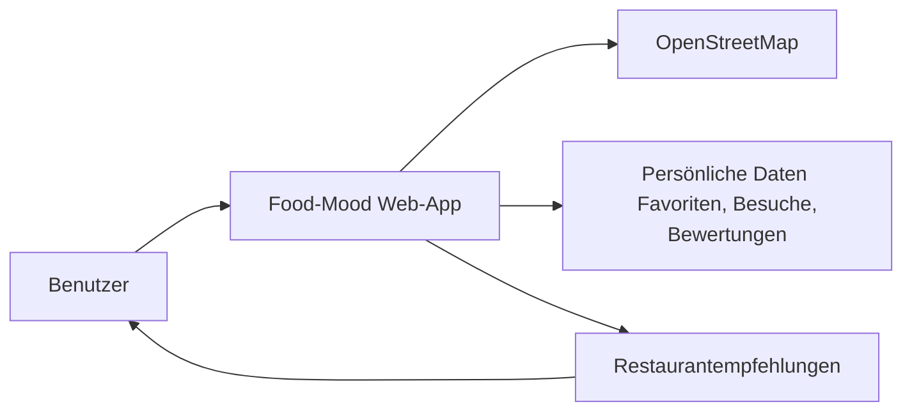

# A01 - Einführung und Ziele

## 1.1 Einleitung

Food-Mood ist eine Web-App, die Nutzern dabei hilft, Restaurants gezielt nach ihrem aktuellen Bedarf zu finden. Die Anwendung kombiniert Standort, persönlicher Stimmung, Anlass und individuelle Filter, um passende Vorschläge zu erzeugen. Ziel ist es, die Entscheidung für ein Restaurant deutlich einfacher, schneller und persönlicher zu machen als bei herkömmlichen Suchmaschinen oder allgemeinen Restaurantlisten.

Die App ist bewusst als leicht nutzbare Webanwendung konzipiert. Sie soll ohne aufwändige Registrierung direkt verwendet werden können und trotzdem persönliche Präferenzen wie Favoriten, besuchte Orte und eigene Bewertungen verwalten.

## 1.2 Systemzweck

Food-Mood soll Menschen dabei unterstützen, in kurzer Zeit passende Restaurants in ihrer Nähe zu finden. Das Problem liegt darin, dass viele Nutzer bei der Auswahl eines Restaurants mit verschiedenen Anforderungen konfrontiert sind: Standort, Essenswunsch, Stimmung, Anlass, Preis, Öffnungszeiten und persönliche Vorlieben.

Oft entstehen dadurch lange, unstrukturierte Suchen, die nicht zuverlässig zu passenden Ergebnissen führen. Food-Mood vereinfacht diesen Prozess, indem es die relevanten Kriterien zusammenführt und Empfehlungen auf Basis eines klaren Suchprofils berechnet.

## 1.3 Ziel des Systems

Das System verfolgt folgende Ziele:

- passende Restaurants anhand von Standort, Stimmung, Anlass und Filter finden,
- den Nutzer bei der Auswahl eines Restaurants schnell unterstützen,
- persönliche Vorlieben wie Favoriten, Besuche und Bewertungen nachvollziehbar verwalten,
- Empfehlungen verständlich und nachvollziehbar machen,
- eine einfache, responsive Weboberfläche für schnelle Nutzung bieten,
- eine Architektur schaffen, die leicht erweiterbar und wartbar ist.

## 1.4 Stakeholder

Die wichtigsten Stakeholder von Food-Mood und ihre Erwartungen sind in der folgenden Tabelle dargestellt.

| Rolle | Relevanz | Architektonische Erwartungen |
| --- | --- | --- |
| Nutzer | Hauptnutzer der App | Schnelle, verständliche Restaurantempfehlungen; einfache Bedienung; passende Ergebnisse zu Standort, Stimmung und Anlass; persönliche Favoriten und Bewertungen müssen zuverlässig verwaltet werden. |
| Betreiber | Verantwortlich für Betrieb und Pflege | Stabile, verfügbare Web-App; einfache Wartung; klare Trennung von Frontend, Backend und Datenhaltung; geringe Betriebsaufwände. |
| Entwickler | Entwurf und Umsetzung | Wartbare Architektur; modulare Struktur; nachvollziehbare fachliche Logik; einfache Erweiterbarkeit für neue Funktionen und externe Datenquellen. |
| Projektteam / Lehrende | fachliche und dokumentarische Bewertung | Ein verständlicher Architekturaufbau; nachvollziehbare Zielsetzung; konsistente Dokumentation gemäß arc42; klare Beziehung zwischen Anforderungen und Entwurf. |

> Weitere fachliche Rahmenbedingungen und Kontextinformationen finden sich in [P1 – Ziele und Rahmenbedingungen](../specs/P1-Ziele-und-Rahmenbedingungen.md), [P2 – Architekturüberblick](../specs/P2-architekturueberblick.md) sowie [S1 – Nachbarsysteme und APIs](../specs/S1-Nachbarsysteme-und-APIs.md).

### Akteure im System

Die Hauptakteure sind:

- Der Nutzer, der eine Empfehlung für ein Restaurant benötigt,
- das System Food-Mood, das Daten verarbeitet und Empfehlungen berechnet,
- externe Datenquellen, insbesondere OpenStreetMap, die Restaurant- und Geodaten bereitstellen.

## 1.5 Qualitätsziele

Die wichtigsten Qualitätsziele für Food-Mood sind in der folgenden Tabelle systematisch erfasst. Sie verbinden fachliche Ziele mit messbaren Erwartungen und verweisen auf die detaillierten Nichtfunktionalen Anforderungen in [N1 – Nichtfunktionale Anforderungen](../specs/N1-Nichtfunktionale-Anforderungen.md).

| ID | Qualitätsziel | ISO 25010-Kategorie | Szenario / Messgröße | Getrieben durch |
| --- | --- | --- | --- | --- |
| QG-01 | Benutzerfreundlichkeit und intuitive Bedienung | Usability | Der Nutzer kann die App ohne Einarbeitung direkt bedienen; die Suche und Empfehlung erfolgen in kurzer Zeit verständlich und nachvollziehbar. | Nutzer, Projektteam |
| QG-02 | Relevanz und Qualität der Empfehlungen | Functional Suitability | Die Empfehlungen passen möglichst gut zu Standort, Stimmung, Anlass und Filter; unpassende Vorschläge werden minimiert. | Nutzer, Entwickler |
| QG-03 | Verfügbarkeit und Stabilität | Reliability | Die Anwendung funktioniert bei typischen Nutzungsszenarien zuverlässig und bleibt ohne Ausfälle nutzbar. | Betreiber, Entwickler |
| QG-04 | Wartbarkeit und Erweiterbarkeit | Maintainability | Neue Funktionen können ohne große Umstrukturierung ergänzt werden; fachliche und technische Komponenten bleiben sauber getrennt. | Entwickler |
| QG-05 | Datenschutz und sichere Verarbeitung persönlicher Daten | Security | Favoriten, Besuche und Bewertungen werden sicher verarbeitet; sensible Daten werden nur im notwendigen Umfang gespeichert und verwaltet. | Betreiber, Entwickler |
| QG-06 | Aktualität und Zuverlässigkeit der Daten | Compatibility / Reliability | Restaurant- und Geodaten werden aus verlässlichen externen Quellen bezogen und für die Empfehlung verwendet. | Betreiber, Nachbarsysteme |

### Qualitätsziele in Kurzform

- Die App soll für Nutzer schnell und verständlich nutzbar sein.
- Die Empfehlung soll fachlich relevant und individuell passend sein.
- Das System soll stabil, wartbar und erweiterbar aufgebaut sein.
- Persönliche Nutzerdaten müssen sicher und nachvollziehbar verarbeitet werden.
- Externe Datenquellen müssen zuverlässig und konsistent in die Empfehlung einfließen.

> Die detaillierte fachliche Ausarbeitung der Qualitätsanforderungen befindet sich in [N1 – Nichtfunktionale Anforderungen](../specs/N1-Nichtfunktionale-Anforderungen.md).

## 1.6 Systemüberblick

Die Web-App stellt die zentrale Schnittstelle für den Nutzer dar. Der Nutzer gibt Standort, Stimmung, Anlass und Filter ein. Food-Mood verarbeitet diese Informationen, fragt relevante Restaurantdaten bei OpenStreetMap ab und liefert darauf basierend personalisierte Empfehlungen zurück.

## 1.7 Zusammenfassung

Food-Mood ist eine Webanwendung zur Unterstützung bei der Auswahl eines passenden Restaurants. Sie löst das Problem unscharfer und zeitaufwändiger Restaurant-Suche, indem sie nutzerbezogene Kriterien wie Ort, Stimmung, Anlass und persönliche Vorlieben in eine verständliche Empfehlung zusammenführt.

Die Architektur orientiert sich an den Anforderungen von Benutzerfreundlichkeit, fachlicher Relevanz, Stabilität und Wartbarkeit. Damit ist das System nicht nur für den unmittelbaren Einsatz geeignet, sondern auch für zukünftige Erweiterungen und langfristige Pflege vorbereitet.

---

Diese Einführung bildet die Grundlage für die weiteren arc42-Kapitel und beschreibt die wichtigsten Ziele, Stakeholder und Qualitätsanforderungen von Food-Mood.
