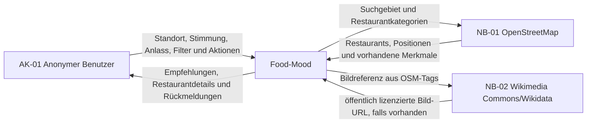
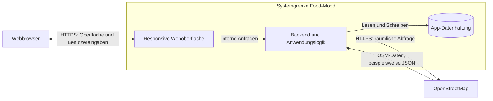

# A03 – Kontextabgrenzung

## A03.1 Zweck

Dieses Kapitel grenzt Food-Mood von seiner Umgebung ab. Der fachliche Kontext beschreibt die beteiligten Akteure und Nachbarsysteme sowie die ausgetauschten Informationen. Der technische Kontext ergänzt die dafür verwendeten Kommunikationswege. Die fachliche Grundlage bilden [P2 – Fachlicher Architekturüberblick](../specs/P2-architekturueberblick.md) und [S1 – Nachbarsysteme und externe APIs](../specs/S1-Nachbarsysteme-und-APIs.md).

## A03.2 Fachlicher Kontext

Food-Mood unterstützt einen anonymen Benutzer dabei, Restaurants zu finden, die zu seinem Standort, seiner Stimmung, seinem Anlass und seinen ausgewählten Filtern passen. Persönliche Daten wie Favoriten, Besuche und eigene Bewertungen werden von Food-Mood verwaltet. Restaurant- und Geodaten werden aus OpenStreetMap bezogen.

### Beteiligte und Nachbarsysteme

| ID | Element | Rolle | Verantwortung |
|---|---|---|---|
| `AK-01` | Anonymer Benutzer | Akteur | Erstellt oder verwendet eine UserID, wählt Standort, Stimmung, Anlass und Filter und verwaltet Favoriten, Besuche und eigene Bewertungen. |
| `NB-01` | OpenStreetMap | fachliches Nachbarsystem | Stellt vorhandene Restaurant- und Geodaten für das gewählte Suchgebiet bereit. |
| `NB-02` | Wikimedia Commons/Wikidata | optionales, ergänzendes Nachbarsystem | Liefert bei vorhandenem OSM-Verweis (`image`, `wikimedia_commons`, `wikidata`) ein öffentlich lizenziertes Restaurantbild; ohne passenden Verweis bleibt das Bild `null`. |

### Fachlicher Informationsaustausch

| ID | Richtung | Ausgetauschte Informationen |
|---|---|---|
| `FI-01` | Anonymer Benutzer → Food-Mood | Name zur Profilerstellung, vorhandene UserID, Standortfreigabe oder Ortseingabe, Stimmung, Anlass, Filter sowie Aktionen für Favoriten, Besuche und Bewertungen |
| `FI-02` | Food-Mood → Anonymer Benutzer | UserID, verständliche Status- und Fehlermeldungen, sortierte Restaurantempfehlungen, Match-Gründe und Restaurantdetails |
| `FI-03` | Food-Mood → OpenStreetMap | geografisches Suchgebiet, Suchradius und gesuchte gastronomische Kategorien |
| `FI-04` | OpenStreetMap → Food-Mood | OSM-Objekttyp und OSM-ID, Name, Position und weitere vorhandene Restaurantmerkmale, darunter optionale Bildverweise (`image`, `wikimedia_commons`, `wikidata`) |
| `FI-05` | Food-Mood → Wikimedia Commons/Wikidata | aus OSM-Tags übernommener Bildverweis (Dateiname, Kategorie oder Wikidata-ID) |
| `FI-06` | Wikimedia Commons/Wikidata → Food-Mood | aufgelöste Bild-URL oder keine Antwort/Fehler, wenn kein Bild verfügbar ist |

OpenStreetMap stellt keine verlässlichen allgemeinen Sternebewertungen, Rezensionstexte oder Preisstufen bereit. Bewertungen innerhalb von Food-Mood stammen deshalb ausschließlich aus der eigenen Bewertungsfunktion. Fehlende externe Merkmale werden als unbekannt behandelt und nicht durch erfundene Werte ergänzt. Wikimedia Commons/Wikidata wird ausschließlich lesend und optional angefragt; Fehler oder fehlende Bilder wirken sich nicht auf die Restaurantsuche aus und werden als `image: null` behandelt.

## A03.3 Technischer Kontext

Der Benutzer greift mit einem modernen Webbrowser über HTTPS auf die responsive Food-Mood-Web-App zu. Die serverseitige Anwendungslogik verarbeitet die Suchanfrage und greift über eine gekapselte OpenStreetMap-Anbindung auf externe Restaurant- und Geodaten zu. Die persönlichen App-Daten werden innerhalb der Systemgrenze gespeichert.

### Technische Kommunikationswege

| ID | Verbindung | Technik | Inhalt und Regeln |
|---|---|---|---|
| `TK-01` | Webbrowser ↔ Food-Mood | HTTPS | Auslieferung der Weboberfläche sowie Übertragung von Benutzereingaben und Ergebnissen. Die UserID wird lokal persistent gehalten; API-Aufrufe verwenden den daraus abgeleiteten UserIdHash. |
| `TK-02` | Food-Mood ↔ OpenStreetMap | HTTPS über eine gekapselte OSM-Anbindung | Räumliche Restaurantabfragen und Rückgabe vorhandener OSM-Objekte. Overpass kann für Restaurantabfragen und Nominatim für die Auflösung einer manuellen Ortseingabe eingesetzt werden. Beide sind technische Zugänge zu OpenStreetMap und keine zusätzlichen fachlichen Nachbarsysteme. |
| `TK-03` | Anwendungslogik ↔ App-Datenhaltung | interne Datenbankverbindung | Dauerhafte Speicherung von Nutzerprofil, Favoriten, Besuchen und eigenen Bewertungen. Die Datenhaltung ist Teil von Food-Mood und kein Nachbarsystem. |
| `TK-04` | Food-Mood ↔ Wikimedia Commons/Wikidata | HTTPS über eine gekapselte, gecachte Bild-Anbindung | Optionale, zeitlich begrenzte Anfrage einer Bild-URL anhand eines aus OSM-Tags übernommenen Verweises. Ergebnis wird 24 Stunden gecacht; Fehler oder Timeouts führen zu `image: null`, nie zu einem Fehlschlag der Restaurantsuche (vgl. ADR-08 in [A09 – Architekturentscheidungen](A09-Architekturentscheidungen.md)). |

Die konkreten Frameworks, Datenbankprodukte und Bereitstellungsdetails werden nicht in diesem Kapitel festgelegt. Sie werden in [A04 – Lösungsstrategie](A04-Loesungsstrategie.md), [A07 – Verteilungssicht](A07-Verteilungssicht.md) und [A09 – Architekturentscheidungen](A09-Architekturentscheidungen.md) dokumentiert.

## A03.4 Systemgrenze

| Innerhalb von Food-Mood | Außerhalb von Food-Mood |
|---|---|
| responsive Benutzeroberfläche und Dialogführung | Benutzer und sein Endgerät |
| Erzeugung, Prüfung und Verwaltung der UserID | Verfügbarkeit der Internetverbindung |
| Verarbeitung des temporären Suchstandorts | Vollständigkeit und Aktualität der OpenStreetMap-Daten |
| Erfassung von Stimmung, Anlass und Filtern | Betrieb der OpenStreetMap-Infrastruktur |
| Mapping und Empfehlungsberechnung | technische Eigenschaften des verwendeten Webbrowsers |
| Normalisierung externer Restaurantdaten |  |
| Speicherung von Favoriten, Besuchen und eigenen Bewertungen |  |
| Fehlerbehandlung und Ergebnisdarstellung |  |

Die Browser-Geolokalisierung ist eine technische Fähigkeit des Endgeräts. Ihre Ansteuerung und die Verarbeitung des freigegebenen Standorts gehören zur Food-Mood-Anwendung. Der Standort wird nur für die aktuelle Suche verwendet und nicht dauerhaft gespeichert.

## A03.5 Abgrenzungsregeln

- OpenStreetMap ist das primäre fachliche Nachbarsystem der ersten Version; Wikimedia Commons/Wikidata ist ein zweites, rein optionales Nachbarsystem nur für die Bildanreicherung.
- Overpass und Nominatim werden nur als mögliche technische Zugänge zu OpenStreetMap betrachtet.
- Die App-Datenhaltung ist ein interner Bestandteil von Food-Mood.
- Die UserID wird weder an OpenStreetMap noch an Wikimedia Commons/Wikidata übertragen.
- Antworten externer Dienste werden vor der weiteren Verarbeitung geprüft und in interne Datentypen überführt.
- Reservierungen, Bestellungen, Zahlungen und klassische Benutzerkonten gehören nicht zum Systemumfang.
- Externe Fehler dürfen gespeicherte Favoriten, Besuche und Bewertungen nicht verändern oder löschen.
- Ist kein Bildverweis in den OSM-Tags vorhanden oder liefert Wikimedia Commons/Wikidata kein Ergebnis, bleibt `image: null`; es werden keine erfundenen oder generischen Bilder angezeigt.

