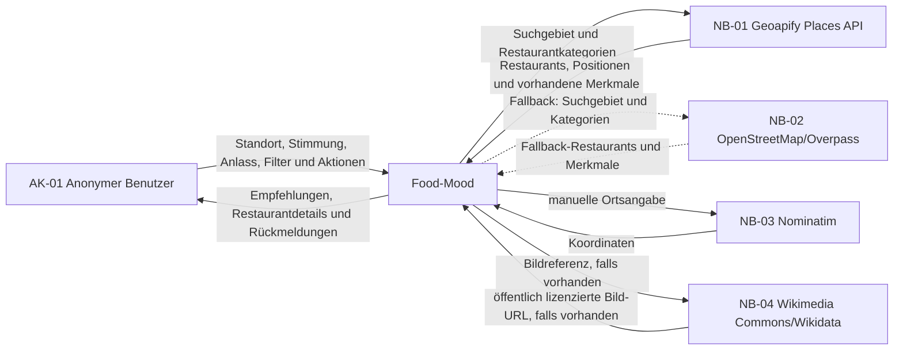
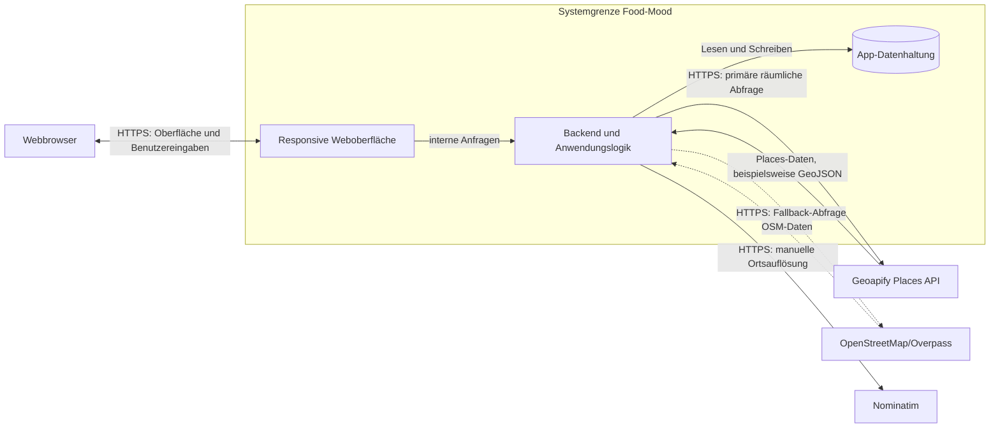

# A03 – Kontextabgrenzung

## A03.1 Zweck

Dieses Kapitel grenzt Food-Mood von seiner Umgebung ab. Der fachliche Kontext beschreibt die beteiligten Akteure und Nachbarsysteme sowie die ausgetauschten Informationen. Der technische Kontext ergänzt die dafür verwendeten Kommunikationswege. Die fachliche Grundlage bilden [P2 – Fachlicher Architekturüberblick](../specs/P2-architekturueberblick.md) und [S1 – Nachbarsysteme und externe APIs](../specs/S1-Nachbarsysteme-und-APIs.md).

## A03.2 Fachlicher Kontext

Food-Mood unterstützt einen anonymen Benutzer dabei, Restaurants zu finden, die zu seinem Standort, seiner Stimmung, seinem Anlass und seinen ausgewählten Filtern passen. Persönliche Daten wie Favoriten, Besuche und eigene Bewertungen werden von Food-Mood verwaltet. Restaurantdaten werden primär über Geoapify Places bezogen; OpenStreetMap/Overpass bleibt als Fallback erhalten.

### Beteiligte und Nachbarsysteme

| ID | Element | Rolle | Verantwortung |
|---|---|---|---|
| `AK-01` | Anonymer Benutzer | Akteur | Erstellt oder verwendet eine UserID, wählt Standort, Stimmung, Anlass und Filter und verwaltet Favoriten, Besuche und eigene Bewertungen. |
| `NB-01` | Geoapify Places API | primäres fachliches Nachbarsystem | Stellt gastronomische Orte, Positionen und vorhandene Merkmale für das gewählte Suchgebiet bereit. |
| `NB-02` | OpenStreetMap/Overpass | technischer Fallback | Liefert bei fehlendem Geoapify-Schlüssel oder einem Geoapify-Fehler alternative Restaurant- und Geodaten. |
| `NB-03` | Nominatim | optionaler Geocoding-Dienst | Löst manuelle Ortsangaben in Koordinaten auf. |
| `NB-04` | Wikimedia Commons/Wikidata | optionales, ergänzendes Nachbarsystem | Liefert bei vorhandenen Bildreferenzen ein öffentlich lizenziertes Restaurantbild; ohne passenden Verweis bleibt das Bild `null`. |

### Fachlicher Informationsaustausch

| ID | Richtung | Ausgetauschte Informationen |
|---|---|---|
| `FI-01` | Anonymer Benutzer → Food-Mood | Name zur Profilerstellung, vorhandene UserID, Standortfreigabe oder Ortseingabe, Stimmung, Anlass, Filter sowie Aktionen für Favoriten, Besuche und Bewertungen |
| `FI-02` | Food-Mood → Anonymer Benutzer | UserID, verständliche Status- und Fehlermeldungen, sortierte Restaurantempfehlungen, Match-Gründe und Restaurantdetails |
| `FI-03` | Food-Mood → Geoapify Places | geografisches Suchgebiet, Suchradius und gastronomische Kategorien |
| `FI-04` | Geoapify Places → Food-Mood | externe Place-ID, Name, Position, Anschrift und vorhandene Restaurantmerkmale |
| `FI-05` | Food-Mood → OpenStreetMap/Overpass | Fallback-Suchgebiet, Suchradius und gastronomische Kategorien |
| `FI-06` | Food-Mood → Nominatim | manuelle Ortsangabe zur Geocodierung |
| `FI-07` | Food-Mood ↔ Wikimedia Commons/Wikidata | optionale Bildreferenz und aufgelöste Bild-URL, falls verfügbar |

Geoapify und OpenStreetMap stellen keine verlässlichen Food-Mood-Bewertungen oder Rezensionstexte bereit. Bewertungen innerhalb von Food-Mood stammen deshalb ausschließlich aus der eigenen Bewertungsfunktion. Fehlende externe Merkmale werden als unbekannt behandelt und nicht durch erfundene Werte ergänzt. Wikimedia Commons/Wikidata wird ausschließlich lesend und optional angefragt; Fehler oder fehlende Bilder wirken sich nicht auf die Restaurantsuche aus und werden als `image: null` behandelt.

## A03.3 Technischer Kontext

Der Benutzer greift mit einem modernen Webbrowser über HTTPS auf die responsive Food-Mood-Web-App zu. Die serverseitige Anwendungslogik verarbeitet die Suchanfrage und greift über eine gekapselte OpenStreetMap-Anbindung auf externe Restaurant- und Geodaten zu. Die persönlichen App-Daten werden innerhalb der Systemgrenze gespeichert.

### Technische Kommunikationswege

| ID | Verbindung | Technik | Inhalt und Regeln |
|---|---|---|---|
| `TK-01` | Webbrowser ↔ Food-Mood | HTTPS | Auslieferung der Weboberfläche sowie Übertragung von Benutzereingaben und Ergebnissen. Die UserID wird lokal persistent gehalten; API-Aufrufe verwenden den daraus abgeleiteten UserIdHash. |
| `TK-02` | Food-Mood ↔ Geoapify Places | HTTPS über den gekapselten Places-Adapter | Primäre räumliche Restaurantabfragen mit API-Schlüssel aus der Serverumgebung. |
| `TK-03` | Food-Mood ↔ OpenStreetMap/Overpass | HTTPS über den gekapselten Fallback-Adapter | Räumliche Restaurantabfragen, wenn Geoapify nicht verwendet werden kann. |
| `TK-04` | Food-Mood ↔ Nominatim | HTTPS über den gekapselten Geocoding-Adapter | Auflösung einer manuellen Ortsangabe in Koordinaten. |
| `TK-05` | Anwendungslogik ↔ App-Datenhaltung | interne Datenbankverbindung | Dauerhafte Speicherung von Nutzerprofil, Favoriten, Besuchen und eigenen Bewertungen. Die Datenhaltung ist Teil von Food-Mood und kein Nachbarsystem. |
| `TK-06` | Food-Mood ↔ Wikimedia Commons/Wikidata | HTTPS über eine gekapselte, gecachte Bild-Anbindung | Optionale Anfrage einer Bild-URL anhand vorhandener externer Bildreferenzen. Ergebnis wird 24 Stunden gecacht; Fehler oder Timeouts führen zu `image: null`. |

Die konkreten Frameworks, Datenbankprodukte und Bereitstellungsdetails werden nicht in diesem Kapitel festgelegt. Sie werden in [A04 – Lösungsstrategie](A04-Loesungsstrategie.md), [A07 – Verteilungssicht](A07-Verteilungssicht.md) und [A09 – Architekturentscheidungen](A09-Architekturentscheidungen.md) dokumentiert.

## A03.4 Systemgrenze

| Innerhalb von Food-Mood | Außerhalb von Food-Mood |
|---|---|
| responsive Benutzeroberfläche und Dialogführung | Benutzer und sein Endgerät |
| Erzeugung, Prüfung und Verwaltung der UserID | Verfügbarkeit der Internetverbindung |
| Verarbeitung des temporären Suchstandorts | Vollständigkeit und Aktualität der OpenStreetMap-Daten |
| Erfassung von Stimmung, Anlass und Filtern | Betrieb der OpenStreetMap-Infrastruktur |
| Mapping und Empfehlungsberechnung | technische Eigenschaften des verwendeten Webbrowsers |
| Normalisierung externer Restaurantdaten |  |
| Speicherung von Favoriten, Besuchen und eigenen Bewertungen |  |
| Fehlerbehandlung und Ergebnisdarstellung |  |

Die Browser-Geolokalisierung ist eine technische Fähigkeit des Endgeräts. Ihre Ansteuerung und die Verarbeitung des freigegebenen Standorts gehören zur Food-Mood-Anwendung. Der Standort wird nur für die aktuelle Suche verwendet und nicht dauerhaft gespeichert.

## A03.5 Abgrenzungsregeln

- Geoapify Places ist das primäre fachliche Nachbarsystem der aktuellen Version; OpenStreetMap/Overpass ist ein technischer Fallback.
- Nominatim dient der optionalen Auflösung manueller Ortsangaben; Wikimedia Commons/Wikidata dient ausschließlich der optionalen Bildanreicherung.
- Die App-Datenhaltung ist ein interner Bestandteil von Food-Mood.
- Die UserID wird weder an OpenStreetMap noch an Wikimedia Commons/Wikidata übertragen.
- Antworten externer Dienste werden vor der weiteren Verarbeitung geprüft und in interne Datentypen überführt.
- Reservierungen, Bestellungen, Zahlungen und klassische Benutzerkonten gehören nicht zum Systemumfang.
- Externe Fehler dürfen gespeicherte Favoriten, Besuche und Bewertungen nicht verändern oder löschen.
- Ist kein Bildverweis vorhanden oder liefert Wikimedia Commons/Wikidata kein Ergebnis, bleibt `image: null`; es werden keine erfundenen oder generischen Bilder angezeigt.

