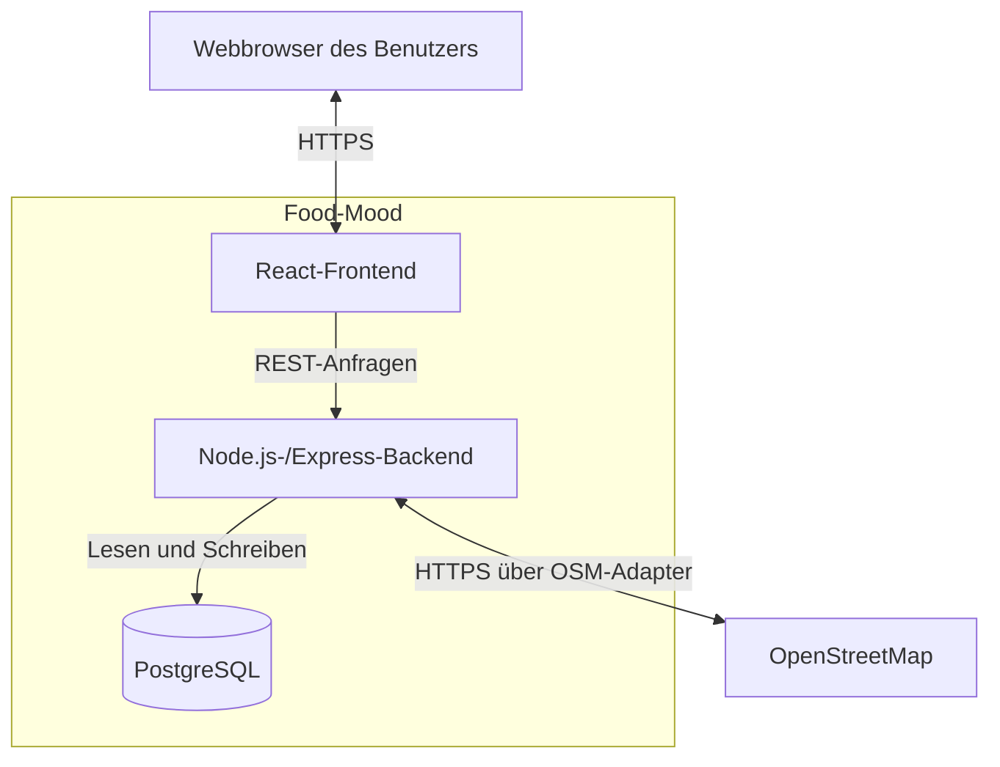

# A04 – Lösungsstrategie

## A04.1 Zweck

Dieses Kapitel fasst die grundlegenden Lösungsentscheidungen für Food-Mood zusammen. Es beschreibt, mit welchen Technologien und Architekturprinzipien die fachlichen Anforderungen aus der Spezifikation umgesetzt werden. Detaillierte Bausteine werden in [A05 – Bausteinsicht](A05-Bausteinsicht.md), Laufzeitabläufe in [A06 – Laufzeitsicht](A06-Laufzeitsicht.md), die Bereitstellung in [A07 – Verteilungssicht](A07-Verteilungssicht.md) und einzelne Architekturentscheidungen in [A09 – Architekturentscheidungen](A09-Architekturentscheidungen.md) behandelt.

## A04.2 Architekturüberblick

Food-Mood wird als responsive Webanwendung mit einer klaren Trennung von Benutzeroberfläche, serverseitiger Anwendungslogik und Datenhaltung umgesetzt. Die Anwendung besteht aus einem React-Frontend, einem Node.js-/Express-Backend und einer PostgreSQL-Datenbank. Der Zugriff auf Restaurant- und Geodaten erfolgt ausschließlich über eine gekapselte OpenStreetMap-Anbindung im Backend.

Die Lösung ist eine modular aufgebaute Drei-Schichten-Anwendung und keine Microservice-Architektur. Frontend, Backend und Datenbank sind getrennte technische Bausteine, bleiben aber Bestandteil einer gemeinsamen Food-Mood-Anwendung.

## A04.3 Grundlegende Technologieentscheidungen

| ID | Bereich | Entscheidung | Begründung und Auswirkung |
|---|---|---|---|
| `LS-01` | Programmiersprache | JavaScript im Frontend und Backend | Das Team verwendet nur eine zentrale Programmiersprache. Datenobjekte und Validierungsregeln können zwischen den Anwendungsteilen konsistent gehalten werden. |
| `LS-02` | Frontend | React mit Vite | React ermöglicht eine komponentenbasierte Umsetzung der in B1 beschriebenen Masken. Vite stellt den Entwicklungsserver und den Produktions-Build bereit. |
| `LS-03` | Backend | Node.js mit Express | Express stellt eine schlanke HTTP- und REST-Schnittstelle bereit. Fachlogik, Validierung, Datenzugriff und externe Zugriffe werden in getrennten Modulen organisiert. |
| `LS-04` | Persistenz | PostgreSQL | Das relationale Datenmodell aus D1 kann mit Schlüsseln, Beziehungen und Integritätsregeln umgesetzt werden. UserIDs, Favoriten, Besuche und Bewertungen werden dauerhaft gespeichert. |
| `LS-05` | Restaurant- und Geodaten | OpenStreetMap über einen eigenen Backend-Adapter | OpenStreetMap bleibt das einzige fachliche Nachbarsystem. Overpass kann für Restaurantabfragen und Nominatim für die Auflösung manueller Ortseingaben verwendet werden. Technische Details bleiben hinter einer internen Schnittstelle verborgen. |
| `LS-06` | Entwicklung | Docker Compose | Frontend, Backend und PostgreSQL erhalten eine einheitliche lokale Umgebung, die von allen Teammitgliedern reproduzierbar gestartet werden kann. |
| `LS-07` | Bereitstellung | Webserver mit Domain und HTTPS | Die Anwendung ist ohne Installation über einen Browser erreichbar. Die genaue Serverstruktur wird in A07 beschrieben. |
| `LS-08` | Nutzeridentifikation | anonyme UserID statt klassischem Benutzerkonto | Es werden keine E-Mail-Adresse und kein Passwort benötigt. Favoriten, Besuche und Bewertungen werden der aktiven UserID zugeordnet. |

Versionsnummern werden nicht dauerhaft in dieser Strategie festgeschrieben. Die tatsächlich eingesetzten Versionen werden in den Projekt- und Build-Dateien verwaltet, damit die Architekturdokumentation nicht durch reguläre Aktualisierungen veraltet.

## A04.4 Strukturelle Zerlegung

Die Anwendung wird in fünf Verantwortungsbereiche aufgeteilt:

| Bereich | Hauptverantwortung |
|---|---|
| Benutzeroberfläche | responsive Masken, Navigation, Formulare sowie Lade-, Leer- und Fehlerzustände darstellen |
| HTTP- und REST-Schnittstelle | Anfragen entgegennehmen, Eingaben validieren und Ergebnisse in einem einheitlichen Format zurückgeben |
| Anwendungs- und Fachlogik | Suchprofil erstellen, Stimmung und Anlass zuordnen, Empfehlungen berechnen und fachliche Regeln durchsetzen |
| Integration | OpenStreetMap-Abfragen ausführen, externe Antworten prüfen und in interne Restaurantdaten überführen |
| Persistenz | Nutzerprofile, Favoriten, Besuche und eigene Bewertungen in PostgreSQL speichern und laden |

Die Benutzeroberfläche greift nicht direkt auf PostgreSQL zu. Ebenso werden Restaurantabfragen nicht direkt aus den React-Komponenten ausgeführt. Alle fachlichen und externen Zugriffe laufen über das Backend. Dadurch bleiben Verantwortlichkeiten nachvollziehbar und Änderungen an Datenquelle oder Datenbank auf wenige Bausteine begrenzt.

## A04.5 Vorgehen zur Erfüllung der Qualitätsanforderungen

| Qualitätsanforderung | Lösungsansatz |
|---|---|
| [NFA-01](../specs/N1-Nichtfunktionale-Anforderungen.md) – Empfehlungen innerhalb von fünf Sekunden | Suchradius und Ergebnismenge werden begrenzt. Externe Aufrufe erhalten eine Zeitüberschreitung, geeignete Antworten werden zwischengespeichert und unnötige Wiederholungen vermieden. |
| [NFA-02](../specs/N1-Nichtfunktionale-Anforderungen.md) – Ergebnisdarstellung innerhalb einer Sekunde | Das Backend liefert bereits normalisierte und sortierte Ergebnisse. React stellt höchstens 50 Einträge komponentenbasiert dar. |
| [NFA-03](../specs/N1-Nichtfunktionale-Anforderungen.md) – Bedienbarkeit ab 360 Pixel | Die Oberfläche wird mobile-first und responsiv aufgebaut. Die Masken werden mindestens bei 360 Pixel sowie auf einer Desktopbreite geprüft. |
| [NFA-04](../specs/N1-Nichtfunktionale-Anforderungen.md) – manueller Standort als Ersatzweg | Das Frontend bietet neben der Browserfreigabe immer eine manuelle Ortseingabe an. Die Auflösung erfolgt über die gekapselte OSM-Anbindung. |
| [NFA-05](../specs/N1-Nichtfunktionale-Anforderungen.md) – verständliche Fehlermeldungen | Das Backend übersetzt technische Fehler in einheitliche Fehlerantworten. Das Frontend zeigt allgemeinsprachliche Hinweise und, wenn sinnvoll, „Erneut versuchen“ an. |
| [NFA-06](../specs/N1-Nichtfunktionale-Anforderungen.md) – Standort nicht dauerhaft speichern | Koordinaten und Ortseingaben werden nur für die aktuelle Suche verarbeitet und nicht in PostgreSQL gespeichert. |
| [NFA-07](../specs/N1-Nichtfunktionale-Anforderungen.md) – keine personenbezogenen Kontodaten | Es gibt keine Registrierung mit E-Mail-Adresse oder Passwort. Die Zuordnung persönlicher App-Daten erfolgt ausschließlich über die UserID. |
| [NFA-08](../specs/N1-Nichtfunktionale-Anforderungen.md) – gültige Bewertungen | Frontend und Backend prüfen den ganzzahligen Wertebereich von einem bis fünf Sternen. Ungültige Werte werden nicht gespeichert. |
| [NFA-09](../specs/N1-Nichtfunktionale-Anforderungen.md) – Bewertung erst nach Besuch | Die Fachlogik prüft vor dem Speichern einer Bewertung, ob für dieselbe UserID und dasselbe Restaurant ein Besuch vorhanden ist. |
| [NFA-10](../specs/N1-Nichtfunktionale-Anforderungen.md) – dauerhafte persönliche Daten | PostgreSQL speichert UserIDs, Favoriten, Besuche und Bewertungen dauerhaft und stellt ihre Beziehungen durch Schlüssel sicher. |

## A04.6 Integrationsstrategie für OpenStreetMap

Der Zugriff auf OpenStreetMap wird in einem eigenen Integrationsbaustein gekapselt. Die Empfehlungslogik arbeitet nur mit den internen Datentypen aus [D2 – Datentypen](../specs/D2-Datentypen.md) und kennt keine anbieterspezifische Antwortstruktur.

Für die Anbindung gelten folgende Regeln:

- Overpass wird für räumliche Restaurantabfragen verwendet.
- Nominatim kann eine manuelle Ortseingabe in Koordinaten auflösen.
- Externe Antworten werden validiert und normalisiert.
- Fehlende optionale Merkmale bleiben unbekannt.
- Die UserID, Favoriten, Besuche und Bewertungen werden nicht an OpenStreetMap übertragen.
- Anfragen werden zeitlich begrenzt und geeignete Ergebnisse zwischengespeichert.
- Nutzungsrichtlinien, Anfragelimits und die erforderliche OpenStreetMap-Attribution werden eingehalten.
- Der technische Endpunkt wird konfigurierbar gehalten, damit er ohne Änderung der Fachlogik ausgetauscht werden kann.

Der vollständige fachliche Vertrag ist in [S1 – Nachbarsysteme und externe APIs](../specs/S1-Nachbarsysteme-und-APIs.md) beschrieben.

## A04.7 Entwicklungs- und Bereitstellungsstrategie

Für die lokale Entwicklung werden mindestens drei Docker-Compose-Dienste vorgesehen:

| Dienst | Inhalt |
|---|---|
| `frontend` | React-Anwendung und Vite-Entwicklungsserver |
| `backend` | Node.js-Anwendung mit Express und der Food-Mood-Fachlogik |
| `database` | PostgreSQL mit dauerhaftem Volume für Entwicklungsdaten |

Im Produktivbetrieb wird das mit Vite erzeugte Frontend über HTTPS bereitgestellt. Das Backend ist über dieselbe Domain oder einen eindeutig festgelegten API-Pfad erreichbar. PostgreSQL ist nicht öffentlich aus dem Internet erreichbar. Konfigurationen und mögliche Zugangsdaten werden außerhalb des Quellcodes über Umgebungsvariablen bereitgestellt.

Die konkreten Server, Ports, Container, Sicherungswege und Installationsschritte werden erst in [A07 – Verteilungssicht](A07-Verteilungssicht.md) und [S3 – Inbetriebnahme](../specs/S3-Inbetriebnahme.md) festgelegt.

## A04.8 Bewusste Vereinfachungen für die erste Version

Folgende Ansätze werden für den MVP nicht verwendet:

- keine Microservices und keine verteilte Nachrichtenverarbeitung
- keine native Android- oder iOS-App
- keine GraphQL-Schnittstelle
- keine komplexe KI- oder Machine-Learning-Empfehlungsengine
- keine zusätzliche Restaurant- oder Bewertungs-API
- kein Scraping fremder Bewertungsportale
- kein klassisches Login mit E-Mail-Adresse und Passwort
- keine verpflichtende Kartenansicht

Falls später eine Kartenansicht benötigt wird, kann Leaflet als austauschbare Frontend-Bibliothek ergänzt werden. Sie ist nicht erforderlich, um die Restaurantliste und die Kernfunktionen der ersten Version umzusetzen.

## A04.9 Offene Detailentscheidungen

Die folgenden Punkte müssen vor oder während der Implementierung in A07 beziehungsweise A09 konkretisiert werden, verändern aber nicht die grundlegende Lösungsstrategie:

| ID | Offener Punkt | Zuständiges Dokument |
|---|---|---|
| `OD-01` | konkreter Hosting-Anbieter und Domain | A07 |
| `OD-02` | konkrete Bibliothek für PostgreSQL-Zugriffe und Migrationen | A09 |
| `OD-03` | konkrete Cache-Dauer und Begrenzung externer Anfragen | A08 oder A09 |
| `OD-04` | Entscheidung, ob eine Kartenansicht nach dem MVP ergänzt wird | A09 |
| `OD-05` | konkrete Endpunkte und Ports der Produktionsumgebung | A07 |

## A04.10 Weiterführende Dokumente

| Thema | Dokument |
|---|---|
| Ziele und Rahmenbedingungen | [P1 – Ziele und Rahmenbedingungen](../specs/P1-Ziele-und-Rahmenbedingungen.md) |
| Kontext und Systemgrenze | [A03 – Kontextabgrenzung](A03-Kontextabgrenzung.md) |
| fachliche Bausteine | [P2 – Fachlicher Architekturüberblick](../specs/P2-architekturueberblick.md) |
| detaillierte technische Bausteine | [A05 – Bausteinsicht](A05-Bausteinsicht.md) |
| Datenmodell und Datentypen | [D1 – Datenmodell](../specs/D1-Datenmodell.md) und [D2 – Datentypen](../specs/D2-Datentypen.md) |
| Architekturentscheidungen | [A09 – Architekturentscheidungen](A09-Architekturentscheidungen.md) |

## A04.11 Akzeptanzkriterien

- Die grundlegenden Technologien und ihre Aufgaben sind eindeutig benannt.
- Frontend, Backend, Fachlogik, Integration und Persistenz sind voneinander abgegrenzt.
- OpenStreetMap bleibt das einzige fachliche Nachbarsystem.
- Die Strategie unterstützt die nichtfunktionalen Anforderungen aus N1.
- Standort- und UserID-Daten werden entsprechend den Vorgaben aus M1 behandelt.
- Offene Detailentscheidungen sind sichtbar und den passenden Architekturkapiteln zugeordnet.
- Die Lösung bleibt für ein vierköpfiges Team und den Umfang der ersten Version realistisch.
