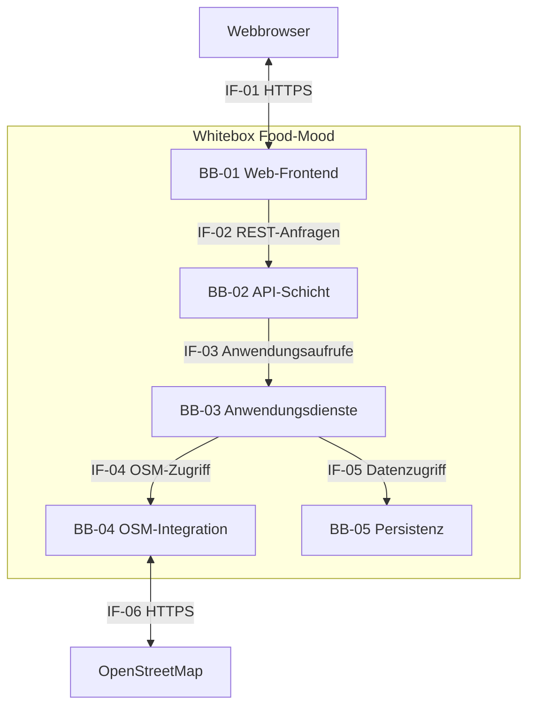
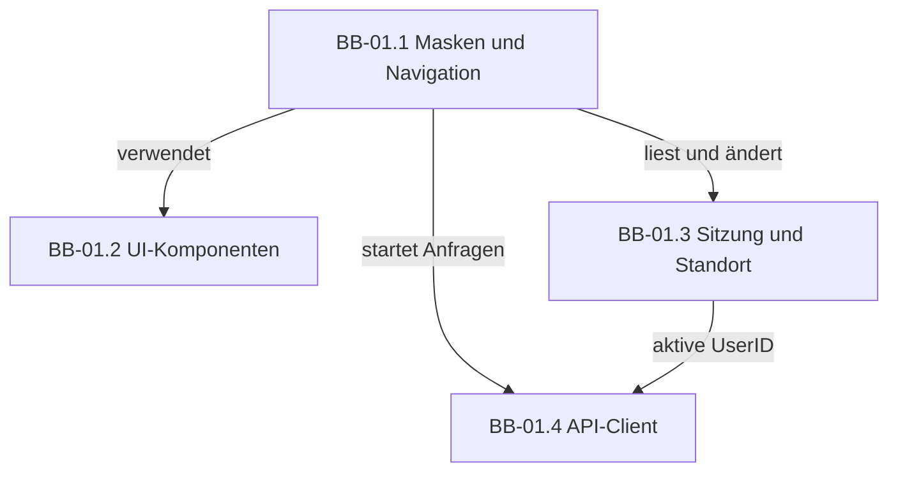
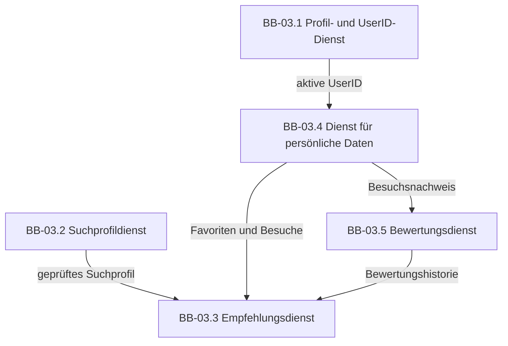
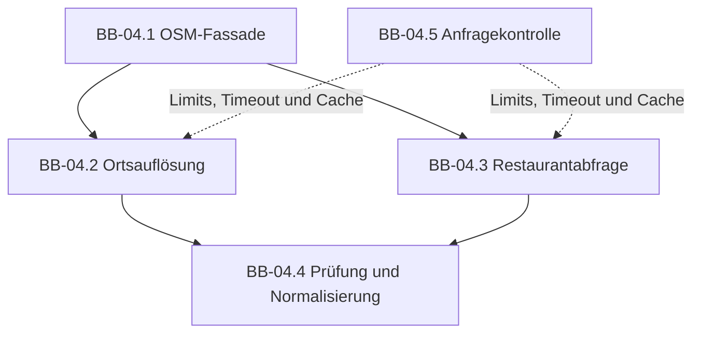

# A05 – Bausteinsicht

## A05.1 Zweck und Darstellungsregeln

Die Bausteinsicht beschreibt die statische Zerlegung von Food-Mood. Sie zeigt, welche technischen Bausteine vorgesehen sind, welche Verantwortung sie besitzen und über welche Schnittstellen sie zusammenarbeiten.

Die Darstellung wird schrittweise verfeinert:

- **Ebene 0** betrachtet Food-Mood als Blackbox innerhalb seines Systemkontexts.
- **Ebene 1** öffnet Food-Mood als Whitebox und zeigt die wichtigsten technischen Bausteine.
- **Ebene 2** verfeinert die Bausteine, deren innere Struktur für die Umsetzung wichtig ist.

Die fachlichen Verantwortlichkeiten sind in [P2 – Fachlicher Architekturüberblick](../specs/P2-architekturueberblick.md) festgelegt. Dieses Kapitel ordnet sie technischen Bausteinen zu. Da die Implementierung noch aufgebaut wird, beschreibt A05 eine **Soll-Architektur**. Abweichungen im späteren Quellcode müssen entweder korrigiert oder in dieser Dokumentation begründet werden.

## A05.2 Ebene 0 – Blackbox Food-Mood

Auf Ebene 0 wird Food-Mood als ein zusammenhängendes System betrachtet. Der anonyme Benutzer greift über einen Webbrowser auf die Anwendung zu. OpenStreetMap stellt als einziges fachliches Nachbarsystem Restaurant- und Geodaten bereit.

| Merkmal | Beschreibung |
|---|---|
| Blackbox | Food-Mood |
| Zweck | passende Restaurants anhand von Standort, Stimmung, Anlass, Filtern und persönlichen App-Daten empfehlen |
| bereitgestellte Schnittstelle | responsive Weboberfläche für den anonymen Benutzer |
| benötigte Schnittstelle | OpenStreetMap für Restaurant- und Geodaten |
| dauerhaft verwaltete Daten | Nutzerprofile mit UserID, Favoriten, Besuche und eigene Bewertungen |
| Kontext | [A03 – Kontextabgrenzung](A03-Kontextabgrenzung.md) |

## A05.3 Ebene 1 – Whitebox Gesamtsystem

### Enthaltene Bausteine

| ID | Baustein | Technologie | Hauptverantwortung | Verfeinerung |
|---|---|---|---|---|
| `BB-01` | Web-Frontend | React und Vite | Masken, Navigation, Eingaben und Ergebnisdarstellung im Browser | [A05.4.1](#a0541-whitebox-web-frontend) |
| `BB-02` | API-Schicht | Node.js und Express | HTTP-Anfragen annehmen, validieren und an die Anwendungsdienste weiterleiten | keine weitere Verfeinerung erforderlich |
| `BB-03` | Anwendungsdienste | JavaScript-Module im Backend | fachliche Abläufe, Suchprofil, Empfehlung, Nutzerprofil und persönliche Daten verarbeiten | [A05.4.2](#a0542-whitebox-anwendungsdienste) |
| `BB-04` | OSM-Integration | Backend-Adapter über HTTPS | technische OpenStreetMap-Zugriffe kapseln und externe Daten normalisieren | [A05.4.3](#a0543-whitebox-osm-integration) |
| `BB-05` | Persistenz | PostgreSQL und Datenzugriffsschicht | Nutzerprofile, Favoriten, Besuche und Bewertungen dauerhaft speichern | keine weitere Verfeinerung; Datenstruktur siehe D1 und D2 |

### Lokale Beziehungen und Schnittstellen

| ID | Von → Nach | Vertrag |
|---|---|---|
| `IF-01` | Webbrowser ↔ Web-Frontend | Oberfläche und statische Dateien werden über HTTPS bereitgestellt; Benutzereingaben werden im Browser verarbeitet. |
| `IF-02` | Web-Frontend → API-Schicht | REST-Anfragen und strukturierte Antworten, beispielsweise für Profile, Suche, Favoriten, Besuche und Bewertungen |
| `IF-03` | API-Schicht → Anwendungsdienste | geprüfte Eingabedaten werden an den jeweils zuständigen Anwendungsdienst übergeben |
| `IF-04` | Anwendungsdienste → OSM-Integration | interne Suchparameter hinein; normalisierte Standort- und Restaurantdaten zurück |
| `IF-05` | Anwendungsdienste → Persistenz | Laden und Speichern fachlicher Objekte über klar abgegrenzte Datenzugriffe |
| `IF-06` | OSM-Integration ↔ OpenStreetMap | HTTPS-Abfragen über Overpass beziehungsweise Nominatim und Verarbeitung der externen Antworten |

### Zentrale Entwurfsentscheidungen

- Das Frontend greift weder direkt auf PostgreSQL noch direkt auf Overpass oder Nominatim zu.
- Die API-Schicht enthält keine Empfehlungs- oder Bewertungsberechnung.
- Die Anwendungsdienste arbeiten mit den internen Datentypen aus D2 und kennen keine konkrete OSM-Antwortstruktur.
- Nur die OSM-Integration kennt externe Endpunkte, Abfrageformate und OSM-Merkmale.
- Nur die Persistenzschicht führt Datenbankzugriffe aus.
- Die Bausteine gehören zu einer gemeinsamen modularen Webanwendung; es werden keine Microservices eingeführt.

### A05.3.1 Blackbox Web-Frontend

| Merkmal | Beschreibung |
|---|---|
| Verantwortung | Benutzer durch Einstieg, Standortauswahl, Stimmung, Anlass, Filter, Empfehlungen, Details und persönliche Listen führen |
| bereitgestellte Schnittstelle | grafische, responsive Weboberfläche |
| benötigte Schnittstellen | REST-Schnittstelle der API-Schicht und Browser-Geolokalisierung nach Zustimmung des Benutzers |
| Ein- und Ausgaben | UserID, Benutzereingaben und Aktionen hinein; Ergebnisse, Restaurantdetails, Status- und Fehlermeldungen heraus |
| Qualitätsbeitrag | mobile Bedienbarkeit ab 360 Pixel, verständliche Rückmeldungen sowie konsistente Lade-, Leer- und Fehlerzustände |
| fachliche Zuordnung | `FB-01` Benutzerinteraktion und `FB-06` Ergebnisdarstellung aus P2 |
| relevante Spezifikation | [B1 – Dialogspezifikation](../specs/B1-Dialogspezifikation.md) und [F2 – Anwendungsfälle](../specs/F2-Anwendungsfaelle.md) |
| offene Punkte | Entscheidung über eine spätere Kartenansicht |

### A05.3.2 Blackbox API-Schicht

| Merkmal | Beschreibung |
|---|---|
| Verantwortung | REST-Endpunkte bereitstellen, Anfragen prüfen, Anwendungsdienste aufrufen und einheitliche Antworten erzeugen |
| bereitgestellte Schnittstelle | interne Food-Mood-REST-API für das Web-Frontend |
| benötigte Schnittstelle | öffentliche Funktionen der Anwendungsdienste |
| Ein- und Ausgaben | HTTP-Anfrage mit UserID und Fachdaten hinein; Erfolgsergebnis oder verständlich abbildbarer Fehler heraus |
| Qualitätsbeitrag | einheitliche Validierung, begrenzte Eingabegrößen, keine technischen Stacktraces im Frontend |
| fachliche Zuordnung | unterstützt alle Anwendungsfälle, besitzt aber selbst keine Fachlogik |
| offene Punkte | konkrete URL-Pfade und Versionierungsregel der REST-API |
| Verfeinerung | keine; eine weitere Zerlegung würde vor der Implementierung lediglich geplante Controller wiederholen |

### A05.3.3 Blackbox Anwendungsdienste

| Merkmal | Beschreibung |
|---|---|
| Verantwortung | Anwendungsfälle koordinieren und fachliche Regeln für Nutzerprofile, Suche, Empfehlungen, Favoriten, Besuche und Bewertungen durchsetzen |
| bereitgestellte Schnittstelle | anwendungsfallbezogene Funktionen für die API-Schicht |
| benötigte Schnittstellen | OSM-Integration und Persistenz |
| Ein- und Ausgaben | validierte Fachdaten hinein; fachliche Ergebnisse oder definierte Fehler heraus |
| Qualitätsbeitrag | nachvollziehbare Verantwortlichkeiten, testbare Fachlogik und Trennung von externen Datenformaten |
| fachliche Zuordnung | `FB-02`, `FB-03`, `FB-05` und `FB-07`; außerdem `AF-01` und `AF-02` aus F3 |
| relevante Spezifikation | [F2 – Anwendungsfälle](../specs/F2-Anwendungsfaelle.md) und [F3 – Anwendungsfunktionen](../specs/F3-Anwendungsfunktionen.md) |
| offene Punkte | genaue Gewichtung der Empfehlungsfaktoren |

### A05.3.4 Blackbox OSM-Integration

| Merkmal | Beschreibung |
|---|---|
| Verantwortung | manuelle Ortseingaben auflösen, Restaurants im Suchgebiet abfragen, externe Antworten prüfen und normalisieren |
| bereitgestellte Schnittstelle | anbietersunabhängige Standort- und Restaurantsuche für die Anwendungsdienste |
| benötigte Schnittstelle | OpenStreetMap über Overpass und gegebenenfalls Nominatim |
| Ein- und Ausgaben | interne Suchparameter hinein; interne Standort- und Restaurantobjekte zurück |
| Qualitätsbeitrag | gekapselte externe Abhängigkeit, Zeitüberschreitung, begrenzte Anfragen, Caching und kontrollierte Fehlerbehandlung |
| fachliche Zuordnung | `FB-04` Restaurantzugriff aus P2 |
| relevante Spezifikation | [S1 – Nachbarsysteme und externe APIs](../specs/S1-Nachbarsysteme-und-APIs.md) |
| offene Punkte | konkrete Endpunkte, Cache-Dauer und technische Wiederholungsregel |

### A05.3.5 Blackbox Persistenz

| Merkmal | Beschreibung |
|---|---|
| Verantwortung | fachliche Objekte in PostgreSQL speichern, laden, ändern und löschen sowie Beziehungen und Integritätsregeln sichern |
| bereitgestellte Schnittstelle | Datenzugriffsfunktionen für die Anwendungsdienste |
| benötigte Schnittstelle | interne PostgreSQL-Verbindung |
| dauerhaft gespeicherte Daten | Nutzerprofil, Favorit, Besuch und Bewertung; Restaurantreferenzen, soweit sie für diese Beziehungen erforderlich sind |
| nicht gespeicherte Daten | Standort und Suchanfrage der aktuellen Suche |
| Qualitätsbeitrag | dauerhafte persönliche Daten, eindeutige UserID-Zuordnung und referenzielle Integrität |
| fachliche Zuordnung | `FB-07` Persönliche App-Daten aus P2 |
| relevante Spezifikation | [D1 – Datenmodell](../specs/D1-Datenmodell.md) und [D2 – Datentypen](../specs/D2-Datentypen.md) |
| offene Punkte | konkrete Datenzugriffsbibliothek und Migrationswerkzeug |
| Verfeinerung | keine; die innere Datenstruktur ist im fachlichen Datenmodell dokumentiert |

## A05.4 Ebene 2 – Verfeinerte Bausteine

### A05.4.1 Whitebox Web-Frontend

| ID | Baustein | Verantwortung |
|---|---|---|
| `BB-01.1` | Masken und Navigation | setzt die in B1 definierten Masken um und steuert die Übergänge zwischen Einstieg, Suche, Ergebnissen, Details und persönlichen Listen |
| `BB-01.2` | UI-Komponenten | stellt wiederverwendbare Eingaben, Restaurantkarten, Filterelemente, Statusanzeigen und Fehlermeldungen bereit |
| `BB-01.3` | Sitzung und Standort | hält die aktive UserID für die Sitzung und kapselt die Browser-Geolokalisierung; der Standort wird nicht dauerhaft gespeichert |
| `BB-01.4` | API-Client | bündelt alle REST-Aufrufe, überträgt strukturierte Daten und vereinheitlicht die Behandlung technischer Fehler im Frontend |

Die Masken enthalten nur Darstellungs- und Interaktionslogik. Fachliche Prüfungen werden zusätzlich im Backend ausgeführt und können nicht durch direkte Browseranfragen umgangen werden.

### A05.4.2 Whitebox Anwendungsdienste

| ID | Baustein | Verantwortung | Zugeordnete Spezifikation |
|---|---|---|---|
| `BB-03.1` | Profil- und UserID-Dienst | neue UserID erzeugen, bestehende UserID prüfen, Profil laden und Nutzerwechsel koordinieren | UC-00 bis UC-02 |
| `BB-03.2` | Suchprofildienst | Standort, Stimmung, Anlass und Filter prüfen und zu einer internen Suchanfrage bündeln | UC-03 bis UC-05 |
| `BB-03.3` | Empfehlungsdienst | Restaurantdaten filtern, mit dem Suchprofil und persönlichen Daten bewerten, sortieren und Match-Gründe erzeugen | UC-06 sowie `AF-02` |
| `BB-03.4` | Dienst für persönliche Daten | Favoriten und Besuche einer UserID verwalten und persönliche Listen bereitstellen | UC-09, UC-10, UC-12 und UC-13 |
| `BB-03.5` | Bewertungsdienst | Besuchsvoraussetzung prüfen, eigene Bewertung speichern und Durchschnittsbewertung berechnen | UC-11 sowie `AF-01` |

Die Anwendungsdienste verwenden die OSM-Integration und die Persistenz nur über deren bereitgestellte Schnittstellen. Dadurch können die fachlichen Berechnungen mit Testdaten geprüft werden, ohne bei jedem Test OpenStreetMap oder PostgreSQL aufrufen zu müssen.

### A05.4.3 Whitebox OSM-Integration

| ID | Baustein | Verantwortung |
|---|---|---|
| `BB-04.1` | OSM-Fassade | stellt den Anwendungsdiensten eine einheitliche interne Schnittstelle für Ortssuche und Restaurantabfrage bereit |
| `BB-04.2` | Ortsauflösung | löst eine manuelle Ortseingabe über Nominatim in einen temporären Suchstandort auf |
| `BB-04.3` | Restaurantabfrage | fragt über Overpass passende gastronomische Objekte im definierten Suchgebiet ab |
| `BB-04.4` | Prüfung und Normalisierung | verwirft unbrauchbare Objekte und überführt gültige OSM-Daten in die internen Datentypen aus D2 |
| `BB-04.5` | Anfragekontrolle | setzt Zeitüberschreitungen, Anfragelimits, Caching und einen kontrollierten Wiederholungsversuch um |

Overpass und Nominatim sind technische Zugänge innerhalb von `BB-04`. Sie werden nicht als zusätzliche fachliche Nachbarsysteme behandelt.

## A05.5 Zuordnung fachlicher und technischer Bausteine

| Fachlicher Baustein aus P2 | Technische Realisierung |
|---|---|
| `FB-01` Benutzerinteraktion | `BB-01` Web-Frontend und `BB-02` API-Schicht |
| `FB-02` Standortbestimmung | `BB-01.3` Sitzung und Standort, `BB-03.2` Suchprofildienst und `BB-04.2` Ortsauflösung |
| `FB-03` Suchprofil | `BB-03.2` Suchprofildienst |
| `FB-04` Restaurantzugriff | `BB-04` OSM-Integration |
| `FB-05` Empfehlungslogik | `BB-03.3` Empfehlungsdienst |
| `FB-06` Ergebnisdarstellung | `BB-01.1` Masken und Navigation sowie `BB-01.2` UI-Komponenten |
| `FB-07` Persönliche App-Daten | `BB-03.1`, `BB-03.4`, `BB-03.5` und `BB-05` Persistenz |

## A05.6 Geplante Zuordnung zum Quellcode

Die folgende Struktur dient als Orientierung für die Implementierung. Verzeichnisnamen können während der Einrichtung angepasst werden, die Trennung der Verantwortlichkeiten soll jedoch erhalten bleiben.

| Architekturbaustein | Geplanter Bereich im Repository |
|---|---|
| `BB-01` Web-Frontend | `frontend/src/` mit Unterbereichen für Masken, Komponenten, Sitzung und API-Client |
| `BB-02` API-Schicht | `backend/src/api/` beziehungsweise getrennte Routen und Controller |
| `BB-03` Anwendungsdienste | `backend/src/services/` |
| `BB-04` OSM-Integration | `backend/src/integrations/osm/` |
| `BB-05` Persistenz | `backend/src/repositories/` und `backend/src/database/` |

## A05.7 Abhängigkeitsregeln

- Abhängigkeiten verlaufen vom Frontend über API und Anwendungsdienste zu Integration beziehungsweise Persistenz.
- Es bestehen keine direkten Abhängigkeiten vom Frontend zu OpenStreetMap oder PostgreSQL.
- Die OSM-Integration darf keine Favoriten, Besuche oder Bewertungen verändern.
- Die Persistenz kennt keine React-Komponenten, HTTP-Antworten oder OSM-Abfrageformate.
- Anwendungsdienste dürfen sich nicht zyklisch voneinander abhängig machen.
- Die UserID wird nur innerhalb von Food-Mood verwendet und nicht an OpenStreetMap übertragen.
- Fachliche Regeln müssen in den Anwendungsdiensten und nicht ausschließlich im Frontend umgesetzt werden.

## A05.8 Offene Punkte

| ID | Offener Punkt | Weiterbehandlung |
|---|---|---|
| `OB-01` | konkrete REST-Pfade und Fehlerformate | bei Einrichtung des Backends festlegen und in A08 dokumentieren |
| `OB-02` | Bibliothek für PostgreSQL-Zugriffe und Migrationen | in A09 als Architekturentscheidung festhalten |
| `OB-03` | genaue Empfehlungsgewichtung | mit F3 abstimmen und anschließend im Empfehlungsdienst umsetzen |
| `OB-04` | genaue Cache-Dauer und Wiederholungsregel der OSM-Anbindung | in A08 oder A09 festlegen |
| `OB-05` | mögliche Kartenansicht und Kartenbibliothek | nur bei Aufnahme in den MVP entscheiden |

## A05.9 Weiterführende Dokumente

| Thema | Dokument |
|---|---|
| Kontext und Systemgrenze | [A03 – Kontextabgrenzung](A03-Kontextabgrenzung.md) |
| grundlegende Lösungsentscheidungen | [A04 – Lösungsstrategie](A04-Loesungsstrategie.md) |
| fachliche Bausteine | [P2 – Fachlicher Architekturüberblick](../specs/P2-architekturueberblick.md) |
| Anwendungsfälle und Berechnungen | [F2 – Anwendungsfälle](../specs/F2-Anwendungsfaelle.md) und [F3 – Anwendungsfunktionen](../specs/F3-Anwendungsfunktionen.md) |
| Dialoge | [B1 – Dialogspezifikation](../specs/B1-Dialogspezifikation.md) |
| Datenmodell | [D1 – Datenmodell](../specs/D1-Datenmodell.md) und [D2 – Datentypen](../specs/D2-Datentypen.md) |
| Laufzeitverhalten | [A06 – Laufzeitsicht](A06-Laufzeitsicht.md) |
| Verteilung und Deployment | [A07 – Verteilungssicht](A07-Verteilungssicht.md) |

## A05.10 Akzeptanzkriterien

- Food-Mood wird auf Ebene 1 als Whitebox mit eindeutig benannten technischen Bausteinen dargestellt.
- Jeder Baustein besitzt eine klar abgegrenzte Verantwortung sowie bereitgestellte und benötigte Schnittstellen.
- Die wichtigsten Bausteine werden auf Ebene 2 sinnvoll verfeinert.
- Fachliche Bausteine aus P2 sind technischen Bausteinen zugeordnet.
- Die Anwendungsfunktionen `AF-01` und `AF-02` sind einem Anwendungsdienst zugeordnet.
- OpenStreetMap bleibt das einzige fachliche Nachbarsystem.
- Frontend, Fachlogik, externe Integration und Datenhaltung sind klar voneinander getrennt.
- Offene Implementierungsentscheidungen sind sichtbar dokumentiert.
