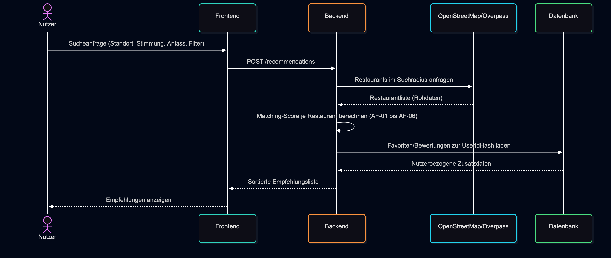
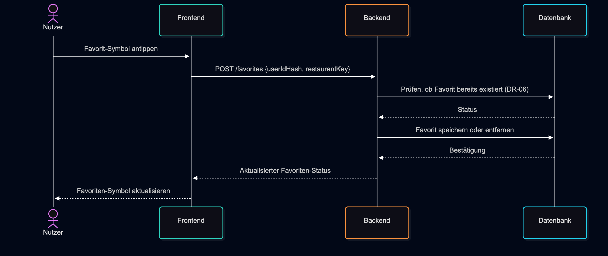
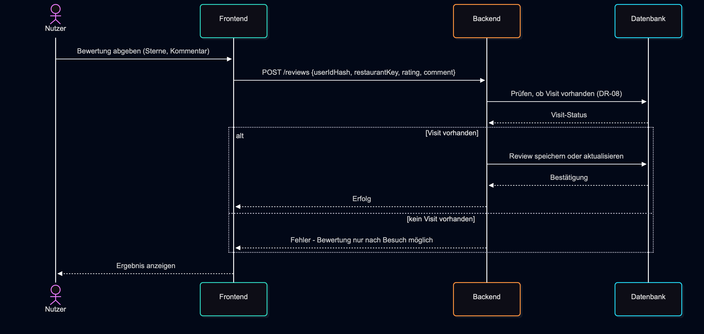

# A06 – Laufzeitsicht

Diese Datei zeigt architektonisch wichtige Abläufe von Food-Mood zur Laufzeit – also wie die Bausteine aus [A05 – Bausteinsicht](A05-Bausteinsicht.md) (Frontend, Backend, externe Restaurantquelle OpenStreetMap/Overpass, Datenbank) bei zentralen Vorgängen zusammenspielen. Es werden bewusst keine einzelnen UI-Klicks/Use-Cases im Detail gezeigt, sondern die Kommunikation zwischen den Architektur-Komponenten.

## A06.0 Überblick

| Abschnitt | Thema | Verknüpfung |
|---|---|---|
| [§ 6.1](#61-empfehlung-berechnen-uc-06) | Empfehlung berechnen | [UC-06](../specs/F2-Anwendungsfaelle.md), [AF-02](../specs/F3-Anwendungsfunktionen.md#af-02--personalisierte-empfehlungen-ermitteln) |
| [§ 6.2](#62-favorit-speichern-uc-09) | Favorit speichern | [UC-09](../specs/F2-Anwendungsfaelle.md), [D1 – Datenmodell](../specs/D1-Datenmodell.md) |
| [§ 6.3](#63-bewertung-speichern-uc-11) | Bewertung speichern | [UC-11](../specs/F2-Anwendungsfaelle.md), [D2 – Datentypen](../specs/D2-Datentypen.md) |
| [§ 6.4](#64-verwendete-komponenten-aus-a05) | Komponenten und Zusammenspiel | [A05 – Bausteinsicht](A05-Bausteinsicht.md), [A03 – Kontextabgrenzung](A03-Kontextabgrenzung.md) |

## § 6.1 Empfehlung berechnen (UC-06)

Quelldatei: [diagrams/runtime-recommendation.mmd](diagrams/runtime-recommendation.mmd)

Das Frontend sendet die aktuelle Suchanfrage (Standort, Stimmung, Anlass, Filter) an das Backend. Das Backend fragt passende Restaurants im Suchradius bei OpenStreetMap/Overpass ab, berechnet anschließend für jedes Restaurant einen Matching-Score (vgl. [F3 – Anwendungsfunktionen](../specs/F3-Anwendungsfunktionen.md), AF-01 bis AF-06) und reichert die Liste bei Bedarf mit nutzerbezogenen Daten (z. B. bereits gesetzte Favoriten) aus der Datenbank an. Das Ergebnis ist eine sortierte Empfehlungsliste, die an das Frontend zurückgegeben und dem Nutzer angezeigt wird.

## § 6.2 Favorit speichern (UC-09)

Quelldatei: [diagrams/runtime-favorite.mmd](diagrams/runtime-favorite.mmd)

Beim Antippen des Favoriten-Symbols sendet das Frontend die `UserIdHash` und den Restaurant-Schlüssel an das Backend. Das Backend prüft zunächst, ob für diese Kombination bereits ein Favorit existiert (Regel DR-06: höchstens ein aktiver Favorit pro Nutzer und Restaurant), speichert bzw. entfernt den Favorit in der Datenbank und meldet den neuen Status an das Frontend zurück. Die fachliche Basis dafür liegt in [D1 – Datenmodell](../specs/D1-Datenmodell.md) und [F2 – Anwendungsfälle](../specs/F2-Anwendungsfaelle.md).

## § 6.3 Bewertung speichern (UC-11)

Quelldatei: [diagrams/runtime-rating.mmd](diagrams/runtime-rating.mmd)

Vor dem Speichern einer Bewertung prüft das Backend in der Datenbank, ob für die Kombination aus Nutzer und Restaurant bereits ein Besuch (`Visit`) vorliegt (Regel DR-08: eine Bewertung ist nur nach einem Besuch zulässig). Ist das der Fall, wird die Bewertung gespeichert oder eine bestehende aktualisiert; andernfalls erhält das Frontend eine Fehlermeldung, die dem Nutzer verständlich angezeigt wird. Das entspricht den fachlichen Regeln aus [D2 – Datentypen](../specs/D2-Datentypen.md) und [F2 – Anwendungsfälle](../specs/F2-Anwendungsfaelle.md).

## § 6.4 Verwendete Komponenten (aus A05)

Alle drei Szenarien verwenden dieselben Architektur-Bausteine: **Frontend** (Benutzeroberfläche), **Backend** (Geschäftslogik, Matching, Validierung), **OpenStreetMap/Overpass** (externe Restaurantquelle, nur für Empfehlungen relevant) und **Datenbank** (persistente Speicherung von Favoriten, Besuchen und Bewertungen). Die Szenarien zeigen damit unterschiedliche, aber konsistente Kommunikationswege durch dieselbe Architektur. Die technische Einordnung ist in [A05 – Bausteinsicht](A05-Bausteinsicht.md) und der fachliche Rand in [A03 – Kontextabgrenzung](A03-Kontextabgrenzung.md) beschrieben.

