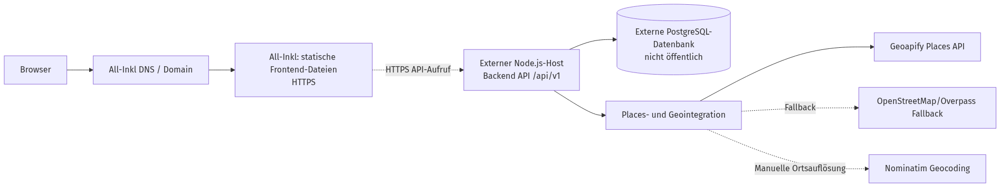

# A07 – Verteilungssicht

Diese Datei beschreibt, wie Food-Mood als Web-App bereitgestellt wird – also auf welcher Infrastruktur Frontend, Backend und Datenbank laufen und wie der Zugriff über die Domain erfolgt (bewusst technologieoffen gehalten, vgl. [S3 – Inbetriebnahme](../specs/S3-Inbetriebnahme.md)).

## A07.0 Überblick

| Abschnitt | Thema | Verknüpfung |
|---|---|---|
| [§ 7.1](#71-hosting) | Hosting und Laufzeitumgebung | [A04 – Lösungsstrategie](A04-Loesungsstrategie.md), [A05 – Bausteinsicht](A05-Bausteinsicht.md) |
| [§ 7.2](#72-domain-und-zugriff) | Domain und öffentliche Erreichbarkeit | [A02 – Randbedingungen](A02-Randbedingungen.md), [A03 – Kontextabgrenzung](A03-Kontextabgrenzung.md) |
| [§ 7.3](#73-entwicklungsumgebung) | lokale Entwicklung | [S3 – Inbetriebnahme](../specs/S3-Inbetriebnahme.md) |
| [§ 7.4](#74-produktivumgebung) | produktive Bereitstellung | [A09 – Architekturentscheidungen](A09-Architekturentscheidungen.md), [A02 – Randbedingungen](A02-Randbedingungen.md) |
| [§ 7.5](#75-diagramm-verteilungssicht) | Gesamtbild der Verteilung | [A06 – Laufzeitsicht](A06-Laufzeitsicht.md) |

## § 7.1 Hosting

Food-Mood wird als Web-App gehostet, nicht als native Mobile-App (vgl. ADR-03 in [A09 – Architekturentscheidungen](A09-Architekturentscheidungen.md)). Ein Webserver liefert das Frontend aus und leitet API-Anfragen an das Backend weiter. Die fachliche Einordnung dieser Bereitstellungsform findet sich in [A04 – Lösungsstrategie](A04-Loesungsstrategie.md) und in [A05 – Bausteinsicht](A05-Bausteinsicht.md).

## § 7.2 Domain

Die Anwendung ist über eine eigene Domain erreichbar. Die Domain zeigt per DNS-Eintrag auf die IP-Adresse des Webservers. Diese öffentliche Erreichbarkeit ist eine fachliche Randbedingung aus [A02 – Randbedingungen](A02-Randbedingungen.md) und bildet zugleich den Zugriffspfad aus [A03 – Kontextabgrenzung](A03-Kontextabgrenzung.md).

## § 7.3 Entwicklungsumgebung

In der Entwicklungsumgebung laufen Frontend und Backend lokal auf dem Rechner der Entwickler:innen (z. B. über einen lokalen Entwicklungsserver), zusammen mit einer lokalen oder containerisierten Test-Datenbank. Der Zugriff erfolgt über `localhost`, es wird keine öffentliche Domain benötigt. Die dazugehörigen Betriebs- und Startbedingungen sind in [S3 – Inbetriebnahme](../specs/S3-Inbetriebnahme.md) beschrieben.

## § 7.4 Produktivumgebung

In der Produktivumgebung ist die Domain öffentlich erreichbar und zeigt auf den Webserver. Der Webserver liefert die gebauten Frontend-Dateien aus und leitet Backend-Anfragen (z. B. `/api/...`) als Reverse Proxy an das Backend weiter. Das Backend verbindet sich mit der produktiven PostgreSQL-Datenbank, die nicht direkt aus dem Internet erreichbar ist. Die fachlichen und organisatorischen Rahmenbedingungen dazu sind in [A02 – Randbedingungen](A02-Randbedingungen.md) und [A09 – Architekturentscheidungen](A09-Architekturentscheidungen.md) dokumentiert.

### Zusätzlich beschrieben

- **Wo läuft das Frontend?** Als statisch gebaute Anwendung, ausgeliefert über den Webserver.
- **Wo läuft das Backend?** Als eigenständiger Dienst, erreichbar über den Webserver (Reverse Proxy).
- **Wo liegt die Datenbank?** Als PostgreSQL-Instanz, ausschließlich vom Backend aus erreichbar.
- **Wie erfolgt der Zugriff über die Domain?** Der Browser ruft die Domain auf; der DNS-Eintrag löst sie zur IP des Webservers auf; der Webserver terminiert die Verbindung (inkl. HTTPS) und leitet Anfragen an Frontend-Dateien bzw. an das Backend weiter.

## § 7.5 Diagramm: Verteilungssicht

Quelldatei: [diagrams/deployment.mmd](diagrams/deployment.mmd)

Das Diagramm zeigt den Weg einer Anfrage vom Browser über die Domain und den Webserver bis zum Backend und der Datenbank. Es ergänzt die Laufzeitlogik aus [A06 – Laufzeitsicht](A06-Laufzeitsicht.md) mit der Bereitstellungs- und Netzwerkperspektive aus [A05 – Bausteinsicht](A05-Bausteinsicht.md).