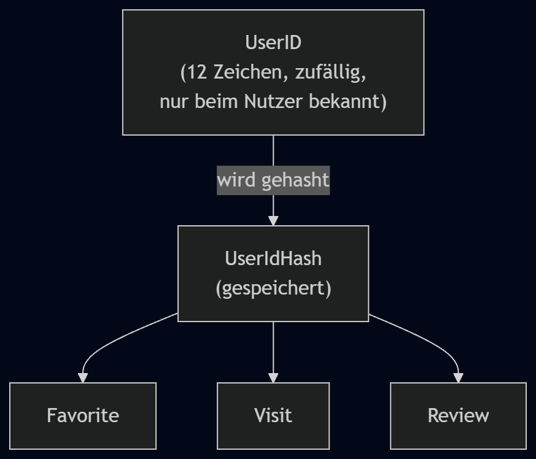

# A08 – Querschnittskonzepte

## A08.0 Überblick

| Abschnitt | Thema | Relevante Verknüpfungen |
|---|---|---|
| [§ 8.1](#81-userid-konzept-statt-login) | UserID statt klassischem Login | [D1 – Datenmodell](../specs/D1-Datenmodell.md), [D2 – Datentypen](../specs/D2-Datentypen.md), [A02 – Randbedingungen](A02-Randbedingungen.md) |
| [§ 8.2](#82-datenschutz-und-minimale-datenerhebung) | Schutz persönlicher und temporärer Daten | [N1 – Nichtfunktionale Anforderungen](../specs/N1-Nichtfunktionale-Anforderungen.md), [A03 – Kontextabgrenzung](A03-Kontextabgrenzung.md) |
| [§ 8.3](#83-validierung-fachlicher-regeln) | fachliche Validierung und Integrität | [F2 – Anwendungsfälle](../specs/F2-Anwendungsfaelle.md), [F3 – Anwendungsfunktionen](../specs/F3-Anwendungsfunktionen.md) |
| [§ 8.4](#84-fehlerbehandlung-bei-externen-daten) | Reaktionsmuster bei OSM/Overpass-Ausfällen | [S1 – Nachbarsysteme und externe APIs](../specs/S1-Nachbarsysteme-und-APIs.md), [A03 – Kontextabgrenzung](A03-Kontextabgrenzung.md) |
| [§ 8.5](#85-session-und-profilzustand) | aktive UserID, Sitzungszustand und Profilwechsel | [A05 – Bausteinsicht](A05-Bausteinsicht.md), [P2 – Fachlicher Architekturüberblick](../specs/P2-architekturueberblick.md) |

Die Querschnittskonzepte beschreiben Regeln, die mehrere Bausteine von Food-Mood gemeinsam betreffen. Sie ergänzen die fachliche Beschreibung aus [D1 – Datenmodell](../specs/D1-Datenmodell.md) und [D2 – Datentypen](../specs/D2-Datentypen.md), ohne die konkrete technische Umsetzung zu überzeichnen. Die wichtigsten Querschnittsfragen in Food-Mood sind: Wie erkennt das System einen Nutzer ohne Login? Welche Daten dürfen dauerhaft gespeichert werden? Welche Regeln müssen bei Standort, Bewertung und OSM-Daten immer gelten?

## § 8.1 UserID-Konzept (statt Login)

Food-Mood verwendet kein klassisches Benutzerkonto mit E-Mail, Passwort oder Registrierung. Die Identifikation des Nutzers erfolgt über eine anonyme, selbst verwaltete `UserID`, die beim ersten Start erzeugt wird. Dieses Konzept ist eine fachliche Architekturentscheidung aus [A02 – Randbedingungen](A02-Randbedingungen.md) und bildet den Kern des Datenschutz- und Profilmodells.

Bei der Initialisierung eines neuen Profils (UC-00) erzeugt Food-Mood eine zufällige, genau zwölf Zeichen lange `UserID` und zeigt sie dem Nutzer an. Die `UserID` selbst wird nicht im Klartext gespeichert. Vor der dauerhaften Speicherung wird sie gehasht, und nur der `UserIdHash` wird in der Datenbasis persistiert. Dadurch bleibt das Profil eindeutig identifizierbar, ohne dass der eigentliche Schlüssel sichtbar oder nachträglich rekonstruiert werden kann.

Möchte ein Nutzer ein bestehendes Profil laden oder wechseln (UC-01, UC-02), gibt er seine `UserID` erneut ein. Food-Mood wendet dasselbe Hash-Verfahren auf die Eingabe an und vergleicht den berechneten Wert mit dem gespeicherten `UserIdHash`. Stimmen beide überein, wird das zugehörige Profil geladen. Siehe auch [§ 8.5](#85-session-und-profilzustand) für den aktiven Profilzustand.

Favoriten, Besuche und Bewertungen werden nicht direkt mit der `UserID`, sondern mit dem `UserIdHash` verknüpft. Diese Zuordnung ist in [D1 – Datenmodell](../specs/D1-Datenmodell.md) als Fremdschlüssel im jeweiligen Objekt modelliert. Die eigentliche `UserID` bleibt damit an der Systemgrenze und wird nicht mehrfach in verschiedenen Datenstrukturen im Klartext weitergegeben.

## § 8.2 Datenschutz und minimale Datenerhebung

Food-Mood erhebt bewusst nur die minimal notwendigen Daten. Es gibt keine E-Mail-Adresse, kein Passwort, keine Benutzerregistrierung und keinen klassischen Nutzeraccount. Die Datenbasis enthält daher primär:

- den Namen des Nutzers zur persönlichen Begrüßung,
- den `UserIdHash` zur Identifikation des Profils,
- gespeicherte Favoriten,
- gespeicherte Besuche,
- eigene Bewertungen.

Wichtige fachliche Einschränkung: Standortdaten, Suchanfragen und kurzfristige Ergebnisse werden nur für die aktuelle Nutzung verarbeitet und nicht dauerhaft gespeichert. Der aktuelle Standort ist damit ein transientes Suchkriterium, kein Profilattribut. Das schützt die Privatsphäre und entspricht der Mehrfachforderung aus [A02 – Randbedingungen](A02-Randbedingungen.md) und [N1 – Nichtfunktionale Anforderungen](../specs/N1-Nichtfunktionale-Anforderungen.md). Siehe auch [§ 8.1](#81-userid-konzept-statt-login) und [§ 8.3](#83-validierung-fachlicher-regeln).

Außerdem gilt: Standort- und Suchtextdaten dürfen nicht nachträglich in Favoriten, Besuche oder Bewertungen kopiert werden. So bleibt die dauerhaft gespeicherte Datenbasis auf das Nötigste begrenzt. Diese Regel verhindert eine ungewollte Erstellung von Profilprofilen auf Basis von Ad-hoc-Suchverhalten und ist ein zentraler Beitrag zur Datenminimierung.

## § 8.3 Validierung fachlicher Regeln

Validierung ist in Food-Mood kein rein technisches Detail, sondern eine fachliche Sicherung der Konsistenz. Die wichtigsten Regeln ergeben sich aus [D1 – Datenmodell](../specs/D1-Datenmodell.md), [D2 – Datentypen](../specs/D2-Datentypen.md) und den Anwendungsfällen in [F2 – Anwendungsfälle](../specs/F2-Anwendungsfaelle.md).

| Regel | Bedeutung | fachliche Konsequenz |
|---|---|---|
| `UserName` | darf bei der Initialisierung nicht leer sein | Ein neues Profil kann nur mit einem gültigen Namen angelegt werden |
| `UserID` | wird intern zufällig und eindeutig erzeugt | Keine manuelle Eingabe bei der Neuanlage |
| `SearchRequest` | erfordert genau einen gültigen Standort und genau eine Stimmung | Eine Suchanfrage ohne Standort oder Stimmung ist fachlich ungültig |
| `Occasion` / Filter | optional, dürfen leer bleiben | Ein Anlass oder Filter kann gesetzt werden, muss aber nicht |
| `Suchradius` | nur 1 km, 3 km, 5 km oder 10 km | Die Suche bleibt innerhalb eines definierten Wertebereichs |
| `Rating` | ganzzahliger Wert zwischen 1 und 5 | Bewertungen bleiben konsistent und vergleichbar |
| `Review` | nur zulässig, wenn ein passender Besuch vorliegt | Bewertungen sind nur nach realisiertem Besuch möglich |

Diese Regeln stellen sicher, dass Daten nur in fachlich sinnvollen Zuständen entstehen. Die fachliche Integrität ist damit an mehreren Stellen geschützt: bereits beim Eingeben, beim Anlegen eines Profils und beim Speichern von Bewertungen oder Favoriten. Siehe auch [§ 8.4](#84-fehlerbehandlung-bei-externen-daten).

## § 8.4 Fehlerbehandlung bei externen Daten

Food-Mood arbeitet mit externen Restaurant- und Geodaten aus OpenStreetMap/Overpass. Diese Daten sind grundsätzlich nützlich, aber nicht immer vollständig, konsistent oder zeitlich aktuell. Deshalb muss die Anwendung Fehler und unvollständige Antworten an der Systemgrenze kontrolliert behandeln.

Die fachlichen Regeln aus [A03 – Kontextabgrenzung](A03-Kontextabgrenzung.md) und [S1 – Nachbarsysteme und externe APIs](../specs/S1-Nachbarsysteme-und-APIs.md) legen fest:

- Fehler bei der externen Anfrage müssen erkannt werden,
- unvollständige oder fehlerhafte Antwortdaten dürfen nicht in das interne Datenmodell übernommen werden,
- historische Nutzerdaten wie Favoriten, Besuche und Bewertungen dürfen durch externe Daten nie gelöscht oder überschrieben werden,
- vorhandene Restaurantanzeigedaten können nur als veraltete Anzeige aktualisiert werden, nicht als fachlich persistente Datenbasis.

Diese Regel ist besonders wichtig, weil Food-Mood externe Anbieter nicht als „verantwortliche Datenquelle“ für eigene Bewertungen, Favoriten oder Besuche benutzt. OpenStreetMap liefert nur Rohdaten; die eigenständigen Bewertungs- und Nutzerdaten bleiben im Systembereich von Food-Mood. Siehe auch [§ 8.3](#83-validierung-fachlicher-regeln).

## § 8.5 Session- und Profilzustand

Food-Mood verwendet keine klassische serverseitige Session mit Benutzerkonto, Cookie-Auth und Rollenmodell. Stattdessen ist der aktive Zustand des Nutzers durch die lokale `UserID` bzw. den `UserIdHash` des aktuellen Profils bestimmt. Der Nutzer bleibt über die laufende App-Nutzung als aktiver Benutzer identifiziert, bis er ein anderes Profil lädt oder die App-Daten lokal zurücksetzt.

Diese Logik ist im fachlichen Sinne eine Session-ähnliche Zustandsverwaltung:

- Nach dem erfolgreichen Laden oder Erstellen eines Profils wird die aktive `UserID` für die laufende App-Nutzung als aktuell gesetzt.
- Danach werden Favoriten, Besuche und Bewertungen automatisch dem aktiven Profil zugeordnet.
- Eine laufende Suchanfrage ist nur für die aktuelle Sitzung relevant und wird nicht als dauerhaftes Benutzerprofil gespeichert.
- Ein Wechsel des Profils ersetzt lediglich die aktive Identität; es gibt keinen klassischen Logout-Prozess im Sinne eines Benutzerkontos.

Damit bleibt das System einfach, schnell und datensparsam, ohne die fachlichen Anforderungen an Personalisierung zu verlieren. Siehe auch [§ 8.1](#81-userid-konzept-statt-login) und [§ 8.2](#82-datenschutz-und-minimale-datenerhebung).

## Diagramm: UserID-Konzept

Quelldatei: [diagrams/user-id-concept.mmd](diagrams/user-id-concept.mmd)

Das Diagramm zeigt den fachlichen Kern des Konzepts: Die vom Nutzer gehaltene `UserID` wird beim Speichern und beim Laden gehasht. Nur der `UserIdHash` wird dauerhaft gespeichert und dient als Schlüssel für die Zuordnung von `Favorite`, `Visit` und `Review` zum Nutzerprofil. Die eigentliche `UserID` bleibt damit außerhalb der persistierten Systemdaten und wird im Projektkontext als anonyme, leichtgewichtige Kennung verwaltet.