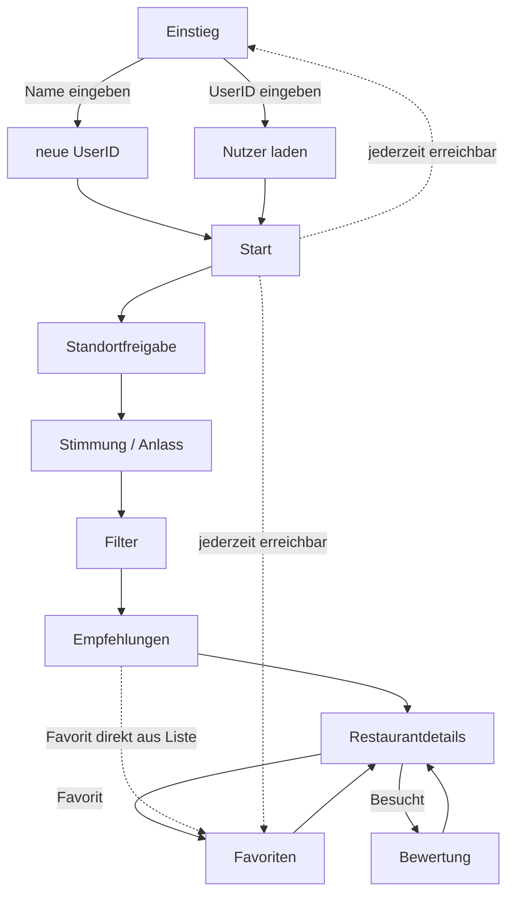

# B1 - Dialogspezifikation
Diese Datei beschreibt die Zentralen Ansichten der Foof-Mood App: Zweck, sichtbare Informationen, Eingabefelder, Aktionen, Navigation sowie Lade- Fehler- und Leerzustände. Die Skizzen sind bewusst einfach gehalten.

## Maskenübersicht

| ID | Maske | Zweck | Use Cases |
|---|---|---|---|
| M-00 | Einstieg | Nutzer erstellen oder laden | UC-00, UC-01 |
| M-01 | Start | Einstieg in Restaurantempfehlung | UC-03 |
| M-02 | Stimmung/Anlass | Präferenzen auswählen | UC-04 |
| M-03 | Filter | Suche eingrenzen | UC-05 |
| M-04 | Ergebnisse | Empfehlungen anzeigen | UC-06, UC-07 |
| M-05 | Restaurantdetails | Restaurant betrachten | UC-08 |
| M-06 | Favoriten | Favoriten anzeigen | UC-12 |
| M-07 | Besucht | Besuche und Bewertungen | UC-10, UC-11 |

## Navigation



## M-00 Einstieg

- **ID:** M-00
- **Name:** Einstieg
- **Zweck:** Ermöglicht dem Nutzer, ein neues Profil zu erstellen oder ein bestehendes Profil über seine UserID zu laden.
- **Statische GUI-Inhalte:** App-Titel "Food-Mood", Beschriftungen "Neues Profil erstellen" und "Vorhandenes Profil laden". Feldbeschriftungen "Name" und "UserID".
- **Dynamische GUI-Inhalte:** Fehlermeldung bei ungültiger/nicht gefundener UserID Ladeanzeige während das Profil erstellt/geladen wird.
- **Eingaben:** Freitextfeld "Name", Freitextfeld "UserID".
- **Aktionen:** "Neues Profil erstellen", "Profil laden".
- **Validierungen:** Name darf nicht leer sein (bei neuem Profil). UserID muss einem gültigen Format entsprechen und im System vorhanden sein (bei bestehendem Profil).
- **Navigation:** -> M-01 Start, sobald Profil erstellt oder geladen wurde.
- **Fehlerzustände:** UserID nicht gefunden/ungültig -> Hinweistext "UserID nicht gefunden. Bitte prüfen oder neues Profil erstellen". Name leer gelassen -> Hinweistext "Bitte einen Namen eingeben".
- **Zugehörige Use Cases:** UC-00.

## M-01 Startseite

- **ID:** M-01
- **Name:** Start
- **Zweck:** Einstiegspunkt in den eigentlichen Empfehlungsablauf.
- **Statische GUI-Inhalte:** App-Titel "Food-Mood". Slogan "Dein Mood, dein Biss". Beschriftung Button "Los geht's".
- **Dynamische GUI-Inhalte:** keine.
- **Eingaben:** keine.
- **Aktionen:** "Los geht's".
- **Validierungen:** nicht zutreffend.
- **Navigation:** -> M-02 Standortfreigabe.
- **Fehlerzustände:** keine.
- **Zugehörige Use Cases:** reiner Einstieg, kein dedizierter Use Case.

```Text
-----------------------------------------------------
|                    Food-Mood                      |
|               Dein Mood, dein Biss                |
|                                                   |
|         [ Los geht's / Restaurant finden]         |
-----------------------------------------------------
```

## M-02 Standortfreigabe

- **ID:** M-02
- **Name:** Standortfreigabe
- **Zweck:** Standort des Nutzers ermitteln, damit passende Restaurants in der Nähe gefunden werden können.
- **Statische GUI-Inhalte:** Hinweistext, warum der Standort gebraucht wird. Beschriftung Button "Standort freigeben". Beschriftung "oder Ort manuell eingeben". Beschriftung Button "Weiter".
- **Dynamische GUI-Inhalte:** Ladehinweis "Standort wird ermittelt …". Fehlermeldung bei abgelehnter/fehlgeschlagener Standortfreigabe.
- **Eingaben:** Freitextfeld "Ort oder Adresse eingeben".
- **Aktionen:** "Standort freigeben", "Weiter".
- **Validierungen:** Eingabefeld darf bei manueller Eingabe nicht leer sein. Eingegebener Ort muss auf eine gültige Position auflösbar sein.
- **Navigation:** -> M-03 Stimmung und Anlass.
- **Fehlerzustände:** Standortfreigabe abgelehnt oder Standortdienst nicht verfügbar -> Hinweistext, Weiterleitung zur manuellen Eingabe.
- **Zugehörige Use Cases:** UC-01.

```text
----------------------------------
|       Wo bist du gerade?       |
|                                |
|     [ Standort freigeben ]     |
|                                |
|   oder Ort manuell eingeben:   |
|   [ z.B. Frankfurt, Zeil 1 ]   |
|                                |
|            [ Weiter ]          |
----------------------------------
```

## M-03 Stimmung und Anlass

- **ID:** M-03
- **Name:** Stimmung & Anlass
- **Zweck:** Auswahl der aktuellen Stimmung und/oder des Anlasses.
- **Statische GUI-Inhalte:** Überschriften "Wie ist deine Stimmung?" und "Für welchen Anlass?" Beschriftung Button "Weiter".
- **Dynamische GUI-Inhalte:** Auswahlzustand der Stimmungs- und Anlass-Kacheln (welche gerade aktiv sind).
- **Eingaben:** keine Freitexteingabe, reine Auswahl per Klick (Stimmung: gemütlich, romantisch, schnell, gesellig, neu, günstig. Anlass: Date, Familie, Freunde, Mittagspause, Uni).
- **Aktionen:** Stimmungs-Kachel auswählen, Anlass-Kachel auswählen, "Weiter".
- **Validierungen:** mindestens eine Auswahl (Stimmung oder Anlass) muss getroffen sein, bevor "Weiter" aktiv wird.
- **Navigation:** -> M-04 Filterauswahl.
- **Fehlerzustände:** keine Auswahl getroffen und "Weiter" angetippt -> Hinweistext "Bitte wähle Stimmung und/oder Anlass aus".
- **Zugehörige Use Cases:** UC-02, UC-03.

```text
----------------------------------
|    Wie ist deine Stimmung?     |
|                                |
|  ( gemütlich ) ( romantisch )  |
|  (  schnell  ) (  gesellig  )  |
|                                |
|   Für welchen Anlass?          |
|  (   Date  ) (    Familie   )  |
|  ( Freunde ) ( Mittagspause )  |
|                                |
|          [ Weiter ]            |
----------------------------------
```

## M-04 Filterauswahl

- **ID:** M-04
- **Name:** Filterauswahl
- **Zweck:** Eingrenzung der Restaurantsuche über Filterkriterien.
- **Statische GUI-Inhalte:** Überschrift "Filter". Feldbeschriftungen "Preis", "Entfernung", "Küche", "Ernährung", "Bewertung". Beschriftung Schalter "nur geöffnete Restaurants". Beschriftungen Buttons "Zurücksetzen"/"Anzeigen".
- **Dynamische GUI-Inhalte:** aktueller Auswahlzustand aller Filter (welche Chips/Werte gerade aktiv sind).
- **Eingaben:** Auswahlfeld Entfernung, Mehrfachauswahl Küche, Mehrfachauswahl Ernährung, Auswahlfeld Mindestbewertung, Ein/Aus-Schalter "nur geöffnet".
- **Aktionen:** "Zurücksetzen", "Anzeigen".
- **Validierungen:** keine Pflichtfelder. Alle Filter sind optional und dürfen leer bleiben.
- **Navigation:** -> M-05 Empfehlungsliste.
- **Fehlerzustände:** nicht zutreffend.
- **Zugehörige Use Cases:** UC-03.

```text
------------------------------------
|            Filter                |
|                                  |
| Preis:      ( € )( €€ )( €€€ )   |
| Entfernung: [ bis 5 km v ]       |
| Küche:      ( Italienisch )      |
|             ( Asiatisch )        |
| Ernährung:  ( vegetarisch )      |
| Bewertung:  [ ab ★★★ v ]        |
| [ ] nur geöffnete Restaurants    |
|                                  |
| [ Zurücksetzen ]   [ Anzeigen ]  |
------------------------------------
```

## M-05 Empfehlungsliste

- **ID:** M-05
- **Name:** Empfehlungsliste
- **Zweck:** Anzeige der berechneten Restaurant Empfehlungen.
- **Statische GUI-Inhalte:** Überschrift "Empfehlungen für dich". Beschriftung Button "Filter anpassen".
- **Dynamische GUI-Inhalte:** Liste der Restaurant Einträge (Name, Küche, Entfernung, Preisklasse, Bewertung, Öffnungsstatus, Favoriten-Symbol-Zustand). Ladeanzeige, Fehlermeldung: Hinweis bei leerer Ergebnisliste.
- **Eingaben:** keine. Optional Sortier Auswahl.
- **Aktionen:** Restaurant antippen, Favoriten Symbol antippen, "Filter anpassen".
- **Validierungen:** nicht zutreffend.
- **Navigation:** -> M-06 Restaurantdetails. <- zurück zu M-04.
- **Fehlerzustände:** externe API nicht erreichbar -> Hinweis mit "Erneut versuchen". Keine passenden Restaurants gefunden -> Hinweis mit Verweis auf "Filter anpassen".
- **Zugehörige Use Cases:** UC-04, UC-05, UC-08.

```text
--------------------------------------
|  Empfehlungen für dich             |
|                                    |
|  Trattoria Bella      ★★★★  ♥    |
|  Italienisch · 800 m · €€          |
|  geöffnet                          |
|  -----------------------------     |
|  Sushi Zen            ★★★★★ ♡   |
|  Asiatisch · 1,2 km · €€€          |
|  geöffnet                          |
|  -----------------------------     |
|  ...                               |
|                                    |
|         [ Filter anpassen ]        |
--------------------------------------
```

## M-06 Restaurantsdetails

- **ID:** M-06
- **Name:** Restaurantdetails
- **Zweck:** Detailansicht eines Restaurants. Ermöglicht Favorisieren sowie "als besucht markieren und bewerten".
- **Statische GUI-Inhalte:** Beschriftungen Buttons "Favorit hinzufügen/entfernen", "Als besucht markieren", "Bewertung speichern", "Zurück zur Liste". Beschriftung "Bewertung", Beschriftung Kommentarfeld "Kommentar (optional)".
- **Dynamische GUI-Inhalte:** Restaurant Stammdaten (Name, Adresse, Küche, Preisklasse, Entfernung, Öffnungsstatus, Durchschnittsbewertung), Kartenausschnitt, eigene Sterne Bewertung (nach Aktivierung), Ladeanzeige, Fehlermeldung.
- **Eingaben:** Sterne Bewertung (1–5), Kommentarfeld (optional).
- **Aktionen:** "Favorit hinzufügen/entfernen", "Als besucht markieren", "Bewertung speichern", "Zurück zur Liste".
- **Validierungen:** Sterne-Bewertung ist Pflicht, sobald "Bewertung speichern" gedrückt wird (ganzzahlig, 1–5). Kommentar ist optional.
- **Navigation:** <- zurück zu M-05 bzw. M-07, je nachdem von wo geöffnet.
- **Fehlerzustände:** Detaildaten nicht ladbar -> Hinweis mit "Erneut versuchen". Bewertung nicht speicherbar (z.B. kein Netz) -> entsprechender Hinweis.
- **Zugehörige Use Cases:** UC-06, UC-07, UC-09.

```text
---------------------------------------
|  Beispiel Restaurant                |
|  Italienisch  €€  800m              |
|  ★★★★  (124 Bewertungen)          |
|  Babastraße 12, Frankfurt           |
|  geöffnet bis 22:00                 |
|  [ kleine Karte / Standort-Pin ]    |
|                                     |
|  [ Als besucht markieren ]          |
|   -> Bewertung: ★ ★ ★ ★ ★        |
|      Kommentar (optional): [....] m |
|      [ Bewertung speichern ]        |
|                                     |
|          [ Zurück zur Liste ]       |
---------------------------------------
```

## M-07 Favoriten

- **ID:** M-07
- **Name:** Favoriten
- **Zweck:** Übersicht und Verwaltung aller favorisierten Restaurants.
- **Statische GUI-Inhalte:** Überschrift "Deine Favoriten".
- **Dynamische GUI-Inhalte:** Liste der favorisierten Restaurants (Name, Küche, Entfernung, Bewertung, Öffnungsstatus, "Schon besucht" Badge). Ladeanzeige, Fehlermeldung: Hinweis bei leerer Liste.
- **Eingaben:** keine.
- **Aktionen:** Eintrag antippen, Favoriten Symbol antippen (entfernen).
- **Validierungen:** nicht zutreffend.
- **Navigation:** -> M-06 Restaurantdetails.
- **Fehlerzustände:** Favoriten nicht ladbar -> Hinweistext. Keine Favoriten vorhanden -> Hinweistext mit Link zur Empfehlungssuche.
- **Zugehörige Use Cases:** UC-07, UC-09.

```text
----------------------------------------
|  Deine Favoriten                     |
|                                      |
|  Beispiel Restaurant      ★★★★     |
|  Italienisch · 800 m · besucht ★★★★|
|  -----------------------------       |
|  Beispiel Restaurant 2    ★★★★★   |
|  Asiatisch · 1,2 km · noch nicht     |
|     besucht                          |
----------------------------------------
```