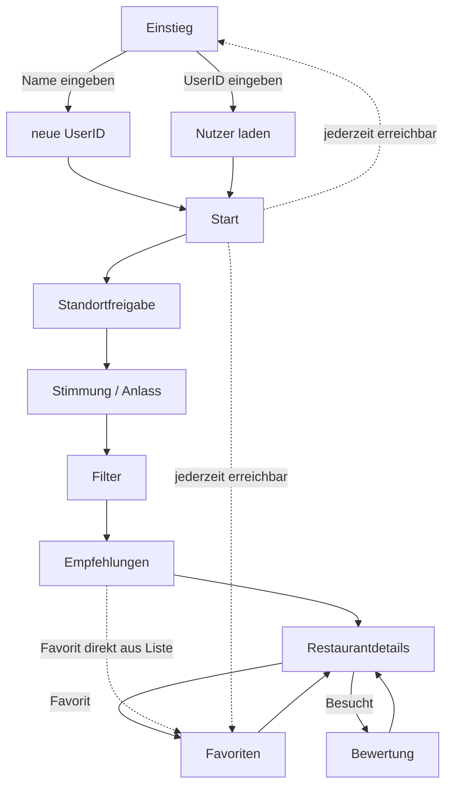
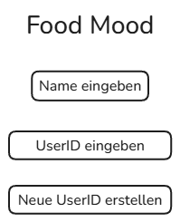
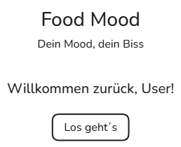
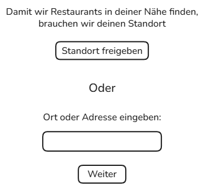
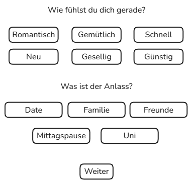
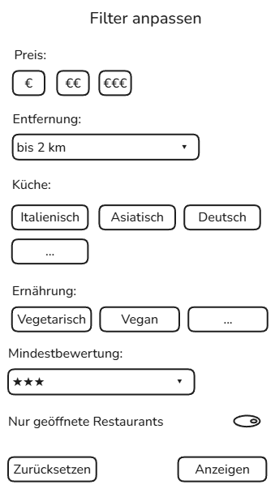
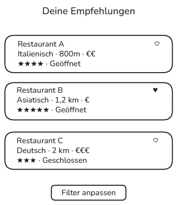
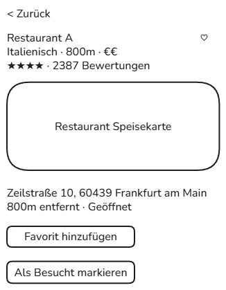
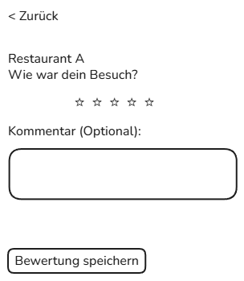
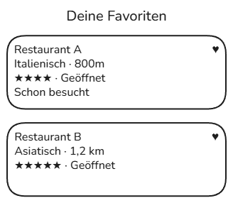

# B1 - Dialogspezifikation
Diese Datei beschreibt die Zentralen Ansichten der Foof-Mood App: Zweck, sichtbare Informationen, Eingabefelder, Aktionen, Navigation sowie Lade- Fehler- und Leerzustände. Die Skizzen sind bewusst einfach gehalten.

## Maskenübersicht

| ID | Maske | Zweck | Use Cases |
|---|---|---|---|
| M-00 | Einstieg | Nutzer erstellen oder laden | UC-00, UC-01 |
| M-01 | Start | Einstieg in Restaurantempfehlung | UC-03 |
| M-02 | Stimmung/Anlass | Präferenzen auswählen | UC-04 |
| M-03 | Filter | Suche eingrenzen | UC-05 |
| M-04 | Ergebnisse | Empfehlungen anzeigen | UC-06, UC-07 |
| M-05 | Restaurantdetails | Restaurant betrachten | UC-08 |
| M-06 | Favoriten | Favoriten anzeigen | UC-12 |
| M-07 | Besucht | Besuche und Bewertungen | UC-10, UC-11 |

## Navigation

## M-00 Einstieg

- **ID:** M-00
- **Name:** Einstieg
- **Zweck:** Ermöglicht dem Nutzer, ein neues Profil zu erstellen oder ein bestehendes Profil über seine UserID zu laden.
- **Statische GUI-Inhalte:** App-Titel "Food-Mood", Beschriftungen "Neues Profil erstellen" und "Vorhandenes Profil laden". Feldbeschriftungen "Name" und "UserID".
- **Dynamische GUI-Inhalte:** Fehlermeldung bei ungültiger/nicht gefundener UserID Ladeanzeige während das Profil erstellt/geladen wird.
- **Eingaben:** Freitextfeld "Name", Freitextfeld "UserID".
- **Aktionen:** "Neues Profil erstellen", "Profil laden".
- **Validierungen:** Name darf nicht leer sein (bei neuem Profil). UserID muss einem gültigen Format entsprechen und im System vorhanden sein (bei bestehendem Profil).
- **Navigation:** -> M-01 Start, sobald Profil erstellt oder geladen wurde.
- **Fehlerzustände:** UserID nicht gefunden/ungültig -> Hinweistext "UserID nicht gefunden. Bitte prüfen oder neues Profil erstellen". Name leer gelassen -> Hinweistext "Bitte einen Namen eingeben".
- **Zugehörige Use Cases:** UC-00.

### Mockup M-00 – Einstieg/UserID

- **Was sieht der Nutzer?** Eine kurze Begrüßung, ein Eingabefeld für den Namen sowie zwei Optionen: "Neue UserID erstellen" und "Bestehende UserID eingeben".
- **Was kann er tun?** Namen eingeben und eine neue UserID erzeugen lassen, oder eine vorhandene UserID eingeben, um sein bestehendes Profil zu laden.
- **Welche Daten sind dynamisch?** Die generierte UserID (wird erst nach Klick erzeugt), Fehlermeldung bei ungültiger/unbekannter UserID.
- **Welche Use Cases gehören dazu?** UC-00.

## M-01 Startseite

- **ID:** M-01
- **Name:** Start
- **Zweck:** Einstiegspunkt in den eigentlichen Empfehlungsablauf.
- **Statische GUI-Inhalte:** App-Titel "Food-Mood". Slogan "Dein Mood, dein Biss". Beschriftung Button "Los geht's".
- **Dynamische GUI-Inhalte:** keine.
- **Eingaben:** keine.
- **Aktionen:** "Los geht's".
- **Validierungen:** nicht zutreffend.
- **Navigation:** -> M-02 Standortfreigabe.
- **Fehlerzustände:** keine.
- **Zugehörige Use Cases:** reiner Einstieg, kein dedizierter Use Case.

### Mockup M-01 – Start

- **Was sieht der Nutzer?** App-Titel "Food-Mood", kurzer Slogan ("Dein Mood, dein Biss"), Begrüßung mit dem geladenen Namen, Button "Los geht's".
- **Was kann er tun?** Auf "Los geht's" klicken, um mit der Standortfreigabe fortzufahren.
- **Welche Daten sind dynamisch?** Der angezeigte Name des Nutzers (kommt aus M-00 Einstieg).
- **Welche Use Cases gehören dazu?** reiner Einstiegspunkt in den Suchablauf, kein eigener Use Case.

## M-02 Standortfreigabe

- **ID:** M-02
- **Name:** Standortfreigabe
- **Zweck:** Standort des Nutzers ermitteln, damit passende Restaurants in der Nähe gefunden werden können.
- **Statische GUI-Inhalte:** Hinweistext, warum der Standort gebraucht wird. Beschriftung Button "Standort freigeben". Beschriftung "oder Ort manuell eingeben". Beschriftung Button "Weiter".
- **Dynamische GUI-Inhalte:** Ladehinweis "Standort wird ermittelt …". Fehlermeldung bei abgelehnter/fehlgeschlagener Standortfreigabe.
- **Eingaben:** Freitextfeld "Ort oder Adresse eingeben".
- **Aktionen:** "Standort freigeben", "Weiter".
- **Validierungen:** Eingabefeld darf bei manueller Eingabe nicht leer sein. Eingegebener Ort muss auf eine gültige Position auflösbar sein.
- **Navigation:** -> M-03 Stimmung und Anlass.
- **Fehlerzustände:** Standortfreigabe abgelehnt oder Standortdienst nicht verfügbar -> Hinweistext, Weiterleitung zur manuellen Eingabe.
- **Zugehörige Use Cases:** UC-01.

### Mockup M-02 – Standortfreigabe

- **Was sieht der Nutzer?** Kurzen Hinweistext, warum der Standort benötigt wird, einen Button zur automatischen Freigabe sowie eine Alternative zur manuellen Eingabe.
- **Was kann er tun?** Standort automatisch freigeben oder Ort/Adresse manuell eingeben und bestätigen.
- **Welche Daten sind dynamisch?** Ladehinweis "Standort wird ermittelt …", Fehlermeldung bei abgelehnter Freigabe oder nicht verfügbarem Standortdienst, der eingegebene Ortstext.
- **Welche Use Cases gehören dazu?** UC-01.

## M-03 Stimmung und Anlass

- **ID:** M-03
- **Name:** Stimmung & Anlass
- **Zweck:** Auswahl der aktuellen Stimmung und/oder des Anlasses.
- **Statische GUI-Inhalte:** Überschriften "Wie ist deine Stimmung?" und "Für welchen Anlass?" Beschriftung Button "Weiter".
- **Dynamische GUI-Inhalte:** Auswahlzustand der Stimmungs- und Anlass-Kacheln (welche gerade aktiv sind).
- **Eingaben:** keine Freitexteingabe, reine Auswahl per Klick (Stimmung: gemütlich, romantisch, schnell, gesellig, neu, günstig. Anlass: Date, Familie, Freunde, Mittagspause, Uni).
- **Aktionen:** Stimmungs-Kachel auswählen, Anlass-Kachel auswählen, "Weiter".
- **Validierungen:** mindestens eine Auswahl (Stimmung oder Anlass) muss getroffen sein, bevor "Weiter" aktiv wird.
- **Navigation:** -> M-04 Filterauswahl.
- **Fehlerzustände:** keine Auswahl getroffen und "Weiter" angetippt -> Hinweistext "Bitte wähle Stimmung und/oder Anlass aus".
- **Zugehörige Use Cases:** UC-02, UC-03.

### Mockup M-03 – Stimmung und Anlass

- **Was sieht der Nutzer?** Anklickbare Kacheln für Stimmungen (gemütlich, romantisch, schnell, gesellig, neu, günstig) und für Anlässe (Date, Familie, Freunde, Mittagspause, Uni).
- **Was kann er tun?** Eine oder mehrere Stimmungs-/Anlass-Kacheln auswählen und mit "Weiter" bestätigen.
- **Welche Daten sind dynamisch?** Der optische Auswahlzustand der Kacheln (ausgewählt/nicht ausgewählt). Der "Weiter"-Button wird erst aktiv, sobald mindestens eine Auswahl getroffen wurde.
- **Welche Use Cases gehören dazu?** UC-02, UC-03.

## M-04 Filterauswahl

- **ID:** M-04
- **Name:** Filterauswahl
- **Zweck:** Eingrenzung der Restaurantsuche über Filterkriterien.
- **Statische GUI-Inhalte:** Überschrift "Filter". Feldbeschriftungen "Preis", "Entfernung", "Küche", "Ernährung", "Bewertung". Beschriftung Schalter "nur geöffnete Restaurants". Beschriftungen Buttons "Zurücksetzen"/"Anzeigen".
- **Dynamische GUI-Inhalte:** aktueller Auswahlzustand aller Filter (welche Chips/Werte gerade aktiv sind).
- **Eingaben:** Auswahlfeld Entfernung, Mehrfachauswahl Küche, Mehrfachauswahl Ernährung, Auswahlfeld Mindestbewertung, Ein/Aus-Schalter "nur geöffnet".
- **Aktionen:** "Zurücksetzen", "Anzeigen".
- **Validierungen:** keine Pflichtfelder. Alle Filter sind optional und dürfen leer bleiben.
- **Navigation:** -> M-05 Empfehlungsliste.
- **Fehlerzustände:** nicht zutreffend.
- **Zugehörige Use Cases:** UC-03.

### Mockup M-04 – Filter

- **Was sieht der Nutzer?** Filteroptionen für Preis, Entfernung, Küche, Ernährung, Mindestbewertung sowie einen Schalter "nur geöffnete Restaurants".
- **Was kann er tun?** Filter setzen, zurücksetzen und die gefilterte Suche über "Anzeigen" starten.
- **Welche Daten sind dynamisch?** Die aktuell gewählten Filterwerte, ob der "Anzeigen"-Button aktiv ist, hängt vom Auswahlstatus ab.
- **Welche Use Cases gehören dazu?** UC-03.

## M-05 Empfehlungsliste

- **ID:** M-05
- **Name:** Empfehlungsliste
- **Zweck:** Anzeige der berechneten Restaurant Empfehlungen.
- **Statische GUI-Inhalte:** Überschrift "Empfehlungen für dich". Beschriftung Button "Filter anpassen".
- **Dynamische GUI-Inhalte:** Liste der Restaurant Einträge (Name, Küche, Entfernung, Preisklasse, Bewertung, Öffnungsstatus, Favoriten-Symbol-Zustand). Ladeanzeige, Fehlermeldung: Hinweis bei leerer Ergebnisliste.
- **Eingaben:** keine. Optional Sortier Auswahl.
- **Aktionen:** Restaurant antippen, Favoriten Symbol antippen, "Filter anpassen".
- **Validierungen:** nicht zutreffend.
- **Navigation:** -> M-06 Restaurantdetails. <- zurück zu M-04.
- **Fehlerzustände:** externe API nicht erreichbar -> Hinweis mit "Erneut versuchen". Keine passenden Restaurants gefunden -> Hinweis mit Verweis auf "Filter anpassen".
- **Zugehörige Use Cases:** UC-04, UC-05, UC-08.

### Mockup M-05 – Ergebnisse (Empfehlungen)

- **Was sieht der Nutzer?** Eine Liste berechneter Restaurant Empfehlungen mit Name, Küche, Entfernung, Preisklasse, Bewertung, Öffnungsstatus und Favoriten Symbol je Eintrag.
- **Was kann er tun?** Einen Eintrag antippen (öffnet Restaurantdetails), direkt aus der Liste favorisieren, Filter erneut anpassen.
- **Welche Daten sind dynamisch?** Die komplette Liste inkl. aller Restaurantdaten (kommt live von der API), Ladezustand während der Berechnung, Leerzustand bei keinen Treffern.
- **Welche Use Cases gehören dazu?** UC-04, UC-05, UC-08.

## M-06 Restaurantsdetails

- **ID:** M-06
- **Name:** Restaurantdetails
- **Zweck:** Detailansicht eines Restaurants. Ermöglicht Favorisieren sowie "als besucht markieren und bewerten".
- **Statische GUI-Inhalte:** Beschriftungen Buttons "Favorit hinzufügen/entfernen", "Als besucht markieren", "Bewertung speichern", "Zurück zur Liste". Beschriftung "Bewertung", Beschriftung Kommentarfeld "Kommentar (optional)".
- **Dynamische GUI-Inhalte:** Restaurant Stammdaten (Name, Adresse, Küche, Preisklasse, Entfernung, Öffnungsstatus, Durchschnittsbewertung), Kartenausschnitt, eigene Sterne Bewertung (nach Aktivierung), Ladeanzeige, Fehlermeldung.
- **Eingaben:** Sterne Bewertung (1–5), Kommentarfeld (optional).
- **Aktionen:** "Favorit hinzufügen/entfernen", "Als besucht markieren", "Bewertung speichern", "Zurück zur Liste".
- **Validierungen:** Sterne-Bewertung ist Pflicht, sobald "Bewertung speichern" gedrückt wird (ganzzahlig, 1–5). Kommentar ist optional.
- **Navigation:** <- zurück zu M-05 bzw. M-07, je nachdem von wo geöffnet.
- **Fehlerzustände:** Detaildaten nicht ladbar -> Hinweis mit "Erneut versuchen". Bewertung nicht speicherbar (z.B. kein Netz) -> entsprechender Hinweis.
- **Zugehörige Use Cases:** UC-06, UC-07, UC-09.

### Mockup M-06 – Restaurantdetails

- **Was sieht der Nutzer?** Name, Adresse, Küche, Preisklasse, Entfernung, Öffnungsstatus, Durchschnittsbewertung und eine kleine Karte des Restaurants.
- **Was kann er tun?** Favorit hinzufügen/entfernen, das Restaurant als besucht markieren, zurück zur Liste navigieren.
- **Welche Daten sind dynamisch?** Alle Detaildaten des Restaurants (werden ggf. nachgeladen), aktueller Favoriten-Status, aktueller Öffnungsstatus.
- **Welche Use Cases gehören dazu?** UC-06, UC-07.

### Mockup Bewertung (Zustand innerhalb M-06)

- **Was sieht der Nutzer?** Ein Bewertungsbereich mit Sterne-Auswahl (1–5) und optionalem Kommentarfeld, der erscheint, nachdem "Als besucht markieren" angeklickt wurde.
- **Was kann er tun?** Eine Sternebewertung vergeben, optional einen Kommentar eingeben und die Bewertung speichern.
- **Welche Daten sind dynamisch?** Die aktuell gewählte Sternezahl, der eingegebene Kommentar, Bestätigungs-/Fehlermeldung nach dem Speichern.
- **Welche Use Cases gehören dazu?** UC-09.

## M-07 Favoriten

- **ID:** M-07
- **Name:** Favoriten
- **Zweck:** Übersicht und Verwaltung aller favorisierten Restaurants.
- **Statische GUI-Inhalte:** Überschrift "Deine Favoriten".
- **Dynamische GUI-Inhalte:** Liste der favorisierten Restaurants (Name, Küche, Entfernung, Bewertung, Öffnungsstatus, "Schon besucht" Badge). Ladeanzeige, Fehlermeldung: Hinweis bei leerer Liste.
- **Eingaben:** keine.
- **Aktionen:** Eintrag antippen, Favoriten Symbol antippen (entfernen).
- **Validierungen:** nicht zutreffend.
- **Navigation:** -> M-06 Restaurantdetails.
- **Fehlerzustände:** Favoriten nicht ladbar -> Hinweistext. Keine Favoriten vorhanden -> Hinweistext mit Link zur Empfehlungssuche.
- **Zugehörige Use Cases:** UC-07, UC-09.

### Mockup M-07 – Favoriten/Besucht

- **Was sieht der Nutzer?** Liste favorisierter Restaurants mit Name, Küche, Entfernung, Bewertung, Öffnungsstatus sowie einem "Schon besucht"-Badge, falls zutreffend.
- **Was kann er tun?** Einen Eintrag öffnen (Restaurantdetails), einen Eintrag aus den Favoriten entfernen.
- **Welche Daten sind dynamisch?** Die Favoritenliste selbst, der "Schon besucht"-Status je Eintrag, Leerzustand bei keinen Favoriten.
- **Welche Use Cases gehören dazu?** UC-07, UC-09.