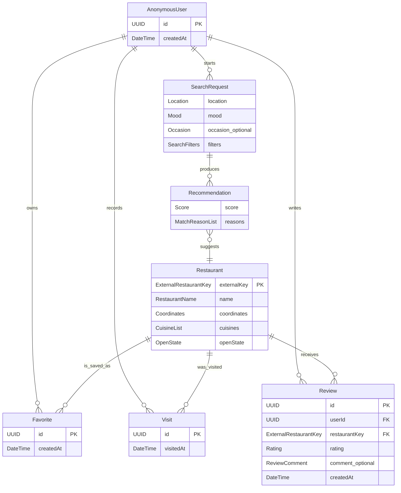

# D1 – Fachliches Datenmodell

## D1.1 Zweck und Modellgrenze

Das fachliche Datenmodell beschreibt die Informationen, mit denen Food-Mood seine Anwendungsfälle erfüllt. Es unterscheidet zwischen kurzlebigen Suchdaten und dauerhaft gespeicherten App-Daten.

- **Kurzlebig:** Standort, Suchanfrage und berechnete Empfehlungen existieren nur während des Suchvorgangs.
- **Dauerhaft:** anonyme Nutzerkennung, Restaurantreferenzen, Favoriten, Besuche und eigene Bewertungen bleiben nach einem Neustart erhalten.
- **Extern:** Restaurantstammdaten werden von OpenStreetMap/Overpass geliefert. Food-Mood speichert keine selbst gepflegte vollständige Restaurantdatenbank.

Die exakten Feldtypen und Wertebereiche sind in [D2 – Datentypenverzeichnis](D2-Datentypenverzeichnis.md) definiert.

## D1.2 Fachliche Objekte

### `AnonymousUser` – anonymer Nutzer

Repräsentiert eine App-Installation ohne Login, Namen oder E-Mail-Adresse. Die technische Kennung ordnet Favoriten, Besuche und Bewertungen derselben Installation zu. Sie ist kein öffentliches Benutzerprofil.

### `Location` – Suchstandort

Enthält Koordinaten, einen optionalen Anzeigenamen, die Herkunft des Standorts und bei automatischer Ortung die gemeldete Genauigkeit. `Location` wird nur für die aktuelle Suche verwendet und nicht dauerhaft gespeichert.

### `SearchRequest` – Suchanfrage

Bündelt den aktuellen Standort, genau eine Stimmung, einen optionalen Anlass und optionale Filter. Jede Restaurantempfehlung lässt sich auf eine `SearchRequest` zurückführen.

### `SearchFilters` – Suchfilter

Enthält den maximalen Suchradius, gewünschte Küchen, Ernährungsoptionen und die Option „nur derzeit geöffnet“. Ein Mindestwert für eigene Food-Mood-Bewertungen ist möglich. Ein Preisfilter gehört nicht zum OSM-basierten MVP, weil OpenStreetMap kein verlässliches Preisniveau liefert.

### `Restaurant` – normalisiertes Restaurant

Stellt einen extern gefundenen gastronomischen Ort im einheitlichen Food-Mood-Format dar. Der externe Schlüssel besteht aus Datenanbieter, OSM-Objekttyp und OSM-ID. Optionale Angaben bleiben unbekannt, wenn die externe Quelle sie nicht liefert.

Ein `Restaurant` wird nur dauerhaft referenziert, wenn mindestens ein Favorit, Besuch oder eine Bewertung darauf verweist. Bei einer neuen Suche können die anzeigbaren Restaurantdaten aus der externen Quelle aktualisiert werden.

### `Recommendation` – Empfehlung

Verknüpft eine Suchanfrage mit einem Restaurant. Sie enthält den berechneten Match-Score und kurze, nachvollziehbare Gründe, beispielsweise „vegetarische Auswahl“, „nur 800 m entfernt“ oder „passt zur Stimmung SCHNELL“. Die Empfehlung selbst wird im MVP nicht dauerhaft gespeichert.

### `Favorite` – Favorit

Verknüpft einen anonymen Nutzer mit einem Restaurant und speichert den Zeitpunkt der Favorisierung. Pro Nutzer und Restaurant existiert höchstens ein aktiver Favorit.

### `Visit` – Besuch

Dokumentiert, dass ein anonymer Nutzer ein Restaurant besucht hat. Mehrere Besuche desselben Restaurants sind erlaubt, damit die Historie fachlich korrekt bleibt.

### `Review` – eigene Bewertung

Gehört genau zu einem anonymen Nutzer und einem Restaurant. Sie enthält eine ganzzahlige Sternebewertung von 1 bis 5 sowie einen optionalen kurzen Kommentar. Pro Nutzer und Restaurant existiert höchstens eine Bewertung; diese kann später aktualisiert werden. Eine Bewertung ist nur zulässig, wenn für denselben Nutzer und dasselbe Restaurant mindestens ein `Visit` vorhanden ist.

## D1.3 Zusammenhänge

`SearchRequest` ist im Diagramm einem `AnonymousUser` zugeordnet, wird aber gemäß NFA-6 nicht dauerhaft gespeichert. Die Beziehung dient ausschließlich der Verarbeitung einer laufenden Sitzung.

## D1.4 Persistenzsicht

| Objekt | Dauerhaft gespeichert? | Begründung |
|---|---|---|
| `AnonymousUser` | ja | Zuordnung lokaler Nutzerdaten ohne Login |
| `Location` | nein | Datenschutz; nur für die aktuelle Suche erforderlich |
| `SearchRequest` | nein | MVP benötigt keine Suchhistorie |
| `SearchFilters` | nein | Bestandteil der aktuellen Suchanfrage |
| `Restaurant` | bedingt | nur als Referenz für Favorit, Besuch oder Bewertung; externe Daten bleiben führend |
| `Recommendation` | nein | wird für jede Suche neu berechnet |
| `Favorite` | ja | muss nach Neustart erhalten bleiben |
| `Visit` | ja | Grundlage der Besuchshistorie und Voraussetzung einer Bewertung |
| `Review` | ja | eigene Bewertung muss dauerhaft verfügbar und ihrem Nutzer und Restaurant zuordenbar sein |

## D1.5 Fachliche Regeln

| ID | Regel |
|---|---|
| DR-01 | Jede `SearchRequest` enthält genau einen gültigen `Location` und genau einen `Mood`. |
| DR-02 | `Occasion` und alle Suchfilter sind optional. |
| DR-03 | Der Suchradius beträgt im MVP 1 km, 3 km, 5 km oder 10 km. |
| DR-04 | Ein Restaurant wird eindeutig durch `ExternalRestaurantKey` identifiziert, nicht allein durch seinen Namen. |
| DR-05 | Unbekannte externe Werte werden als unbekannt behandelt und nicht durch erfundene Standardwerte ersetzt. |
| DR-06 | Pro `AnonymousUser` und `Restaurant` existiert höchstens ein `Favorite`. |
| DR-07 | Ein `Visit` gehört genau zu einem Nutzer und genau zu einem Restaurant. |
| DR-08 | Ein `Review` gehört genau zu einem `AnonymousUser` und einem `Restaurant`. Die Kombination aus Nutzer und Restaurant ist eindeutig. Mindestens ein passender `Visit` muss vorhanden sein. |
| DR-09 | `Rating` ist eine ganze Zahl zwischen 1 und 5. |
| DR-10 | Eine durchschnittliche Food-Mood-Bewertung wird ausschließlich aus eigenen `Review`-Einträgen berechnet. Ohne Bewertungen ist der Durchschnitt nicht `0`, sondern nicht vorhanden. |
| DR-11 | Restaurantdaten aus einer neuen externen Antwort dürfen veraltete optionale Anzeigedaten aktualisieren, aber keine Besuche, Favoriten oder Bewertungen löschen. |
| DR-12 | Standortdaten und Suchtext dürfen nicht in `Favorite`, `Visit` oder `Review` kopiert werden. |

## D1.6 Ableitung der durchschnittlichen Bewertung

Die angezeigte Food-Mood-Bewertung ist ein berechneter Wert:

`averageRating = Summe aller Review.rating des Restaurants / Anzahl dieser Reviews`

Zusätzlich wird die Anzahl der Bewertungen angezeigt. Bei null Bewertungen lautet die Anzeige „Noch keine Bewertungen“. Externe OSM-Daten fließen nicht in diesen Durchschnitt ein.

## D1.7 Abdeckung der Anwendungsfälle

| Anwendungsfälle | Beteiligte fachliche Objekte |
|---|---|
| UC-01, UC-02 Standort bestimmen | `Location` |
| UC-03, UC-04, UC-05 Auswahl und Filter | `SearchRequest`, `SearchFilters`, `Mood`, `Occasion` |
| UC-06 Empfehlungen berechnen | `SearchRequest`, `Restaurant`, `Recommendation` |
| UC-07, UC-08 Ergebnisse und Details | `Restaurant`, `Recommendation` |
| UC-09 Favorisieren, UC-12 Favoriten anzeigen | `AnonymousUser`, `Restaurant`, `Favorite` |
| UC-10 Besuch markieren, UC-13 Besuche anzeigen | `AnonymousUser`, `Restaurant`, `Visit` |
| UC-11 Bewertung abgeben | `AnonymousUser`, `Restaurant`, `Visit`, `Review` |
| UC-14 API-Fehler behandeln | keine dauerhafte Fachdatenänderung |

## D1.8 Nicht im MVP-Datenmodell

- registrierte Benutzerkonten, Rollen oder Passwörter
- Reservierungen und Bestellungen
- Zahlungsdaten
- eine selbst gepflegte vollständige Restaurantdatenbank
- externe Rezensionstexte
- verlässliche Preisstufen
- dauerhaft gespeicherte Standort- oder Suchhistorie

## D1.9 Akzeptanzkriterien

- Alle Objekte besitzen eine klare fachliche Verantwortung.
- Dauerhafte und temporäre Daten sind eindeutig getrennt.
- Favoriten, Besuche und Bewertungen sind einer anonymen Installation zuordenbar.
- Eine Bewertung kann fachlich und technisch nur entstehen, wenn derselbe Nutzer das Restaurant zuvor als besucht markiert hat.
- Restaurants bleiben auch bei identischen Namen durch den externen Schlüssel unterscheidbar.
- Das Modell setzt keine externen Bewertungen, Preise oder vollständig gepflegten OSM-Tags voraus.
- Bezeichnungen der Objekte und Typen stimmen mit D2 überein und werden später im Code beibehalten.
