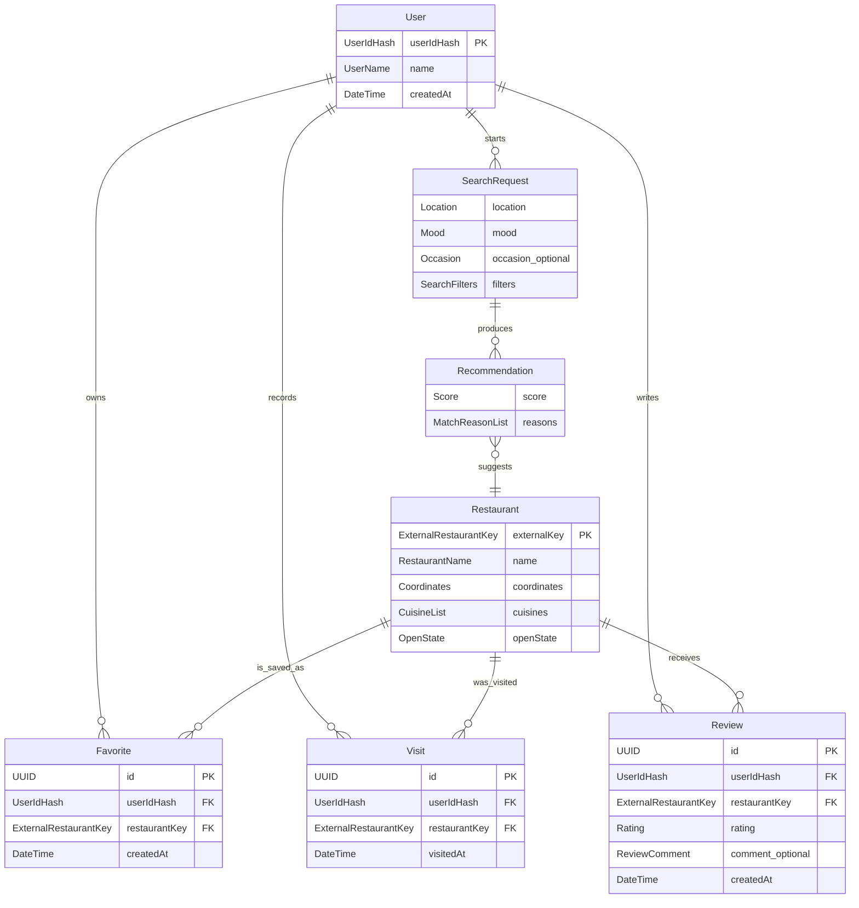

# D1 – Fachliches Datenmodell

## D1.1 Zweck und Modellgrenze

Das fachliche Datenmodell beschreibt die Informationen, mit denen Food-Mood seine Anwendungsfälle erfüllt. Es unterscheidet zwischen kurzlebigen Suchdaten und dauerhaft gespeicherten App-Daten.

- **Kurzlebig:** Standort, Suchanfrage und berechnete Empfehlungen existieren nur während des Suchvorgangs.
- **Dauerhaft:** Nutzername, Hash der UserID, Restaurantreferenzen, Favoriten, Besuche und eigene Bewertungen bleiben nach einem Neustart erhalten.
- **Extern:** Restaurantstammdaten werden von OpenStreetMap/Overpass geliefert. Food-Mood speichert keine selbst gepflegte vollständige Restaurantdatenbank.

Die exakten Feldtypen und Wertebereiche sind in [D2 – Datentypenverzeichnis](D2-Datentypen.md) definiert.

## D1.2 Fachliche Objekte

### `User` – Nutzerprofil ohne Passwort

Repräsentiert ein einfaches Nutzerprofil ohne E-Mail-Adresse und Passwort. Bei der Initialisierung gibt der Nutzer einen Namen ein. Food-Mood erzeugt daraufhin eine zufällige, genau zwölf Zeichen lange `UserId` und zeigt sie dem Nutzer an. Mit dieser UserID kann das Profil bei einem späteren Aufruf erneut geladen oder auf demselben Gerät gewechselt werden.

Die UserID wird nicht im Klartext gespeichert und ist kein Bestandteil einer persönlichen URL. Vor der dauerhaften Speicherung wird sie gehasht. Food-Mood sucht ein bestehendes Profil, indem es die eingegebene UserID mit demselben Verfahren hasht und den Wert mit dem gespeicherten `UserIdHash` vergleicht. Favoriten, Besuche und Bewertungen werden intern über den `UserIdHash` dem richtigen Nutzerprofil zugeordnet.

Eine Registrierung mit E-Mail-Adresse und Passwort gehört nicht zur ersten Version.

### `Location` – Suchstandort

Enthält Koordinaten, einen optionalen Anzeigenamen, die Herkunft des Standorts und bei automatischer Ortung die gemeldete Genauigkeit. `Location` wird nur für die aktuelle Suche verwendet und nicht dauerhaft gespeichert.

### `SearchRequest` – Suchanfrage

Bündelt den aktuellen Standort, genau eine Stimmung, einen optionalen Anlass und optionale Filter. Jede Restaurantempfehlung lässt sich auf eine `SearchRequest` zurückführen.

### `SearchFilters` – Suchfilter

Enthält den maximalen Suchradius, gewünschte Küchen, Ernährungsoptionen und die Option „nur derzeit geöffnet“. Ein Mindestwert für eigene Food-Mood-Bewertungen ist möglich. Ein Preisfilter gehört nicht zum OSM-basierten MVP, weil OpenStreetMap kein verlässliches Preisniveau liefert.

### `Restaurant` – normalisiertes Restaurant

Stellt einen extern gefundenen gastronomischen Ort im einheitlichen Food-Mood-Format dar. Der externe Schlüssel besteht aus OSM-Objekttyp und OSM-ID. Optionale Angaben bleiben unbekannt, wenn die externe Quelle sie nicht liefert.

Ein `Restaurant` wird nur dauerhaft referenziert, wenn mindestens ein Favorit, Besuch oder eine Bewertung darauf verweist. Bei einer neuen Suche können die anzeigbaren Restaurantdaten aus der externen Quelle aktualisiert werden.

### `Recommendation` – Empfehlung

Verknüpft eine Suchanfrage mit einem Restaurant. Sie enthält den berechneten Match-Score und kurze, nachvollziehbare Gründe, beispielsweise „vegetarische Auswahl“, „nur 800 m entfernt“ oder „passt zur Stimmung SCHNELL“. Die Empfehlung selbst wird im MVP nicht dauerhaft gespeichert.

### `Favorite` – Favorit

Verknüpft ein Nutzerprofil mit einem Restaurant und speichert den Zeitpunkt der Favorisierung. Pro Nutzer und Restaurant existiert höchstens ein aktiver Favorit.

### `Visit` – Besuch

Dokumentiert, dass ein Nutzer ein Restaurant besucht hat. Mehrere Besuche desselben Restaurants sind erlaubt, damit die Historie fachlich korrekt bleibt.

### `Review` – eigene Bewertung

Gehört genau zu einem Nutzerprofil und einem Restaurant. Sie enthält eine ganzzahlige Sternebewertung von 1 bis 5 sowie einen optionalen kurzen Kommentar. Pro Nutzer und Restaurant existiert höchstens eine Bewertung; diese kann später aktualisiert werden. Eine Bewertung ist nur zulässig, wenn für denselben Nutzer und dasselbe Restaurant mindestens ein `Visit` vorhanden ist.

## D1.3 Zusammenhänge

`SearchRequest` ist im Diagramm einem `User` zugeordnet, wird aber gemäß NFA-6 nicht dauerhaft gespeichert. Die Beziehung dient ausschließlich der Verarbeitung einer laufenden Sitzung.

## D1.4 Persistenzsicht

| Objekt | Dauerhaft gespeichert? | Begründung |
|---|---|---|
| `User` | ja | Zuordnung persönlicher Daten über den Hash der zwölfstelligen UserID; keine Registrierung mit E-Mail-Adresse oder Passwort |
| `Location` | nein | Datenschutz; nur für die aktuelle Suche erforderlich |
| `SearchRequest` | nein | MVP benötigt keine Suchhistorie |
| `SearchFilters` | nein | Bestandteil der aktuellen Suchanfrage |
| `Restaurant` | bedingt | nur als Referenz für Favorit, Besuch oder Bewertung; externe Daten bleiben führend |
| `Recommendation` | nein | wird für jede Suche neu berechnet |
| `Favorite` | ja | muss nach Neustart erhalten bleiben |
| `Visit` | ja | Grundlage der Besuchshistorie und Voraussetzung einer Bewertung |
| `Review` | ja | eigene Bewertung muss dauerhaft verfügbar und ihrem Nutzer und Restaurant zuordenbar sein |

## D1.5 Fachliche Regeln

| ID | Regel |
|---|---|
| DR-01 | Jede `SearchRequest` enthält genau einen gültigen `Location` und genau einen `Mood`. |
| DR-02 | `Occasion` und alle Suchfilter sind optional. |
| DR-03 | Der Suchradius beträgt im MVP 1 km, 3 km, 5 km oder 10 km. |
| DR-04 | Ein Restaurant wird eindeutig durch `ExternalRestaurantKey` identifiziert, nicht allein durch seinen Namen. |
| DR-05 | Unbekannte externe Werte werden als unbekannt behandelt und nicht durch erfundene Standardwerte ersetzt. |
| DR-06 | Pro `User` und `Restaurant` existiert höchstens ein `Favorite`. |
| DR-07 | Ein `Visit` gehört genau zu einem Nutzer und genau zu einem Restaurant. |
| DR-08 | Ein `Review` gehört genau zu einem `User` und einem `Restaurant`. Die Kombination aus Nutzer und Restaurant ist eindeutig. Mindestens ein passender `Visit` muss vorhanden sein. |
| DR-09 | `Rating` ist eine ganze Zahl zwischen 1 und 5. |
| DR-10 | Eine durchschnittliche Food-Mood-Bewertung wird ausschließlich aus eigenen `Review`-Einträgen berechnet. Ohne Bewertungen ist der Durchschnitt nicht `0`, sondern nicht vorhanden. Die Berechnung ist in [AF-01 – Durchschnittsbewertung berechnen](F3-Anwendungsfunktionen.md#af-01--durchschnittsbewertung-berechnen) beschrieben. |
| DR-11 | Restaurantdaten aus einer neuen externen Antwort dürfen veraltete optionale Anzeigedaten aktualisieren, aber keine Besuche, Favoriten oder Bewertungen löschen. |
| DR-12 | Standortdaten und Suchtext dürfen nicht in `Favorite`, `Visit` oder `Review` kopiert werden. |
| DR-13 | Bei der Initialisierung wird eine zufällige und eindeutige `UserId` mit genau zwölf Zeichen erzeugt und dem Nutzer angezeigt. |
| DR-14 | Die `UserId` wird nicht im Klartext und nicht in einer URL gespeichert. Dauerhaft gespeichert wird ausschließlich der daraus erzeugte `UserIdHash`. |
| DR-15 | Für die Initialisierung eines neuen Nutzerprofils ist ein nicht leerer `UserName` erforderlich. |

## D1.7 Abdeckung der Anwendungsfälle

| Anwendungsfall | Beteiligte fachliche Objekte |
|---|---|
| [UC-00 – Nutzer initialisieren](F2-Anwendungsfaelle.md#uc-00) | `User`, `UserName`, `UserId`, `UserIdHash` |
| [UC-01 – Bestehenden Nutzer laden](F2-Anwendungsfaelle.md#uc-01) | `User`, `UserId`, `UserIdHash` |
| [UC-02 – Nutzer wechseln](F2-Anwendungsfaelle.md#uc-02) | `User`, `UserId`, `UserIdHash` |
| [UC-03 – Standort bestimmen](F2-Anwendungsfaelle.md#uc-03) | `Location` |
| [UC-04 – Stimmung und/oder Anlass auswählen](F2-Anwendungsfaelle.md#uc-04) | `SearchRequest`, `Mood`, `Occasion` |
| [UC-05 – Filter setzen](F2-Anwendungsfaelle.md#uc-05) | `SearchRequest`, `SearchFilters` |
| [UC-06 – Empfehlungen erhalten](F2-Anwendungsfaelle.md#uc-06) | `User`, `SearchRequest`, `Restaurant`, `Recommendation` |
| [UC-07 – Ergebnisse anzeigen](F2-Anwendungsfaelle.md#uc-07) | `Restaurant`, `Recommendation` |
| [UC-08 – Restaurantdetails ansehen](F2-Anwendungsfaelle.md#uc-08) | `Restaurant`, `Recommendation` |
| [UC-09 – Restaurant favorisieren](F2-Anwendungsfaelle.md#uc-09) | `User`, `Restaurant`, `Favorite` |
| [UC-10 – Restaurant als besucht markieren](F2-Anwendungsfaelle.md#uc-10) | `User`, `Restaurant`, `Visit` |
| [UC-11 – Eigene Bewertung abgeben](F2-Anwendungsfaelle.md#uc-11) | `User`, `Restaurant`, `Visit`, `Review` |
| [UC-12 – Favoriten anzeigen](F2-Anwendungsfaelle.md#uc-12) | `User`, `Restaurant`, `Favorite` |
| [UC-13 – Besuchte Restaurants anzeigen](F2-Anwendungsfaelle.md#uc-13) | `User`, `Restaurant`, `Visit` |
| [UC-14 – API-Fehler behandeln](F2-Anwendungsfaelle.md#uc-14) | keine dauerhafte Fachdatenänderung |

## D1.8 Nicht im MVP-Datenmodell

- registrierte Benutzerkonten mit E-Mail-Adresse, Passwort oder Rollen
- Passwort-Wiederherstellungsfunktionen
- Reservierungen und Bestellungen
- Zahlungsdaten
- eine selbst gepflegte vollständige Restaurantdatenbank
- externe Rezensionstexte
- verlässliche Preisstufen
- dauerhaft gespeicherte Standort- oder Suchhistorie
