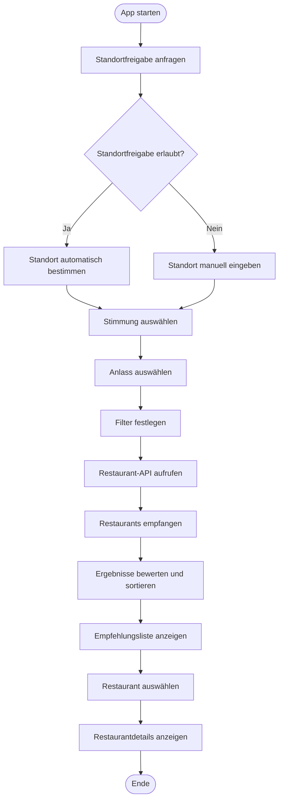

## F1 – Geschäftsprozesse

## Zweck

Dieses Dokument beschreibt die fachlichen Geschäftsprozesse der Anwendung **Food-Mood**. Ziel der Anwendung ist es, Benutzern anhand ihrer Stimmung, ihres Anlasses und weiterer Filter passende Restaurantempfehlungen bereitzustellen.

Die beschriebenen Prozesse bilden die Grundlage für die Anwendungsfälle, die Benutzeroberfläche und die spätere Implementierung.

---

## GP-01 Restaurantempfehlung erhalten (Hauptprozess)

## Ziel

Der Benutzer erhält passende Restaurantempfehlungen auf Grundlage seines Standorts, seiner Stimmung, seines Anlasses und optionaler Filter.

## Beteiligter Akteur

- Benutzer

## Vorbedingungen

- Die Anwendung ist gestartet.
- Eine Internetverbindung ist vorhanden.
- Die Restaurant-API ist erreichbar.

## Ablauf

1. Der Benutzer startet die Anwendung.
2. Die Anwendung fordert die Standortfreigabe an.
3. Der Benutzer erlaubt den Zugriff auf seinen Standort.
4. Die Anwendung bestimmt den aktuellen Standort.
5. Der Benutzer wählt eine Stimmung aus.
6. Der Benutzer wählt einen Anlass aus.
7. Optional legt der Benutzer Filter fest (z. B. Preis, Entfernung oder Küche).
8. Die Anwendung erstellt eine Suchanfrage.
9. Die Anfrage wird an die Restaurant-API gesendet.
10. Die API liefert passende Restaurants zurück.
11. Die Anwendung bewertet und sortiert die Ergebnisse.
12. Die Empfehlungsliste wird angezeigt.
13. Der Benutzer wählt ein Restaurant aus.
14. Die Detailseite des Restaurants wird geöffnet.

## Ergebnis

Der Benutzer erhält eine Liste passender Restaurants und kann Details zu einem Restaurant ansehen.

---

## GP-02 Restaurant als Favorit speichern

## Ziel

Der Benutzer speichert interessante Restaurants für einen späteren Besuch.

## Beteiligter Akteur

- Benutzer

## Vorbedingungen

- Die Restaurantdetailseite ist geöffnet.

## Ablauf

1. Der Benutzer öffnet die Detailseite eines Restaurants.
2. Der Benutzer klickt auf „Zu Favoriten hinzufügen“.
3. Die Anwendung speichert das Restaurant.
4. Das Restaurant erscheint in der Favoritenliste.

## Ergebnis

Das Restaurant wurde erfolgreich als Favorit gespeichert.

---

## GP-03 Restaurant als besucht markieren und bewerten

## Ziel

Der Benutzer kann bereits besuchte Restaurants bewerten.

## Beteiligter Akteur

- Benutzer

## Vorbedingungen

- Die Restaurantdetailseite ist geöffnet.

## Ablauf

1. Der Benutzer markiert das Restaurant als besucht.
2. Der Benutzer vergibt eine Bewertung.
3. Optional schreibt der Benutzer einen kurzen Kommentar.
4. Die Bewertung wird gespeichert.

## Ergebnis

Die Bewertung wurde erfolgreich gespeichert.

---

## Alternativprozesse

## AP-01 Standortfreigabe verweigert

### Beschreibung

Falls der Benutzer die Standortfreigabe ablehnt, kann die Restaurantsuche trotzdem durchgeführt werden.

### Ablauf

1. Die Anwendung erkennt, dass keine Standortfreigabe vorliegt.
2. Die Anwendung bietet eine manuelle Standorteingabe an.
3. Der Benutzer gibt eine Adresse oder einen Ort ein.
4. Die Anwendung verwendet den eingegebenen Standort.
5. Der Hauptprozess wird fortgesetzt.

---

## Fehlerprozesse

## FP-01 Restaurant-API nicht erreichbar

### Ablauf

1. Die Anwendung sendet die Suchanfrage.
2. Die Restaurant-API antwortet nicht oder liefert einen Fehler.
3. Die Anwendung zeigt eine verständliche Fehlermeldung.
4. Der Benutzer kann die Suche erneut starten.

---

## FP-02 Keine Restaurants gefunden

### Ablauf

1. Die Suchanfrage wird erfolgreich verarbeitet.
2. Es werden keine passenden Restaurants gefunden.
3. Die Anwendung informiert den Benutzer.
4. Der Benutzer kann Filter oder Stimmung ändern und erneut suchen.

---

## Aktivitätsdiagramm

---

## Geschäftsregeln

- Eine Restaurantsuche ist auch ohne Standortfreigabe möglich.
- Mindestens eine Stimmung muss ausgewählt werden.
- Der Anlass ist optional.
- Filter sind optional.
- Ohne Internetverbindung können keine Restaurantdaten geladen werden.
- Empfehlungen werden auf Basis der von der API gelieferten Daten erstellt.

---

## Akzeptanzkriterien

- Der Hauptprozess ist vollständig beschrieben.
- Alle wichtigen Alternativ- und Fehlerprozesse sind dokumentiert.
- Der Benutzer kann Restaurants auch ohne Standortfreigabe suchen.
- Mindestens ein Aktivitätsdiagramm ist vorhanden.
- Alle Prozessschritte sind logisch und nachvollziehbar beschrieben.
- Die beschriebenen Prozesse stimmen mit den Anwendungsfällen (F2) und den Anwendungsfunktionen (F3) überein.