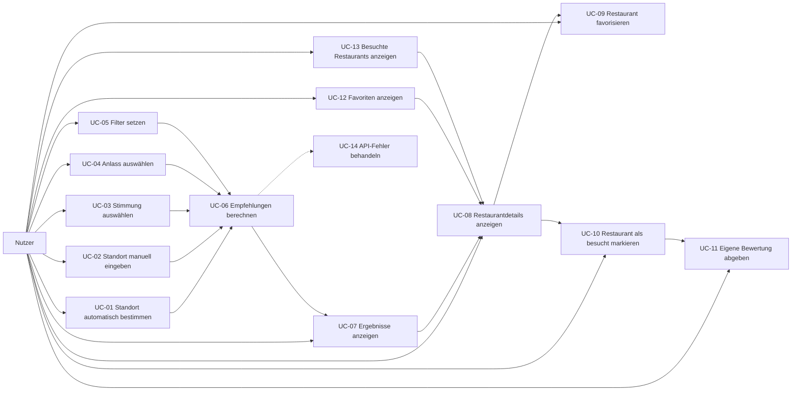

# F2 – Anwendungsfälle

## Übersicht der Use Cases

| ID | Use Case |
|---|---|
| [UC-01](#uc-01) | Standort automatisch bestimmen |
| [UC-02](#uc-02) | Standort manuell eingeben |
| [UC-03](#uc-03) | Stimmung auswählen |
| [UC-04](#uc-04) | Anlass auswählen |
| [UC-05](#uc-05) | Filter setzen |
| [UC-06](#uc-06) | Empfehlungen berechnen |
| [UC-07](#uc-07) | Ergebnisse anzeigen |
| [UC-08](#uc-08) | Restaurantdetails anzeigen |
| [UC-09](#uc-09) | Restaurant favorisieren |
| [UC-10](#uc-10) | Restaurant als besucht markieren |
| [UC-11](#uc-11) | Eigene Bewertung abgeben |
| [UC-12](#uc-12) | Favoriten anzeigen |
| [UC-13](#uc-13) | Besuchte Restaurants anzeigen |
| [UC-14](#uc-14) | API-Fehler behandeln |

---

## Use-Case-Diagramm – Gesamtübersicht

---

# Ausführliche Use Cases (Einheitliches Template)

## UC-01

| Feld | Inhalt |
|---|---|
| ID | UC-01 |
| Name | Standort automatisch bestimmen |
| Akteur | Nutzer |
| Ziel | Den aktuellen Standort des Benutzers automatisch ermitteln, um ihn für die Restaurantsuche zu verwenden. |
| Vorbedingungen | Die Anwendung ist geöffnet. Das Gerät unterstützt die Standortbestimmung. Der Benutzer erteilt die erforderliche Standortfreigabe. |
| Auslöser | Der Benutzer startet eine Restaurantsuche und erlaubt die Standortbestimmung. |
| Hauptszenario | 1. Der Benutzer startet die Restaurantsuche. 2. Food-Mood fragt nach der Standortfreigabe. 3. Der Benutzer erteilt die Freigabe. 4. Food-Mood ermittelt den aktuellen Standort. 5. Der Standort wird für die weitere Restaurantsuche verwendet. |
| Alternativen | Der Benutzer verweigert die Standortfreigabe → Food-Mood bietet die manuelle Eingabe eines Standorts an (siehe UC-02). |
| Fehlerfälle | Der Standort kann technisch nicht ermittelt werden. Die Standortdaten sind nicht verfügbar. |
| Ergebnis | Ein gültiger Standort steht für die Restaurantsuche zur Verfügung. |
| Akzeptanzkriterien | Der Benutzer kann die Standortfreigabe erteilen. Bei erfolgreicher Freigabe wird der aktuelle Standort ermittelt. Bei fehlender Standortfreigabe kann ein Standort manuell eingegeben werden. |
| Datenmodell | Link D1/D2 |
| Dialog | Link B1 |

---

## UC-02

| Feld | Inhalt |
|---|---|
| ID | UC-02 |
| Name | Standort manuell eingeben |
| Akteur | Nutzer |
| Ziel | Einen Standort manuell festlegen, wenn keine automatische Standortbestimmung verwendet werden kann. |
| Vorbedingungen | Die Anwendung ist geöffnet. Die manuelle Standorteingabe ist verfügbar. |
| Auslöser | Der Benutzer entscheidet sich für die manuelle Standortangabe. |
| Hauptszenario | 1. Der Benutzer öffnet die manuelle Standorteingabe. 2. Der Benutzer gibt einen Ort oder eine Adresse ein. 3. Food-Mood prüft die Eingabe. 4. Der Standort wird übernommen. 5. Der Standort wird für die Restaurantsuche verwendet. |
| Alternativen | Der Benutzer ändert seine Eingabe und gibt einen anderen Standort ein. |
| Fehlerfälle | Der eingegebene Standort kann nicht erkannt werden. Die Eingabe ist leer oder ungültig. |
| Ergebnis | Ein gültiger manueller Standort steht für die Restaurantsuche zur Verfügung. |
| Akzeptanzkriterien | Ein Standort kann manuell eingegeben werden. Ungültige Eingaben werden erkannt. Ein gültiger Standort kann für die Suche verwendet werden. |
| Datenmodell | Link D1/D2 |
| Dialog | Link B1 |

---

## UC-03

| Feld | Inhalt |
|---|---|
| ID | UC-03 |
| Name | Stimmung auswählen |
| Akteur | Nutzer |
| Ziel | Die gewünschte Stimmung für die Restaurantempfehlung festlegen. |
| Vorbedingungen | Die Restaurantsuche wurde gestartet. Die Stimmungsauswahl ist verfügbar. |
| Auslöser | Der Benutzer möchte seine gewünschte Stimmung angeben. |
| Hauptszenario | 1. Food-Mood zeigt verfügbare Stimmungen an. 2. Der Benutzer wählt eine Stimmung aus. 3. Food-Mood übernimmt die Auswahl. 4. Die ausgewählte Stimmung wird für die Empfehlung berücksichtigt. |
| Alternativen | Der Benutzer ändert die ausgewählte Stimmung. |
| Fehlerfälle | Es kann keine gültige Stimmung ausgewählt werden. |
| Ergebnis | Eine Stimmung wurde für die Restaurantsuche festgelegt. |
| Akzeptanzkriterien | Verfügbare Stimmungen werden angezeigt. Der Benutzer kann eine Stimmung auswählen. Die Auswahl wird für die Empfehlung berücksichtigt. |
| Datenmodell | Link D1/D2 |
| Dialog | Link B1 |

---

## UC-04

| Feld | Inhalt |
|---|---|
| ID | UC-04 |
| Name | Anlass auswählen |
| Akteur | Nutzer |
| Ziel | Den Anlass für den Restaurantbesuch festlegen. |
| Vorbedingungen | Die Restaurantsuche wurde gestartet. Die Anlassauswahl ist verfügbar. |
| Auslöser | Der Benutzer möchte einen Anlass angeben. |
| Hauptszenario | 1. Food-Mood zeigt verfügbare Anlässe an. 2. Der Benutzer wählt einen Anlass aus. 3. Food-Mood übernimmt die Auswahl. 4. Der Anlass wird für die Empfehlung berücksichtigt. |
| Alternativen | Der Benutzer ändert den ausgewählten Anlass. Der Benutzer verwendet keinen bestimmten Anlass. |
| Fehlerfälle | Es kann kein gültiger Anlass ausgewählt werden. |
| Ergebnis | Der gewünschte Anlass steht für die Empfehlungsermittlung zur Verfügung. |
| Akzeptanzkriterien | Verfügbare Anlässe werden angezeigt. Ein Anlass kann ausgewählt werden. Die Auswahl wird für die Empfehlung berücksichtigt. |
| Datenmodell | Link D1/D2 |
| Dialog | Link B1 |

---

## UC-05

| Feld | Inhalt |
|---|---|
| ID | UC-05 |
| Name | Filter setzen |
| Akteur | Nutzer |
| Ziel | Die Restaurantsuche durch zusätzliche Kriterien einschränken. |
| Vorbedingungen | Ein gültiger Standort ist vorhanden. Die Filterschnittstelle ist verfügbar. |
| Auslöser | Der Benutzer möchte die Suchergebnisse einschränken. |
| Hauptszenario | 1. Food-Mood zeigt verfügbare Filter an. 2. Der Benutzer wählt gewünschte Filter aus. 3. Food-Mood übernimmt die Filter. 4. Die Filter werden bei der Empfehlungsermittlung berücksichtigt. |
| Alternativen | Der Benutzer entfernt einen gesetzten Filter. Der Benutzer verwendet keine zusätzlichen Filter. |
| Fehlerfälle | Eine Filterkombination ist ungültig oder liefert keine Ergebnisse. |
| Ergebnis | Die gewünschten Suchfilter sind für die Restaurantsuche festgelegt. |
| Akzeptanzkriterien | Verfügbare Filter werden angezeigt. Filter können gesetzt und entfernt werden. Die gesetzten Filter beeinflussen die Ergebnisse. |
| Datenmodell | Link D1/D2 |
| Dialog | Link B1 |

---

## UC-06

| Feld | Inhalt |
|---|---|
| ID | UC-06 |
| Name | Empfehlungen berechnen |
| Akteur | Food-Mood-Anwendung |
| Ziel | Auf Grundlage der verfügbaren Standort-, Stimmungs-, Anlass- und Filterdaten passende Restaurants ermitteln. |
| Vorbedingungen | Ein gültiger Standort ist vorhanden. Die gewünschten Suchkriterien wurden übernommen. |
| Auslöser | Der Benutzer startet die Suche nach Restaurantempfehlungen. |
| Hauptszenario | 1. Food-Mood sammelt die vorhandenen Suchkriterien. 2. Food-Mood fordert passende Restaurantdaten an. 3. Die erhaltenen Restaurants werden geprüft. 4. Die Restaurants werden anhand der Suchkriterien bewertet. 5. Die Ergebnisse werden sortiert. 6. Die Empfehlungsliste wird erstellt. |
| Alternativen | Wenn keine zusätzlichen Filter gesetzt wurden, erfolgt die Berechnung nur anhand der verfügbaren Kriterien. |
| Fehlerfälle | Der externe Dienst liefert keine Daten. Es können keine passenden Restaurants ermittelt werden. → siehe UC-14. |
| Ergebnis | Eine sortierte Liste von Restaurantempfehlungen wurde erstellt. |
| Akzeptanzkriterien | Die vorhandenen Suchkriterien werden berücksichtigt. Restaurantdaten werden verarbeitet. Die Ergebnisse werden bewertet und sortiert. Eine Empfehlungsliste wird erstellt. |
| Datenmodell | Link D1/D2 |
| Dialog | Link B1 |

---

## UC-07

| Feld | Inhalt |
|---|---|
| ID | UC-07 |
| Name | Ergebnisse anzeigen |
| Akteur | Nutzer |
| Ziel | Die ermittelten Restaurantempfehlungen übersichtlich anzeigen. |
| Vorbedingungen | Empfehlungen wurden berechnet. |
| Auslöser | Eine Empfehlungsliste wurde erfolgreich erstellt. |
| Hauptszenario | 1. Food-Mood erhält die berechnete Empfehlungsliste. 2. Die Restaurants werden in einer Liste angezeigt. 3. Relevante Informationen werden dargestellt. 4. Der Benutzer kann ein Restaurant auswählen. |
| Alternativen | Der Benutzer startet eine neue Suche mit anderen Kriterien. |
| Fehlerfälle | Es wurden keine Restaurants gefunden. Die Ergebnisse können nicht geladen werden. |
| Ergebnis | Der Benutzer kann die verfügbaren Empfehlungen ansehen. |
| Akzeptanzkriterien | Die Ergebnisse werden übersichtlich angezeigt. Relevante Restaurantinformationen sind sichtbar. Ein Restaurant kann ausgewählt werden. |
| Datenmodell | Link D1/D2 |
| Dialog | Link B1 |

---

## UC-08

| Feld | Inhalt |
|---|---|
| ID | UC-08 |
| Name | Restaurantdetails anzeigen |
| Akteur | Nutzer |
| Ziel | Weitere Informationen zu einem ausgewählten Restaurant anzeigen. |
| Vorbedingungen | Eine Restaurantempfehlung ist vorhanden. |
| Auslöser | Der Benutzer wählt ein Restaurant aus der Empfehlungsliste aus. |
| Hauptszenario | 1. Der Benutzer wählt ein Restaurant aus. 2. Food-Mood öffnet die Detailansicht. 3. Die verfügbaren Restaurantinformationen werden angezeigt. |
| Alternativen | Der Benutzer kehrt zur Empfehlungsliste zurück. |
| Fehlerfälle | Restaurantdaten sind nicht vollständig verfügbar. |
| Ergebnis | Der Benutzer kann die verfügbaren Details des Restaurants einsehen. |
| Akzeptanzkriterien | Eine Detailansicht ist verfügbar. Die verfügbaren Restaurantinformationen werden angezeigt. Der Benutzer kann zur Empfehlungsliste zurückkehren. |
| Datenmodell | Link D1/D2 |
| Dialog | Link B1 |

---

## UC-09

| Feld | Inhalt |
|---|---|
| ID | UC-09 |
| Name | Restaurant favorisieren |
| Akteur | Nutzer |
| Ziel | Ein Restaurant als Favorit speichern. |
| Vorbedingungen | Ein Restaurant wurde ausgewählt. |
| Auslöser | Der Benutzer möchte ein Restaurant später wiederfinden. |
| Hauptszenario | 1. Der Benutzer öffnet die Restaurantdetails. 2. Der Benutzer wählt die Favoritenfunktion. 3. Food-Mood speichert das Restaurant als Favorit (unter der aktuellen UserID). |
| Alternativen | Ein bereits gespeichertes Restaurant wird wieder aus den Favoriten entfernt. |
| Fehlerfälle | Das Restaurant kann nicht gespeichert werden. |
| Ergebnis | Das Restaurant ist als Favorit gespeichert. |
| Akzeptanzkriterien | Ein Restaurant kann als Favorit gespeichert werden. Ein Favorit kann wieder entfernt werden. Gespeicherte Favoriten sind über UC-12 erreichbar. |
| Datenmodell | Link D1/D2 |
| Dialog | Link B1 |

---

## UC-10

| Feld | Inhalt |
|---|---|
| ID | UC-10 |
| Name | Restaurant als besucht markieren |
| Akteur | Nutzer |
| Ziel | Ein Restaurant als bereits besucht kennzeichnen. |
| Vorbedingungen | Ein Restaurant ist ausgewählt. |
| Auslöser | Der Benutzer möchte einen Restaurantbesuch speichern. |
| Hauptszenario | 1. Der Benutzer öffnet die Restaurantdetails. 2. Der Benutzer wählt „Als besucht markieren". 3. Food-Mood speichert den Besuch (unter der aktuellen UserID). 4. Das Restaurant wird als besucht gekennzeichnet. |
| Alternativen | Ein bereits besuchtes Restaurant wird erneut besucht und entsprechend aktualisiert. |
| Fehlerfälle | Der Besuch kann nicht gespeichert werden. |
| Ergebnis | Das Restaurant ist als besucht gespeichert. |
| Akzeptanzkriterien | Ein Restaurant kann als besucht markiert werden. Der gespeicherte Besuch kann in der Besuchsliste angezeigt werden (siehe UC-13). Ein als besucht markiertes Restaurant kann bewertet werden (siehe UC-11). |
| Datenmodell | Link D1/D2 |
| Dialog | Link B1 |

---

## UC-11

| Feld | Inhalt |
|---|---|
| ID | UC-11 |
| Name | Eigene Bewertung abgeben |
| Akteur | Nutzer |
| Ziel | Eine persönliche Bewertung für ein bereits besuchtes Restaurant speichern. |
| Vorbedingungen | Das Restaurant wurde zuvor als besucht markiert (siehe UC-10). |
| Auslöser | Der Benutzer möchte ein bereits besuchtes Restaurant bewerten. |
| Hauptszenario | 1. Der Benutzer öffnet ein bereits besuchtes Restaurant. 2. Food-Mood prüft, ob ein gespeicherter Besuch vorhanden ist. 3. Der Benutzer gibt eine Bewertung ab. 4. Food-Mood prüft die Bewertung. 5. Die Bewertung wird gespeichert. |
| Alternativen | Der Benutzer ändert eine bereits abgegebene Bewertung. |
| Fehlerfälle | Das Restaurant wurde noch nicht als besucht markiert. Die Bewertung liegt außerhalb des erlaubten Wertebereichs. |
| Ergebnis | Die persönliche Bewertung wurde gespeichert. |
| Akzeptanzkriterien | Eine Bewertung kann nur für ein besuchtes Restaurant abgegeben werden. Ungültige Bewertungen werden abgelehnt. Eine bestehende eigene Bewertung kann geändert werden. |
| Datenmodell | Link D1/D2 |
| Dialog | Link B1 |

---

## UC-12

| Feld | Inhalt |
|---|---|
| ID | UC-12 |
| Name | Favoriten anzeigen |
| Akteur | Nutzer |
| Ziel | Die vom Benutzer gespeicherten Lieblingsrestaurants anzeigen. |
| Vorbedingungen | Die Favoritenfunktion ist verfügbar. |
| Auslöser | Der Benutzer öffnet seine Favoriten. |
| Hauptszenario | 1. Der Benutzer öffnet die Favoritenübersicht. 2. Food-Mood lädt die gespeicherten Favoriten (der aktuellen UserID). 3. Die Favoriten werden angezeigt. 4. Der Benutzer kann ein Restaurant auswählen. |
| Alternativen | Es sind keine Favoriten vorhanden. |
| Fehlerfälle | Die Favoriten können nicht geladen werden. |
| Ergebnis | Der Benutzer sieht seine gespeicherten Favoriten. |
| Akzeptanzkriterien | Gespeicherte Favoriten werden angezeigt. Ein Favorit kann ausgewählt werden. Eine leere Favoritenliste wird verständlich dargestellt. |
| Datenmodell | Link D1/D2 |
| Dialog | Link B1 |

---

## UC-13

| Feld | Inhalt |
|---|---|
| ID | UC-13 |
| Name | Besuchte Restaurants anzeigen |
| Akteur | Nutzer |
| Ziel | Eine Übersicht der bisher als besucht markierten Restaurants anzeigen. |
| Vorbedingungen | Die Funktion zum Speichern von Besuchen ist verfügbar. |
| Auslöser | Der Benutzer öffnet die Übersicht der besuchten Restaurants. |
| Hauptszenario | 1. Der Benutzer öffnet die Übersicht der besuchten Restaurants. 2. Food-Mood lädt die gespeicherten Besuche (der aktuellen UserID). 3. Die besuchten Restaurants werden angezeigt. 4. Der Benutzer kann ein Restaurant auswählen. |
| Alternativen | Es wurden noch keine Restaurants als besucht gespeichert. |
| Fehlerfälle | Die Besuchsdaten können nicht geladen werden. |
| Ergebnis | Der Benutzer erhält eine Übersicht seiner besuchten Restaurants. |
| Akzeptanzkriterien | Besuchte Restaurants werden angezeigt. Ein Restaurant kann aus der Übersicht ausgewählt werden. Eine leere Liste wird verständlich dargestellt. |
| Datenmodell | Link D1/D2 |
| Dialog | Link B1 |

---

## UC-14

| Feld | Inhalt |
|---|---|
| ID | UC-14 |
| Name | API-Fehler behandeln |
| Akteur | Food-Mood-Anwendung |
| Ziel | Fehler bei der Kommunikation mit einem externen Restaurant-/Places-Dienst erkennen und dem Benutzer verständlich mitteilen. |
| Vorbedingungen | Food-Mood versucht, Daten von einem externen Dienst abzurufen. |
| Auslöser | Ein externer Dienst liefert einen Fehler oder ist nicht erreichbar. |
| Hauptszenario | 1. Food-Mood sendet eine Anfrage an den externen Dienst. 2. Der externe Dienst liefert einen Fehler oder antwortet nicht. 3. Food-Mood erkennt den Fehler. 4. Food-Mood beendet die fehlerhafte Anfrage kontrolliert. 5. Eine verständliche Fehlermeldung wird angezeigt. |
| Alternativen | Die Anfrage kann nach einer angemessenen Wartezeit erneut durchgeführt werden. |
| Fehlerfälle | Der externe Dienst ist dauerhaft nicht erreichbar. Die Antwort enthält ungültige Daten. Die Anfrage überschreitet das Zeitlimit. |
| Ergebnis | Der Benutzer wird über das Problem informiert, ohne dass die Anwendung unerwartet beendet wird. |
| Akzeptanzkriterien | API-Fehler werden erkannt. Der Benutzer erhält eine verständliche Fehlermeldung. Die Anwendung bleibt trotz des API-Fehlers bedienbar. Ein erneuter Versuch ist möglich. |
| Datenmodell | Link D1/D2 |
| Dialog | Link B1 |

---

# Besonders berücksichtigen

Da Food-Mood laut Vorgabe **keine Benutzeranmeldung** enthält, wird eine leichtgewichtige UserID verwendet, um Favoriten, Besuche und Bewertungen (UC-09 bis UC-13) einer Person zuordnen zu können, ohne einen echten Login-Prozess einzuführen.

**User initialisieren:**