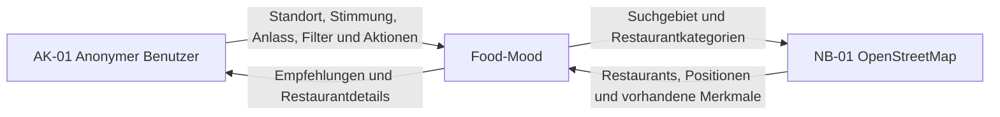
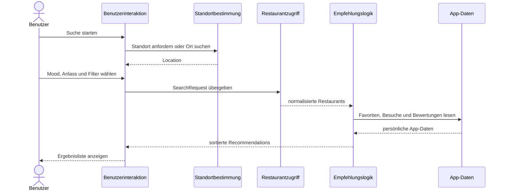

# P2 – Fachlicher Architekturüberblick

Dieser Überblick beschreibt Food-Mood aus fachlicher Sicht. Er grenzt die Web-App von ihrer Umgebung ab, nennt alle Beteiligten und ordnet die fachlichen Verantwortlichkeiten den Bausteinen der Anwendung zu. Interne technische Entscheidungen, konkrete Schnittstellen und detaillierte Abläufe werden in den dafür vorgesehenen Dokumenten beschrieben.

## P2.1 Systemkontext

Food-Mood unterstützt einen anonymen Benutzer dabei, anhand seines Standorts, einer Stimmung, eines Anlasses und weiterer Filter passende gastronomische Orte zu finden. Die Anwendung verwaltet Favoriten, Besuche und eigene Bewertungen selbst. Restaurant- und Geodaten werden nicht selbst gepflegt, sondern von OpenStreetMap bezogen.

OpenStreetMap ist das einzige fachliche Nachbarsystem von Food-Mood. Die automatische Standortbestimmung über den Browser, die Verarbeitung einer manuellen Ortseingabe und die Speicherung persönlicher App-Daten gehören zur Systemgrenze von Food-Mood. Bibliotheken und einzelne technische Zugänge zu OpenStreetMap werden nicht als eigene Nachbarsysteme dargestellt.

Im Produktivbetrieb ist Food-Mood über die öffentliche Domain `https://foodmood-thm.de` erreichbar. Die konkrete Hosting- und Deployment-Konfiguration ist in [S3 – Inbetriebnahme](S3-Inbetriebnahme.md) beschrieben.

## P2.2 Beteiligte und fachliche Bausteine

| Baustein | Verantwortung | Zugeordnete Anwendungsfälle |
|---|---|---|
| Benutzerinteraktion | führt durch Standort, Mood, Anlass, Filter, Ergebnisse und Detailansichten; zeigt Lade-, Leer- und Fehlerzustände | UC-01 bis UC-05, UC-07, UC-08, UC-12, UC-13, UC-14 |
| Standortbestimmung | erzeugt aus Browserfreigabe oder manueller Ortssuche ein temporäres `Location`-Objekt | UC-01, UC-02 |
| Suchprofil | prüft und bündelt `Mood`, optionalen `Occasion` und `SearchFilters` zu einer `SearchRequest` | UC-03, UC-04, UC-05 |
| Restaurantzugriff | fragt externe Restaurantdaten ab und normalisiert unterschiedliche OSM-Objekte in das interne Format `Restaurant` | UC-06, UC-08, UC-14 |
| Empfehlungslogik | filtert und bewertet Restaurants nach Mood, Anlass, Entfernung, Öffnungsstatus, Küche, Ernährung und vorhandener Historie | UC-06 |
| Ergebnisdarstellung | zeigt sortierte `Recommendation`-Einträge und Restaurantdetails; Karte ist eine optionale Ergänzung | UC-07, UC-08 |
| Persönliche App-Daten | verwaltet anonyme Nutzerkennung, `Favorite`, `Visit` und `Review` dauerhaft | UC-09 bis UC-13 |

## P2.4 Zusammenspiel im Hauptprozess

Der Restaurantzugriff kapselt die Besonderheiten externer APIs. Dadurch arbeitet die Empfehlungslogik ausschließlich mit den in D2 festgelegten Food-Mood-Typen und ist nicht von der ursprünglichen OSM-Antwortstruktur abhängig.

## P2.5 Fachlicher Datenfluss

1. Die Standortbestimmung erzeugt ein `Location`-Objekt.
2. Der Benutzer wählt genau einen `Mood`; `Occasion` und `SearchFilters` sind optional.
3. Das Suchprofil erzeugt eine gültige `SearchRequest`.
4. Der Restaurantzugriff lädt Orte und normalisiert sie zu `Restaurant`.
5. Die Empfehlungslogik erzeugt pro passendem Restaurant eine `Recommendation` mit Score, Entfernung und nachvollziehbaren Gründen.
6. Die Ergebnisdarstellung zeigt die sortierten Empfehlungen.
7. Bei einer Benutzeraktion speichern die persönlichen App-Daten einen `Favorite`, einen `Visit` oder eine `Review`.

`Location`, `SearchRequest` und `Recommendation` werden im MVP nicht dauerhaft gespeichert. Der genaue Persistenzumfang ist in D1 festgelegt.

## P2.6 Abgrenzung der Verantwortlichkeiten

### Food-Mood ist verantwortlich für

- Benutzerführung und Validierung
- regelbasiertes Mood-Matching und Sortierung
- Berechnung der Entfernung
- anonyme Zuordnung persönlicher App-Daten
- Speicherung von Favoriten, Besuchen und eigenen Bewertungen
- verständliche Fehler- und Leerzustände
- korrekte Kennzeichnung unbekannter externer Werte

### Nachbarsysteme sind verantwortlich für

- Browser: Bereitstellung des Standorts nach Zustimmung
- Nominatim: Auflösung einer manuellen Ortseingabe in Koordinaten
- OpenStreetMap/Overpass: Bereitstellung vorhandener gastronomischer Geodaten
- Kartenkacheldienst: optionale visuelle Kartengrundlage

Food-Mood übernimmt keine Garantie für Vollständigkeit oder Aktualität externer Daten. Fehlende Angaben werden als unbekannt angezeigt und nicht erfunden.

## P2.7 Fehler- und Ersatzwege

| Situation | Verhalten von Food-Mood |
|---|---|
| Standortfreigabe verweigert | manuelle Ortseingabe anbieten |
| manueller Ort nicht gefunden | Korrektur oder andere Eingabe ermöglichen |
| Restaurantdienst nicht erreichbar | verständliche Fehlermeldung und begrenzten erneuten Versuch anbieten |
| keine Restaurants gefunden | Filter lockern oder Radius ändern lassen |
| optionale Restaurantangabe fehlt | Feld ausblenden oder als unbekannt kennzeichnen |
| Kartenanzeige fällt aus | Restaurantliste bleibt vollständig bedienbar |
| Speichern persönlicher Daten schlägt fehl | Aktion nicht als erfolgreich darstellen und erneuten Versuch anbieten |

## P2.8 Qualitätsleitlinien

- **Nachvollziehbarkeit:** Jede Empfehlung besitzt mindestens einen verständlichen Match-Grund.
- **Datensparsamkeit:** Standort und Suchanfrage werden nicht dauerhaft gespeichert.
- **Austauschbarkeit:** Externe Anbieter werden hinter dem Restaurantzugriff bzw. der Standortbestimmung gekapselt.
- **Robustheit:** Fehlende optionale API-Felder brechen die Suche nicht ab.
- **Konsistenz:** Die in D1 und D2 definierten Objekt- und Typnamen werden in Architektur und Code weiterverwendet.
- **Mobile Nutzung:** Der Hauptablauf bleibt ab 360 Pixel Bildschirmbreite vollständig bedienbar.

## P2.9 Weiterführende Dokumente

- [D1 – Fachliches Datenmodell](D1-Fachliches-Datenmodell.md)
- [D2 – Datentypenverzeichnis](D2-Datentypenverzeichnis.md)
- [S1 – Nachbarsysteme und externe APIs](S1-Nachbarsysteme-und-APIs.md)
- F1 – Geschäftsprozesse
- F2 – Anwendungsfälle
- B1 – Dialogspezifikation
- N1 – Nichtfunktionale Anforderungen
- N2 – Querschnittskonzepte

## P2.10 Akzeptanzkriterien

- Die Systemgrenze und alle für das MVP benötigten Nachbarsysteme sind erkennbar.
- Jeder fachliche Baustein besitzt eine eindeutige Verantwortung.
- Der Hauptprozess vom Standort bis zur Empfehlung ist vollständig nachvollziehbar.
- Anwendungsfälle, Datenobjekte und Bausteine sind miteinander verknüpft.
- Temporäre Standort- und Suchdaten sind von dauerhaft gespeicherten App-Daten getrennt.
- Der Überblick bleibt fachlich und nimmt keine später zu begründenden Framework- oder Deploymententscheidungen vorweg.
