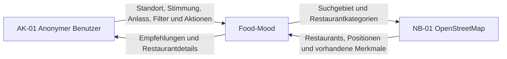

# P2 – Fachlicher Architekturüberblick

Dieser Überblick beschreibt Food-Mood aus fachlicher Sicht. Er grenzt die Web-App von ihrer Umgebung ab, nennt alle Beteiligten und ordnet die fachlichen Verantwortlichkeiten den Bausteinen der Anwendung zu. Interne technische Entscheidungen, konkrete Schnittstellen und detaillierte Abläufe werden in den dafür vorgesehenen Dokumenten beschrieben.

## P2.1 Systemkontext

Food-Mood unterstützt einen anonymen Benutzer dabei, anhand seines Standorts, einer Stimmung, eines Anlasses und weiterer Filter passende gastronomische Orte zu finden. Die Anwendung verwaltet Favoriten, Besuche und eigene Bewertungen selbst. Restaurant- und Geodaten werden nicht selbst gepflegt, sondern von OpenStreetMap bezogen.

OpenStreetMap ist das einzige fachliche Nachbarsystem von Food-Mood. Die automatische Standortbestimmung über den Browser, die Verarbeitung einer manuellen Ortseingabe und die Speicherung persönlicher App-Daten gehören zur Systemgrenze von Food-Mood. Bibliotheken und einzelne technische Zugänge zu OpenStreetMap werden nicht als eigene Nachbarsysteme dargestellt.

## P2.2 Beteiligte und fachliche Bausteine

### Beteiligte

| ID | Beteiligter | Einordnung | Verantwortung | Ausgetauschte Informationen |
|---|---|---|---|---|
| `AK-01` | Anonymer Benutzer | Akteur | wählt Standort, Stimmung, Anlass und Filter aus und verwendet die persönlichen Funktionen der App | Ortseingabe oder Standort, Auswahlwerte, Favoriten, Besuche und eigene Bewertungen; erhält Empfehlungen und Restaurantdetails |
| `NB-01` | [OpenStreetMap](S1-Nachbarsysteme-und-APIs.md) | einziges fachliches Nachbarsystem | stellt vorhandene Restaurant- und Geodaten bereit | erhält Suchgebiet und Restaurantkategorien; liefert gefundene Restaurants mit Positionen und vorhandenen Merkmalen |

Food-Mood übernimmt keine Garantie für die Vollständigkeit oder Aktualität der OpenStreetMap-Daten. Fehlende Angaben werden als unbekannt behandelt und nicht durch erfundene Werte ersetzt.

### Fachliche Bausteine

| ID | Fachlicher Baustein | Verantwortung | Zugeordnete Anwendungsfälle |
|---|---|---|---|
| `FB-01` | Benutzerinteraktion | führt durch Standort, Stimmung, Anlass, Filter, Ergebnisse und Detailansichten und zeigt Lade-, Leer- und Fehlerzustände | [UC-01](F2-Anwendungsfaelle.md#uc-01-standort-automatisch-bestimmen), [UC-02](F2-Anwendungsfaelle.md#uc-02-standort-manuell-eingeben), [UC-03](F2-Anwendungsfaelle.md#uc-03-stimmung-auswählen), [UC-04](F2-Anwendungsfaelle.md#uc-04-anlass-auswählen), [UC-05](F2-Anwendungsfaelle.md#uc-05-filter-setzen), [UC-07](F2-Anwendungsfaelle.md#uc-07-ergebnisse-anzeigen), [UC-08](F2-Anwendungsfaelle.md#uc-08-restaurantdetails-anzeigen), [UC-12](F2-Anwendungsfaelle.md#uc-12-favoriten-anzeigen), [UC-13](F2-Anwendungsfaelle.md#uc-13-besuchte-restaurants-anzeigen), [UC-14](F2-Anwendungsfaelle.md#uc-14-api-fehler-behandeln) |
| `FB-02` | Standortbestimmung | erzeugt aus der Browserfreigabe oder einer manuellen Ortseingabe einen temporären Suchstandort | [UC-01](F2-Anwendungsfaelle.md#uc-01-standort-automatisch-bestimmen), [UC-02](F2-Anwendungsfaelle.md#uc-02-standort-manuell-eingeben) |
| `FB-03` | Suchprofil | prüft die Auswahl und bündelt Standort, Stimmung, Anlass und Filter zu einer Suchanfrage | [UC-03](F2-Anwendungsfaelle.md#uc-03-stimmung-auswählen), [UC-04](F2-Anwendungsfaelle.md#uc-04-anlass-auswählen), [UC-05](F2-Anwendungsfaelle.md#uc-05-filter-setzen) |
| `FB-04` | Restaurantzugriff | fragt Restaurantdaten bei OpenStreetMap ab und überführt sie in das interne Restaurantformat | [UC-06](F2-Anwendungsfaelle.md#uc-06-empfehlungen-berechnen), [UC-08](F2-Anwendungsfaelle.md#uc-08-restaurantdetails-anzeigen), [UC-14](F2-Anwendungsfaelle.md#uc-14-api-fehler-behandeln) |
| `FB-05` | Empfehlungslogik | filtert und bewertet Restaurants anhand der Auswahl des Benutzers und der vorhandenen Restaurantdaten | [UC-06](F2-Anwendungsfaelle.md#uc-06-empfehlungen-berechnen) |
| `FB-06` | Ergebnisdarstellung | zeigt sortierte Empfehlungen und Restaurantdetails | [UC-07](F2-Anwendungsfaelle.md#uc-07-ergebnisse-anzeigen), [UC-08](F2-Anwendungsfaelle.md#uc-08-restaurantdetails-anzeigen) |
| `FB-07` | Persönliche App-Daten | verwaltet die anonyme Nutzerkennung, Favoriten, Besuche und eigene Bewertungen dauerhaft | [UC-09](F2-Anwendungsfaelle.md#uc-09-restaurant-favorisieren), [UC-10](F2-Anwendungsfaelle.md#uc-10-restaurant-als-besucht-markieren), [UC-11](F2-Anwendungsfaelle.md#uc-11-eigene-bewertung-abgeben), [UC-12](F2-Anwendungsfaelle.md#uc-12-favoriten-anzeigen), [UC-13](F2-Anwendungsfaelle.md#uc-13-besuchte-restaurants-anzeigen) |

Das genaue Zusammenspiel der Bausteine innerhalb einzelner Benutzerabläufe wird in [F2 – Anwendungsfälle](F2-Anwendungsfaelle.md) beschrieben. Wiederverwendbare fachliche Berechnungen, beispielsweise das Mapping von Stimmung und Anlass oder die Berechnung einer Bewertung, werden in [F3 – Anwendungsfunktionen](F3-Anwendungsfunktionen.md) dokumentiert.
