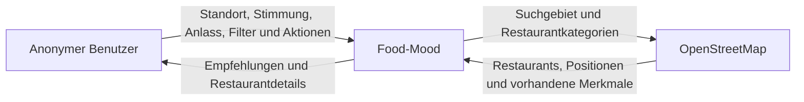

# P2 – Fachlicher Architekturüberblick

## P2.1 Zweck

Dieser Überblick beschreibt Food-Mood aus fachlicher Sicht. Er grenzt die Web-App von ihrer Umgebung ab und ordnet die fachlichen Verantwortlichkeiten den Bausteinen der Anwendung zu. Technische Entscheidungen zu Frameworks, Deployment und konkreten Schnittstellen werden erst in der späteren Architekturdokumentation nach arc42 und in ADRs festgelegt.

## P2.2 Systemkontext

Food-Mood unterstützt einen anonymen Benutzer dabei, anhand seines Standorts, einer Stimmung, eines Anlasses und weiterer Filter passende gastronomische Orte zu finden. Die Anwendung verwaltet Favoriten, Besuche und eigene Bewertungen selbst. Restaurant- und Geodaten werden nicht selbst gepflegt, sondern von OpenStreetMap bezogen.

### Externe Beteiligte

| Beteiligter | Einordnung | Verantwortung | Ausgetauschte Informationen |
|---|---|---|---|
| Anonymer Benutzer | Akteur | trifft eine Auswahl und verwendet die persönlichen Funktionen der App | Standort oder Ortseingabe, Stimmung, Anlass, Filter, Favoriten, Besuche und Bewertungen |
| OpenStreetMap | einziges Nachbarsystem | stellt vorhandene Restaurant- und Geodaten bereit | Suchgebiet und Restaurantkategorien; gefundene Restaurants mit Positionen und vorhandenen Merkmalen |

Die automatische Standortbestimmung über den Browser, die Verarbeitung einer manuellen Ortseingabe und die Speicherung persönlicher App-Daten gehören zur Systemgrenze von Food-Mood. Verwendete Bibliotheken oder einzelne technische Zugänge zu OpenStreetMap werden deshalb nicht als zusätzliche fachliche Nachbarsysteme dargestellt.

## P2.3 Fachliche Bausteine

| Baustein | Verantwortung | Zugeordnete Anwendungsfälle |
|---|---|---|
| Benutzerinteraktion | führt durch Standort, Stimmung, Anlass, Filter, Ergebnisse und Detailansichten; zeigt Lade-, Leer- und Fehlerzustände | UC-01 bis UC-05, UC-07, UC-08, UC-12, UC-13, UC-14 |
| Standortbestimmung | erzeugt aus Browserfreigabe oder manueller Ortseingabe einen temporären Suchstandort | UC-01, UC-02 |
| Suchprofil | prüft die Auswahl und bündelt Standort, Stimmung, Anlass und Filter zu einer Suchanfrage | UC-03 bis UC-05 |
| Restaurantzugriff | fragt Restaurantdaten bei OpenStreetMap ab und überführt sie in das interne Restaurantformat | UC-06, UC-08, UC-14 |
| Empfehlungslogik | filtert und bewertet Restaurants anhand der Auswahl des Benutzers und der vorhandenen Restaurantdaten | UC-06 |
| Ergebnisdarstellung | zeigt sortierte Empfehlungen und Restaurantdetails | UC-07, UC-08 |
| Persönliche App-Daten | verwaltet anonyme Nutzerkennung, Favoriten, Besuche und eigene Bewertungen dauerhaft | UC-09 bis UC-13 |

Das genaue Zusammenspiel dieser Bausteine innerhalb einzelner Abläufe wird nicht in P2 beschrieben. Es gehört zu den Anwendungsfällen in F2. Wiederverwendbare fachliche Berechnungen, beispielsweise das Mapping von Stimmung und Anlass auf Restaurantmerkmale, werden in F3 dokumentiert.

## P2.4 Abgrenzung der Verantwortlichkeiten

### Food-Mood ist verantwortlich für

- Benutzerführung und Validierung der Eingaben
- Bestimmung beziehungsweise Entgegennahme des Suchstandorts
- regelbasierte Ermittlung und Sortierung passender Restaurants
- Berechnung der Entfernung
- anonyme Zuordnung persönlicher App-Daten
- Speicherung von Favoriten, Besuchen und eigenen Bewertungen
- verständliche Fehler- und Leerzustände
- korrekte Kennzeichnung unbekannter externer Werte

### OpenStreetMap ist verantwortlich für

- Bereitstellung vorhandener Restaurant- und Geodaten
- Bereitstellung vorhandener Merkmale wie Küche, Öffnungszeiten oder Ernährungsangaben
- Identifikation und Positionierung der gefundenen Objekte

Food-Mood übernimmt keine Garantie für Vollständigkeit oder Aktualität der OpenStreetMap-Daten. Fehlende Angaben werden als unbekannt behandelt und nicht durch erfundene Werte ersetzt.

## P2.5 Fehler- und Ersatzwege

| Situation | Verhalten von Food-Mood |
|---|---|
| Standortfreigabe verweigert | manuelle Ortseingabe anbieten |
| manueller Ort nicht gefunden | Korrektur oder andere Eingabe ermöglichen |
| OpenStreetMap nicht erreichbar | verständliche Fehlermeldung und begrenzten erneuten Versuch anbieten |
| keine Restaurants gefunden | Filter lockern oder Radius ändern lassen |
| optionale Restaurantangabe fehlt | Feld ausblenden oder als unbekannt kennzeichnen |
| Speichern persönlicher Daten schlägt fehl | Aktion nicht als erfolgreich darstellen und erneuten Versuch anbieten |

## P2.6 Qualitätsleitlinien

- **Nachvollziehbarkeit:** Jede Empfehlung besitzt mindestens einen verständlichen Grund.
- **Datensparsamkeit:** Standort und Suchanfrage werden nicht dauerhaft gespeichert.
- **Austauschbarkeit:** Der Zugriff auf OpenStreetMap wird innerhalb des Restaurantzugriffs gekapselt.
- **Robustheit:** Fehlende optionale OpenStreetMap-Daten brechen die Suche nicht ab.
- **Konsistenz:** Die in D1 und D2 definierten Objekt- und Typnamen werden in Architektur und Code weiterverwendet.
- **Mobile Nutzung:** Der Hauptablauf bleibt ab 360 Pixel Bildschirmbreite vollständig bedienbar.

## P2.7 Weiterführende Dokumente

- [D1 – Fachliches Datenmodell](D1-Datenmodell.md)
- [D2 – Datentypenverzeichnis](D2-Datentypen.md)
- [S1 – Nachbarsysteme und externe APIs](S1-Nachbarsysteme-und-APIs.md)
- F2 – Anwendungsfälle
- F3 – Anwendungsfunktionen
- B1 – Dialogspezifikation
- N1 – Nichtfunktionale Anforderungen
- N2 – Querschnittskonzepte

## P2.8 Akzeptanzkriterien

- Die Systemgrenze von Food-Mood ist eindeutig erkennbar.
- OpenStreetMap ist als einziges fachliches Nachbarsystem dargestellt.
- Browserfunktionen, Bibliotheken und interne Datenspeicherung erscheinen nicht als Nachbarsysteme.
- Jeder fachliche Baustein besitzt eine eindeutige Verantwortung.
- Das detaillierte Zusammenspiel einzelner Anwendungsabläufe wird in F2 und nicht in P2 beschrieben.
- Der Überblick bleibt fachlich und nimmt keine später zu begründenden Framework- oder Deploymententscheidungen vorweg.
