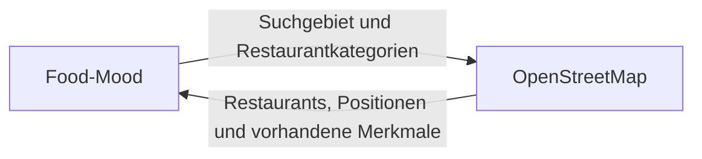

# S1 – Nachbarsysteme und externe APIs

## S1.1 Zweck

Dieses Dokument beschreibt das fachliche Nachbarsystem von Food-Mood und grenzt dessen Verantwortung von der Verantwortung der Web-App ab. Technische Bibliotheken, konkrete Serveradressen und die Begründung der Anbieterauswahl gehören nicht in diese fachliche Beschreibung.

## S1.2 Einordnung im Systemkontext

Food-Mood besitzt in der ersten Version genau ein fachliches Nachbarsystem: **OpenStreetMap**. Die Darstellung entspricht dem Systemkontext in [P2 – Fachlicher Architekturüberblick](P2-architekturueberblick.md#p21-systemkontext).

Die automatische Standortbestimmung des Browsers und die eigene Datenbank sind Bestandteile von Food-Mood. Overpass kann als technischer Zugang zu den OpenStreetMap-Daten verwendet werden. Falls für eine manuelle Ortseingabe Nominatim eingesetzt wird, ist auch dies ein technischer Zugang innerhalb der OpenStreetMap-Anbindung und kein zusätzliches fachliches Nachbarsystem.

## S1.3 Fachlicher Vertrag

### Food-Mood übermittelt

- den geografischen Mittelpunkt der Suche
- den gewählten Suchradius
- die gesuchten gastronomischen Kategorien
- fachlich erforderliche Filter, soweit sie durch vorhandene OpenStreetMap-Daten unterstützt werden

### OpenStreetMap liefert

- gefundene gastronomische Objekte
- deren geografische Position beziehungsweise einen geeigneten Mittelpunkt
- eine eindeutige Kombination aus OSM-Objekttyp und OSM-ID
- vorhandene beschreibende Merkmale eines Restaurants

Food-Mood übernimmt die externen Objekte nicht unverändert. Der Restaurantzugriff prüft die Daten und überführt sie in die in [D2 – Datentypenverzeichnis](D2-Datentypen.md) festgelegten internen Typen.

## S1.4 Verwendeter Datenumfang

Für die erste Version werden gastronomische Objekte der Kategorien Restaurant, Fast Food und Café berücksichtigt. Vorhandene OpenStreetMap-Merkmale können beispielsweise für Name, Position, Anschrift, Küche, Öffnungszeiten, vegetarische oder vegane Angebote, Abholung und Außensitzplätze verwendet werden.

Ein Restaurant ohne eindeutigen externen Schlüssel, Namen oder nutzbare Position wird nicht in die Ergebnisliste übernommen. Alle weiteren Merkmale sind optional. Ein fehlendes Merkmal wird als unbekannt behandelt und nicht durch einen erfundenen Standardwert ersetzt.

## S1.5 Grenzen der OpenStreetMap-Daten

OpenStreetMap wird gemeinschaftlich gepflegt. Deshalb können Restaurantdaten unvollständig, unterschiedlich detailliert oder veraltet sein. Food-Mood darf insbesondere Folgendes nicht voraussetzen:

- vollständige Öffnungszeiten oder Ernährungsangaben
- objektive Eigenschaften wie „gemütlich“ oder „romantisch“
- allgemeine Sternebewertungen oder Rezensionstexte
- eine verlässliche Preisstufe für Restaurants

Bewertungen in Food-Mood stammen ausschließlich aus der eigenen Bewertungsfunktion. Ohne eigene Bewertungen wird „Noch keine Bewertungen“ angezeigt.

Ein Preisfilter und eine automatisch festgestellte Stimmung `GUENSTIG` sind mit den gewählten OpenStreetMap-Daten nicht zuverlässig umsetzbar und gehören deshalb nicht zur ersten Version. Eine spätere Einführung benötigt eine neue fachliche Entscheidung und gegebenenfalls eine zusätzliche Datenquelle.

## S1.6 Verhalten bei Fehlern und fehlenden Daten

| Situation | Verhalten von Food-Mood |
|---|---|
| OpenStreetMap ist vorübergehend nicht erreichbar | verständliche Fehlermeldung anzeigen und einen begrenzten erneuten Versuch anbieten |
| Anfrage überschreitet die vorgesehene Wartezeit | Anfrage abbrechen und Benutzer über die Zeitüberschreitung informieren |
| Antwort enthält einzelne ungültige Objekte | nur betroffene Objekte überspringen; übrige Ergebnisse weiterverarbeiten |
| keine Restaurants gefunden | Änderung des Radius oder Lockerung der Filter anbieten |
| optionales Merkmal fehlt | Merkmal ausblenden oder als unbekannt kennzeichnen |
| manuelle Ortseingabe liefert keinen Treffer | Korrektur oder andere Eingabe ermöglichen |

Fehler externer Dienste dürfen keine Favoriten, Besuche oder eigenen Bewertungen verändern oder löschen.

## S1.7 Nutzung und Schutz der externen Dienste

- Externe Antworten gelten als nicht vertrauenswürdig und werden vor Verarbeitung und HTML-Ausgabe validiert.
- Der Zugriff erfolgt gekapselt, damit ein technischer Endpunkt ohne Änderung der fachlichen Logik ausgetauscht werden kann.
- Anfragen werden begrenzt, mit einer Zeitüberschreitung versehen und geeignete Antworten zwischengespeichert.
- Die vorgeschriebene OpenStreetMap-Attribution wird sichtbar angezeigt.
- Falls die öffentliche Nominatim-Instanz verwendet wird, gelten höchstens eine Anfrage pro Sekunde, ein identifizierender HTTP-Referer oder `User-Agent`, Zwischenspeicherung und kein Autocomplete bei jedem Tastendruck.
- Standort und manuelle Ortseingabe werden nicht dauerhaft gespeichert.

## S1.8 Abgrenzung zur Architekturentscheidung

Die Begründung, warum OpenStreetMap statt anderer Datenanbieter eingesetzt wird, ist eine Architekturentscheidung und gehört nicht in S1. Sie wird später beispielsweise als **ADR-001 – OpenStreetMap als Restaurantdatenquelle verwenden** dokumentiert. Dort werden Entscheidung, Alternativen, Vor- und Nachteile sowie Folgen wie unvollständige Preis- oder Bewertungsdaten festgehalten.

## S1.9 Quellen

- [Overpass API – Benutzerhandbuch](https://dev.overpass-api.de/overpass-doc/de/)
- [OpenStreetMap Wiki – Restaurant](https://wiki.openstreetmap.org/wiki/Tag:amenity%3Drestaurant)
- [OpenStreetMap Wiki – Küche](https://wiki.openstreetmap.org/wiki/Key:cuisine)
- [OpenStreetMap Wiki – Öffnungszeiten](https://wiki.openstreetmap.org/wiki/Key:opening_hours)
- [OpenStreetMap Foundation – Nominatim Usage Policy](https://operations.osmfoundation.org/policies/nominatim/)
- [OpenStreetMap Foundation – Tile Usage Policy](https://operations.osmfoundation.org/policies/tiles/)

Stand der Prüfung: 1. September 2026.
