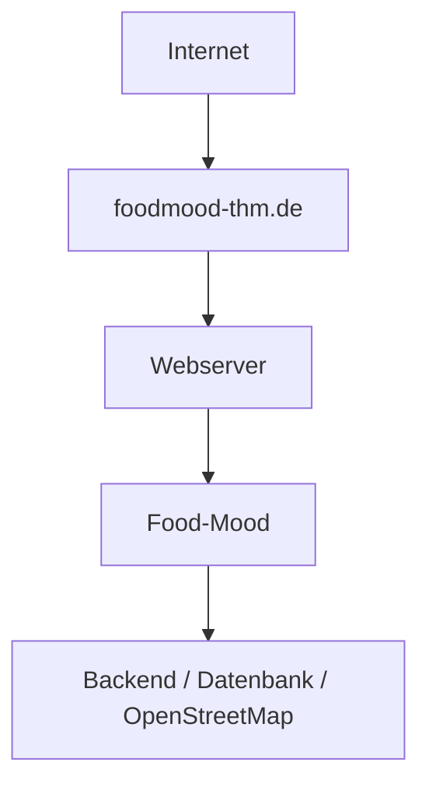

# S3 - Inbetriebnahme

Diese Datei beschreibt fachlich, was nötig ist, um Food-Mood lokal zu starten und produktiv in Betrieb zu nehmen. Genaue Befehle und Anbieter können sich noch ändern, sobald die Architektur in M2 final feststeht.

## 1. Voraussetzungen

- Node.js (aktuelle LTS-Version) sowie ein Paketmanager (z.B. npm) müssen installiert sein.
- Eine lokale PostgreSQL-Instanz (z.B. über Docker) für die Speicherung von Favoriten und Besuchen/Bewertungen.
- Eine bestehende Internetverbindung, da Restaurantdaten über die externe OpenStreetMap/Overpass-API abgerufen werden.
- Ein moderner Webbrowser. Für den Test der automatischen Standortermittlung sollten die Standortdienste des Browsers/Geräts aktiviert sein.

## 2. Repository beziehen

- Repository klonen bzw. aktuellen Stand holen (`git clone` bzw. `git pull`).
- In den Projektordner wechseln.

## 3. Abhängigkeiten installieren

- Abhängigkeiten installieren (voraussichtlich `npm install`).

## 4. Umgebungsvariablen konfigurieren

Die Konfiguration erfolgt über Umgebungsvariablen in einer lokalen env-Datei, die nicht Teil des Repositorys ist (in .gitignore eingetragen). Voraussichtlich benötigt:

- `OVERPASS_API_URL` Basis-URL des Overpass-Servers.
- `DATABASE_URL` Verbindungsangabe zur Datenbank (siehe Datenbankkonfiguration).
- `PORT` Port, unter dem die Anwendung lokal erreichbar ist (optional, mit Standardwert).

Eine Beispieldatei `env.example` mit Platzhalterwerten liegt im Repository, damit neue Teammitglieder wissen, welche Variablen gesetzt werden müssen, ohne echte Werte einzusehen.

## 5. Datenbank konfigurieren

- Die Persistenz erfolgt voraussichtlich über PostgreSQL (siehe TEAMINFO.md).
- Für die lokale Entwicklung reicht eine leere, lokale PostgreSQL-Datenbank. Das Schema wird beim ersten Start automatisch angelegt bzw. über Migrationsskripte eingerichtet (genaue Umsetzung folgt in der Architekturphase, M2).
- Gespeichert werden ausschließlich die UserID sowie die zugehörigen Favoriten und Besuche/Bewertungen. Keine sensiblen personenbezogenen Daten.

## 6. OpenStreetMap-Anbindung konfigurieren

- Food-Mood nutzt OpenStreetMap/Overpass als Datenquelle für Restaurants sowie voraussichtlich Nominatim zur Umwandlung einer manuell eingegebenen Ortsangabe in Koordinaten.
- Beide Dienste sind öffentlich und kostenlos nutzbar. Die jeweilige Basis-URL wird über eine Umgebungsvariable konfiguriert, damit sie bei Bedarf ausgetauscht werden kann, ohne den Code zu ändern.
- Für die aktuell vorgesehene Datenquelle werden keine geheimen API-Schlüssel benötigt. Sollte im weiteren Verlauf dennoch ein Dienst mit Schlüsselpflicht eingesetzt werden, gilt als Grundsatz: Schlüssel werden nicht im Quellcode oder Repository hinterlegt, sondern ausschließlich über die lokale, nicht versionierte env-Datei bereitgestellt.

## 7. Anwendung lokal starten

1. `npm run dev` startet die Anwendung im Entwicklungsmodus (voraussichtlich über Vite) mit automatischem Neuladen bei Codeänderungen.
2. Die App ist anschließend lokal unter einer Adresse wie `http://localhost:5173` erreichbar.

## 8. Anwendung bauen

1. `npm run build` erstellt eine optimierte, produktionsreife Version der Anwendung (statische Dateien).
2. Im Produktivbetrieb werden andere Umgebungsvariablen verwendet als in der lokalen Entwicklung, z.B. eine produktive statt einer lokalen Datenbank-URL.

## 9. Webserver vorbereiten

- Für den Produktivbetrieb wird ein Webserver benötigt, der die gebauten Frontend-Dateien ausliefert und das Backend erreichbar macht.
- Der Server benötigt Node.js in der aktuellen LTS-Version zur Ausführung des Backends sowie Netzwerkzugriff auf die PostgreSQL-Datenbank und die externen OpenStreetMap-Dienste.
- Ein Reverse Proxy (z.B. Nginx oder Caddy) nimmt Anfragen auf Port 80/443 entgegen, liefert das Frontend aus und leitet `/api` an das Backend weiter.
- Das Backend läuft als verwalteter Prozess (z.B. über systemd oder PM2) und wird nach einem Neustart des Servers automatisch gestartet.
- Die Datenbank ist nicht direkt aus dem Internet erreichbar. Firewall-Regeln erlauben ausschließlich die notwendigen Verbindungen zu Webserver, Backend und Datenbank.

## 10. Deployment durchführen

1. Der aktuelle Stand wird auf dem Webserver bereitgestellt und die Abhängigkeiten werden mit `npm ci` installiert.
2. Die Anwendung wird mit `npm run build` gebaut; die erzeugten Frontend-Dateien werden im konfigurierten Webserver-Verzeichnis abgelegt.
3. Die produktiven Umgebungsvariablen (siehe Punkt 4) werden sicher auf dem Server hinterlegt, nicht im Repository.
4. Die PostgreSQL-Datenbank wird eingerichtet und das Datenbankschema wird über die vorgesehenen Migrations- oder Initialisierungsskripte angelegt.
5. Das Backend wird als verwalteter Prozess gestartet bzw. neu geladen.
6. Der Reverse Proxy wird so konfiguriert, dass `foodmood-thm.de` das Frontend ausliefert und API-Anfragen an das Backend weiterleitet.
7. Nach jedem Deployment werden die Erreichbarkeit und die Kernfunktionen gemäß Punkt 12 geprüft.

Die konkrete Umsetzung (manuell, per Skript oder automatisiert über CI/CD) kann nach Festlegung der Architektur ergänzt werden.

## 11. Domain konfigurieren

- Die öffentliche Domain der Anwendung ist `foodmood-thm.de`.
- Beim Domainanbieter wird ein DNS-A-Record für `foodmood-thm.de` auf die öffentliche IPv4-Adresse des Webservers gesetzt. Falls eine IPv6-Adresse verwendet wird, wird zusätzlich ein AAAA-Record eingerichtet.
- Ein optionaler `www`-Eintrag kann per CNAME auf `foodmood-thm.de` zeigen und auf die Hauptdomain weiterleiten.
- Für `foodmood-thm.de` wird ein TLS-Zertifikat eingerichtet. HTTP-Anfragen werden dauerhaft auf HTTPS umgeleitet.
- Der Reverse Proxy nimmt HTTPS-Anfragen entgegen und leitet interne Backend-Anfragen weiter, ohne den Backend-Port öffentlich freizugeben.

Domain und Hosting im Überblick:

## 12. Produktivbetrieb prüfen

- Nach dem Deployment wird geprüft, ob die App über `https://foodmood-thm.de` erreichbar ist und HTTP korrekt auf HTTPS weiterleitet.
- Es wird geprüft, ob die Kernfunktionen (Standortbestimmung, Empfehlungen abrufen, Favoriten/Besuche speichern) im Produktivbetrieb wie im lokalen Betrieb funktionieren.
- Es wird geprüft, ob keine unerwarteten Fehler auftreten (z.B. in den Server-Logs, siehe N2 "Logging").