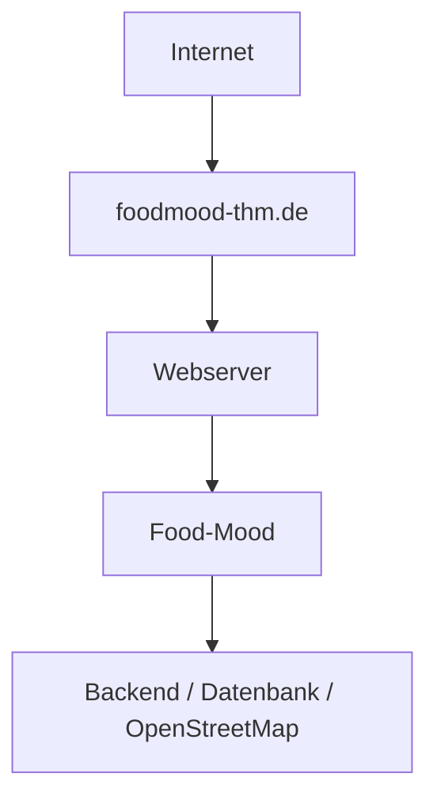

# S3 - Inbetriebnahme

Diese Datei beschreibt fachlich, was nötig ist, um Food-Mood lokal zu starten und für die Projektlaufzeit bei All-Inkl produktiv zu betreiben. Die Architekturentscheidungen sind in [A09 – Architekturentscheidungen](../arch/A09-Architekturentscheidungen.md) dokumentiert.

## 1. Voraussetzungen

- Node.js (aktuelle LTS-Version) sowie ein Paketmanager (z.B. npm) müssen installiert sein.
- Eine lokale PostgreSQL-Instanz (z.B. über Docker) für die Speicherung von Favoriten und Besuchen/Bewertungen.
- Eine bestehende Internetverbindung, da Restaurantdaten über die externe OpenStreetMap/Overpass-API abgerufen werden.
- Ein moderner Webbrowser. Für den Test der automatischen Standortermittlung sollten die Standortdienste des Browsers/Geräts aktiviert sein.

## 2. Repository beziehen

- Repository klonen bzw. aktuellen Stand holen (`git clone` bzw. `git pull`).
- In den Projektordner wechseln.

## 3. Abhängigkeiten installieren

- Abhängigkeiten installieren (voraussichtlich `npm install`).

## 4. Umgebungsvariablen konfigurieren

Die Konfiguration erfolgt über Umgebungsvariablen in einer lokalen env-Datei, die nicht Teil des Repositorys ist (in .gitignore eingetragen). Voraussichtlich benötigt:

- `OVERPASS_API_URL` Basis-URL des Overpass-Servers, Standardwert `https://overpass-api.de/api/interpreter`. Bei anhaltenden Verbindungsfehlern (z. B. `ECONNREFUSED`/„fetch failed“ auf gehosteten Umgebungen mit geteilter IP) kann testweise ein alternativer, öffentlicher Overpass-Mirror mit voller Datenabdeckung eingetragen werden, z. B. `https://lz4.overpass-api.de/api/interpreter`. Regionale Mirrors wie `overpass.osm.ch` liefern nur eingeschränkte, regionale Daten und sind für Deutschland nicht geeignet.
- `NOMINATIM_API_URL` Basis-URL des Nominatim-Servers, Standardwert `https://nominatim.openstreetmap.org`.
- `DATABASE_URL` Verbindungsangabe zur Datenbank (siehe Datenbankkonfiguration).
- `PORT` Port, unter dem die Anwendung lokal erreichbar ist (optional, mit Standardwert).

Eine Beispieldatei `env.example` mit Platzhalterwerten liegt im Repository, damit neue Teammitglieder wissen, welche Variablen gesetzt werden müssen, ohne echte Werte einzusehen.

## 5. Datenbank konfigurieren

- Die Persistenz erfolgt über PostgreSQL.
- Für die lokale Entwicklung reicht eine leere, lokale PostgreSQL-Datenbank. Das Schema wird über versionierte SQL-Migrationen eingerichtet; das Backend verwendet dafür `pg`.
- Die UserID wird lokal im Browser gespeichert. Serverseitig werden ausschließlich der `UserIdHash` sowie die zugehörigen Favoriten, Besuche und Bewertungen gespeichert. Keine sensiblen personenbezogenen Daten.

## 6. OpenStreetMap-Anbindung konfigurieren

- Food-Mood nutzt OpenStreetMap/Overpass als Datenquelle für Restaurants sowie Nominatim zur Umwandlung einer manuell eingegebenen Ortsangabe in Koordinaten.
- Beide Dienste sind öffentlich und kostenlos nutzbar. Die Basis-URLs werden über `OVERPASS_API_URL` und `NOMINATIM_API_URL` konfiguriert, damit sie bei Bedarf ausgetauscht werden können, ohne den Code zu ändern.
- Für die aktuell vorgesehene Datenquelle werden keine geheimen API-Schlüssel benötigt. Sollte im weiteren Verlauf dennoch ein Dienst mit Schlüsselpflicht eingesetzt werden, gilt als Grundsatz: Schlüssel werden nicht im Quellcode oder Repository hinterlegt, sondern ausschließlich über die lokale, nicht versionierte env-Datei bereitgestellt.

## 7. Anwendung lokal starten

1. `npm run dev` startet die Anwendung im Entwicklungsmodus (voraussichtlich über Vite) mit automatischem Neuladen bei Codeänderungen.
2. Die App ist anschließend lokal unter einer Adresse wie `http://localhost:5173` erreichbar.

## 8. Anwendung bauen

1. `npm run build` erstellt eine optimierte, produktionsreife Version der Anwendung (statische Dateien).
2. Im Produktivbetrieb werden andere Umgebungsvariablen verwendet als in der lokalen Entwicklung, z.B. eine produktive statt einer lokalen Datenbank-URL.

## 9. Frontend und Backend getrennt bereitstellen

- All-Inkl liefert ausschließlich den statischen React/Vite-Build aus. Der Inhalt von `frontend/dist/` wird in das Webverzeichnis von `foodmood-thm.de` hochgeladen.
- Das Node.js-/Express-Backend läuft bei einem separaten Anbieter mit Node.js-Unterstützung und ist über eine öffentliche HTTPS-URL erreichbar.
- PostgreSQL läuft beim Backend-/Datenbankanbieter und ist nicht direkt aus dem Browser erreichbar.
- Das Backend erlaubt CORS ausschließlich für `https://foodmood-thm.de` und lokale Entwicklung.
- Die Frontend-Variable `VITE_API_BASE_URL` wird vor dem Produktions-Build auf die externe Backend-URL gesetzt.

## 10. Deployment durchführen

1. Die produktive Backend-URL in `frontend/.env.production` eintragen.
2. Im Repository-Root `npm run build` ausführen.
3. Den Inhalt von `frontend/dist/` per FTP zu All-Inkl hochladen.
4. Die produktiven Backend-Umgebungsvariablen sicher beim externen Anbieter hinterlegen, nicht im Repository.
5. PostgreSQL einrichten und `npm run migrate` im Backend ausführen.
6. Das Backend starten und den Healthcheck prüfen.
7. Nach jedem Deployment werden die Erreichbarkeit und die Kernfunktionen gemäß Punkt 12 geprüft.

Die Bereitstellung erfolgt für die Projektlaufzeit; nach der Abgabe kann die Domain abgeschaltet werden. Backups der PostgreSQL-Datenbank werden täglich erstellt und sieben Tage aufbewahrt.

## 11. Domain konfigurieren

- Die öffentliche Domain der Anwendung ist `foodmood-thm.de`.
- Beim Domainanbieter wird ein DNS-A-Record für `foodmood-thm.de` auf die öffentliche IPv4-Adresse des Webservers gesetzt. Falls eine IPv6-Adresse verwendet wird, wird zusätzlich ein AAAA-Record eingerichtet.
- Ein optionaler `www`-Eintrag kann per CNAME auf `foodmood-thm.de` zeigen und auf die Hauptdomain weiterleiten.
- Für `foodmood-thm.de` wird ein TLS-Zertifikat eingerichtet. HTTP-Anfragen werden dauerhaft auf HTTPS umgeleitet.
- Der Reverse Proxy nimmt HTTPS-Anfragen entgegen und leitet interne Backend-Anfragen weiter, ohne den Backend-Port öffentlich freizugeben.

Domain und Hosting im Überblick:

## 12. Produktivbetrieb prüfen

- Nach dem Deployment wird geprüft, ob die App über `https://foodmood-thm.de` erreichbar ist und HTTP korrekt auf HTTPS weiterleitet.
- Es wird geprüft, ob die Kernfunktionen (Standortbestimmung, Empfehlungen abrufen, Favoriten/Besuche speichern) im Produktivbetrieb wie im lokalen Betrieb funktionieren.
- Es wird geprüft, ob keine unerwarteten Fehler auftreten (z.B. in den Server-Logs, siehe N2 "Logging").